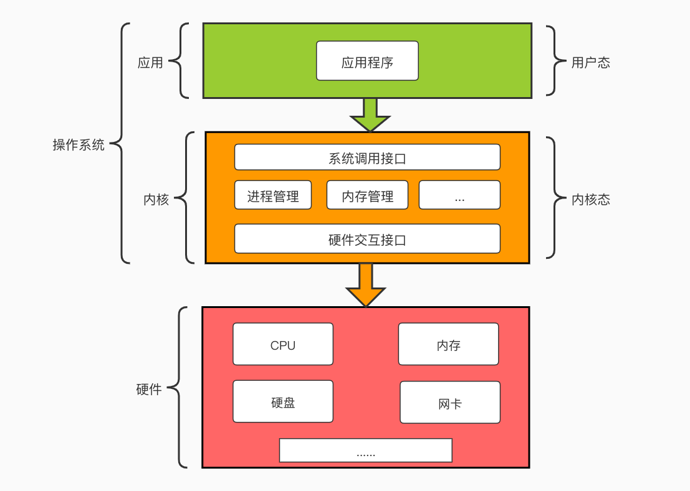
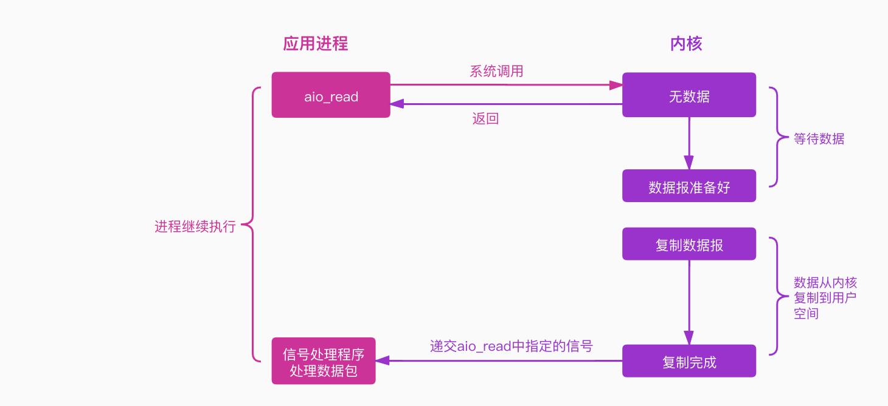

# Java IO 前置知识

## 基本概念

### 同步与异步

什么是同步与异步呢？百度百科是这样定义的：

> 同步指两个或两个以上随时间变化的量在变化过程中保持一定的相对关系。异步与同步相对（这解释让我无言相对）

所以，我们需要明确的是**`同步与异步针对的是两个或者两个以上的事物`**。

对于同步而言，一个任务（调用者）的完成需要依赖另一个人任务（被调用者）的完成，只有等待被依赖的任务完成，依赖的任务才会继续进行，两者步调保持一致。

异步呢？任务与它依赖的任务没有必然的联系，它不需要等待它依赖的任务完成，它只需要向依赖任务发起调用即可，告诉它你可以干活了，至于你啥时候干完跟我没关系。

所以说，`同步和异步的本质区别就在于调用者与被调用者之间结果消息通知机制的不同`。

- 同步：调用者需要一直`主动等待`被调用者的结果。
- 异步：调用者调用被调用者后，调用者不会立刻得到结果，在调用者发起调用后，被调用者通过状态、通知或通过回调函数，让调用者知道结果

所以，同步和异步一个是主动等待结果，一个是被动知道结果。

举一个简单的例子：买奶茶，我们有两种方式拿到我们买的奶茶

- 选择排队等待。这种方式就是同步等待消息通知了，我们需要一直在吧台面前等着我们的奶茶
- 扫码。这种方式，你可以不停地看手机排号是否到你了（状态），也可以在那里玩手机等着服务员喊 88 号，奶茶好了（通知）。

上面提到异步调用可以通过状态、通知或者回调函数来告知调用者。

- 状态：调用者需要每隔一段向被调用者发起一个状态查询请求。这种方式效率较为低下。一般我们在调用支付接口的时候，如果服务方告知支付状态未知，则我们需要每隔一段时间去查询该笔订单的支付状态。虽然效率较为低下，但是靠谱。
- 通知：这种方式，调用者不需要做额外的工作，他只需要等被调用者把结果告诉调用者即可。但是这种方式也有点不是那么靠谱，它到底啥时候调用，如果不调用怎么办呢？这些都是我们需要考虑的问题。
- 回调函数：和通知机制差不多。

### 阻塞与非阻塞

上面解释了什么是同步与异步，那什么是阻塞与非阻塞呢？

> **所谓阻塞，就是有障碍而不能通行，无法畅通。**

所以，`阻塞就是调用结果返回之前，该线程会被一直挂起，一直等待结果，不能继续，函数只有在得到结果之后才会返回`。

可能有小伙伴会将阻塞与同步等同起来，因为他们都是因为等待执行结果而停滞不前，其实两者还是有区别的：

- 同步，针对的是两个进程，一个进程（调用者）因为等待另一个进程（被调用者）的执行结果而停滞不前。而阻塞则是针对一个，它是因为自己本身因等待当前线程中某个执行结果而停滞不前的。
- 对于同步来说，当前线程还是处于激活状态，只是从逻辑（感官）来说它是停滞不前的，当前线程可能还在处理其他事情。而阻塞则不同，当前线程是被挂起了，直接让出了 CPU。

非阻塞则与阻塞概念相对，`指在不能立即得到执行结果之前，该函数不会阻碍当前线程执行，而是会立即返回`。

还是上面那个买奶茶的例子，不论是排队在那里等奶茶还是扫码在哪里等奶茶，只要在等奶茶的过程中你没有做其他事情都是阻塞。如果你在等的过程跟你女朋友聊天（假如你有女朋友的话）或者在玩手机，那么就是非阻塞，因为没有因等待奶茶这件事一直耗着，而是一边等一边干其他的事情。

### 同步&异步、阻塞&非阻塞

同步&异步与阻塞&非阻塞两两组合，分别为`同步阻塞`,`同步非阻塞`，`异步阻塞`，`异步非阻塞`。以上面等奶茶的例子为例。

#### 同步阻塞

你在排队等奶茶的过程中，什么事情都不能做，只能干等着。就问你无聊不无聊，尴尬不尴尬。`效率最为低下`。

#### 同步非阻塞

你在排队等奶茶的过程中，可以干其他事情，比如刷抖音，玩一把王者荣耀，但是你需要不断地看奶茶是否已经到你，你势必会分心导致输掉王者荣耀，成为一个坑货。注意排队等奶茶，玩王者荣耀是两件事情，你需要两件事情来回不断地切换，`效率也不见得高到哪里去`。

#### 异步阻塞

你扫码拿号后，你不用在那里排队干等，你只需要等候服务员告诉你奶茶做好了去拿就可以了，但是在这个等的过程中，你啥事都不能干，只能干等着。很显然你已经被阻塞在这个等待服务员告诉你奶茶做好了的事情（`消息通知`）上面了。我们要注意是，并不是说异步就不能阻塞了，`异步也是可以阻塞的，只不过它不是在处理消息时阻塞，而是在等待消息通知时被阻塞了`。

#### 异步非阻塞

你扫码拿号后，直接去边上玩王者荣耀了，中途你专心玩的王者荣耀，不需要分心去关注你的奶茶是否做好了，你只需要在那里等服务员告诉你奶茶做好了（`消息通知`）去拿就可以了。`效率最高`。

### 什么是IO

什么是IO？维基百科上面是这样解释的：

> I/O（英语：Input/Output），即输入／输出，通常指数据在存储器（内部和外部）或其他周边设备之间的输入和输出，是信息处理系统（例如计算机）与外部世界（可能是人类或另一信息处理系统）之间的通信。输入是系统接收的信号或数据，输出则是从其发送的信号或数据。

这是IO一个完整的定义，不是特别好理解，要厘清IO这个概念，我们需要从如下两个视角来理解它。

#### 计算机视角理解IO

冯•诺伊曼计算机的基本思想中有提到计算机硬件组成应为五大部分：控制器，运算器，存储器，输入和输出。其中输入是指将数据输入到计算机的设备，输出是指从计算机中获取数据的设备。对于计算机而言，任何涉及到计算机核心（CPU和内存）与其他设备间的数据转移的过程就是IO。

IO 对于计算机而言，有两层意思：

- IO 设备。比如我们最常见的打印机、鼠标、键盘
- 对IO设备的数据读写

#### 程序视角理解IO

程序视角我们关注的则是应用程序本身。我们知道应用程序只有加载到内存中作为一个进程才能运行，它需要时刻与计算机进行数据交换，比如读写磁盘、远程调用、访问内存等等，但是操作系统为了能够正常平稳地运行下去，它是不会运行应用程序随意访问计算机硬件部分，如内存、硬盘、网卡，应用程序必须通过操作系统提供的API来访问，以达到安全的访问控制。所以应用程序如果要访问内核管理的IO，则必须通过有操作系统提供的API来间接访问。所以 IO对应应用程序而言，强调的则是 **通过向内核发起系统调用完成对I/O的间接访问**。

所以，换句话说应用程序发起一次IO访问是分为两个阶段的：

1. **IO 调用阶段**：应用程序向内核发起系统调用。
2. **IO执行阶段**：内核执行IO操作并返回。
   1. 数据准备阶段：内核等待IO设备准备好数据
   2. 数据拷贝阶段：将数据从内核缓冲区拷贝到用户空间缓冲区

### 用户空间&内核空间

操作系统是利用CPU 指令来计算和控制计算机系统的，有些指令很温和，我们操作它不会对操作系统产生什么危害，而有些指令则非常危险，如果使用不当则会导致系统崩溃，如果操作系统允许所有的应用程序能够直接访问这些很危险的指令，这会让计算机大大增加崩溃的概率。所以操作系统为了更加地保护自己，则将这些危险的指令保护起来，不允许应用程序直接访问。

现代操作系统都是采用虚拟存储器，操作系统为了保护危险指令被应用程序直接访问，则将虚拟空间划分为内核空间和用户空间。

- 内核空间则是操作系统的核心，它提供操作系统的最基本的功能，是操作系统工作的基础，它负责管理系统的进程、内存、设备驱动程序、文件和网络系统，决定着系统的性能和稳定性。
- 用户空间，非内核应用程序则运行在用户空间。用户空间中的代码运行在较低的特权级别上，只能看到允许它们使用的部分系统资源，并且不能使用某些特定的系统功能，也不能直接访问内核空间和硬件设备，以及其他一些具体的使用限制。

进行空间划分后，用户空间通过操作系统提供的API间接访问操作系统的内核，提高了操作系统的稳定性和可用性。

### 用户态和内核态进程切换

- 内核态: CPU可以访问内存所有数据, 包括外围设备, 例如硬盘,、网卡，CPU也可以将自己从一个程序切换到另一个程序。
- 用户态: 只能受限的访问内存, 且不允许访问外围设备。占用CPU的能力被剥夺, CPU资源可以被其他程序获取。

我们知道CPU为了保护操作系统，将空间划分为内核空间和用户空间，进程既可以在内核空间运行，也可以在用户空间运行。当进程运行在内核空间时，它就处在内核态，当进程运行在用户空间时，他就是用户态。开始所有应用程序都是运行在用户空间的，这个时候它是用户态，但是它想做一些只有内核空间才能做的事情，如读取IO，这个时候进程需要通过系统调用来访问内核空间，进程则需要从用户态转变为内核态。

用户态和内核态之间的切换开销有点儿大，那它开销在哪里呢？有如下几点：

- 保留用户态现场（上下文、寄存器、用户栈等）
- 复制用户态参数，用户栈切到内核栈，进入内核态
- 额外的检查（因为内核代码对用户不信任）
- 执行内核态代码
- 复制内核态代码执行结果，回到用户态
- 恢复用户态现场（上下文、寄存器、用户栈等）

所以，频繁的IO操作会频繁的造成用户态 —> 内核态 —> 用户态的切换，这严重会影响系统性能。后面小编会介绍IO的一些优化，重点就是减少切换。

## UNIX的I/O模型

《UNIX网络编程》说得很清楚，5种IO模型分别是 **阻塞IO模型**、 **非阻塞IO模型**、 **IO复用模型**、 **信号驱动IO模型**、 **异步IO模型**。

如何去理解 UNIX I/O 模型，大致有以下两个维度：

- 区分同步或异步（synchronous/asynchronous）。简单来说，同步是一种可靠的有序运行机制，当我们进行同步操作时，后续的任务是等待当前调用返回，才会进行下一步；而异步则相反，其他任务不需要等待当前调用返回，通常依靠事件、回调等机制来实现任务间次序关系。
- 区分阻塞与非阻塞（blocking/non-blocking）。在进行阻塞操作时，当前线程会处于阻塞状态，无法从事其他任务，只有当条件就绪才能继续，比如 ServerSocket 新连接建立完毕，或数据读取、写入操作完成；而非阻塞则是不管 IO 操作是否结束，直接返回，相应操作在后台继续处理。

不能一概而论认为同步或阻塞就是低效，具体还要看应用和系统特征。

对于一个网络 I/O 通信过程，比如网络数据读取，会涉及两个对象，一个是调用这个 I/O 操作的用户线程，另外一个就是操作系统内核。一个进程的地址空间分为用户空间和内核空间，用户线程不能直接访问内核空间。

当用户线程发起 I/O 操作后，网络数据读取操作会经历两个步骤：

- 用户线程等待内核将数据从网卡拷贝到内核空间。
- 内核将数据从内核空间拷贝到用户空间。

各种 I/O 模型的区别就是：它们实现这两个步骤的方式是不一样的

### 阻塞IO模型

阻塞IO模型是最常见最简单的IO模型，图如下：

应用程序发起一个系统调用（recvform）来读取数据，然后让出CPU，一直阻塞。内核等待网卡数据到来，把数据从网卡拷贝到内核空间，接着把数据拷贝到用户空间，再把用户线程叫醒。

- 优点
  - 模型简单，实现难度低
  - 适用于并发量较小的应用开发
- 缺点
  - 整个过程都阻塞，进程一直挂起，程序性能较为低，不适用并发大的应用

### 非阻塞 IO模型

非阻塞IO模型图例如下：

应用程序发起`recvform`系统调用，如果数据报没有准备会则会立即返回一个`EWOULDBLOCK`错误码，进程并不需要进行等待。进程收到该错误后，判断内核数据还没有准备好，它还可以继续发送 `recvform`，如果数据报已经准备好了，待数据从内核拷贝到用户空间返回成功指示后，进程则可以处理数据报了，

**所以， 非阻塞IO模型需要应用进程不断地主动询问内核数据是否已准备好了。**

- 优点
  - 模型简单，实现难度低
  - 与阻塞IO模型对比，它在等待数据报的过程中，进程并没有阻塞，它可以做其他的事情
- 缺点
  - 轮询发送 recvform ，消耗CPU 资源
  - 与阻塞IO模型一样，它也不适用于并发量大的应用程序

### I/O 多路复用模型

用户线程的读取操作分成两步了，线程先发起 select 调用，目的是问内核数据准备好了吗？等内核把数据准备好了，用户线程再发起 read 调用。在等待数据从内核空间拷贝到用户空间这段时间里，线程还是阻塞的。那为什么叫 I/O 多路复用呢？因为一次 select 调用可以向内核查多个数据通道（Channel）的状态，所以叫多路复用。

IO复用模型图例如下：

- 优点
  - 一个进行负责状态监听，性能较好。
  - 适用于高并发应用程序
- 缺点
  - 模型复杂，实现、开发难度较大

### 信号驱动 I/O模型

IO 复用模型在第一个阶段和第二个阶段其实都有阻塞，第一个阶段阻塞于 select 调用，第二个阶段阻塞于数据复制，那有没有办法在第一个阶段或者第二个阶段不阻塞，进一步提升性能呢？信号驱动IO模型。图例如下：

进程发起一个IO操作，会向内核注册一个信号处理程序，然后 **立即返回不阻塞**，当内核将数据报准备好后会发送一个信号给进程，这时候进程便可以在信号处理程序中调用IO处理数据报。它与IO复用模型的主要区别是等待数据阶段无阻塞。

- 优点
  - 采用回调机制，等待数据阶段无阻塞
  - 适用于高并发应用程序
- 缺点
  - 模型较为复杂，实现起来有点儿困难

### 异步IO模型

信号驱动IO模型，进一步优化了IO操作流程，经过了三轮优化，它终于不用在数据等待阶段阻塞了，但是在数据复制节点依然是阻塞的，所以如果我们需要进一步优化的话，只需要把第二个阶段也进一步优化为异步，我们就大功告成了，也就变成了真正的异步IO了。

当进程发送一个IO操作，进程会立刻返回（不阻塞），但是也不能返回结果，内核会把整个IO数据报准备好后，再通知进程，进程再处理数据报。

- 优点
  - 整个过程都不阻塞，一步到位
  - 非常使用高并发应用
- 缺点
  - 需要操作系统的底层支持，LINUX 2.5 版本内核首现，2.6 版本产品的内核标准特性
  - 模型复杂，实现、开发难度较大

### 总结

五种IO模型，层层递进，一个比一个性能高，当然模型的复杂度也一个比一个复杂。最后用一张图来总结下

