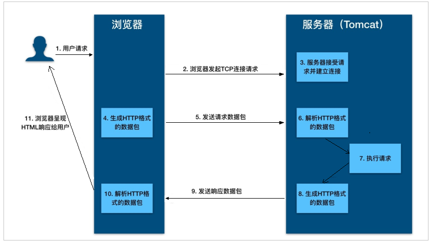
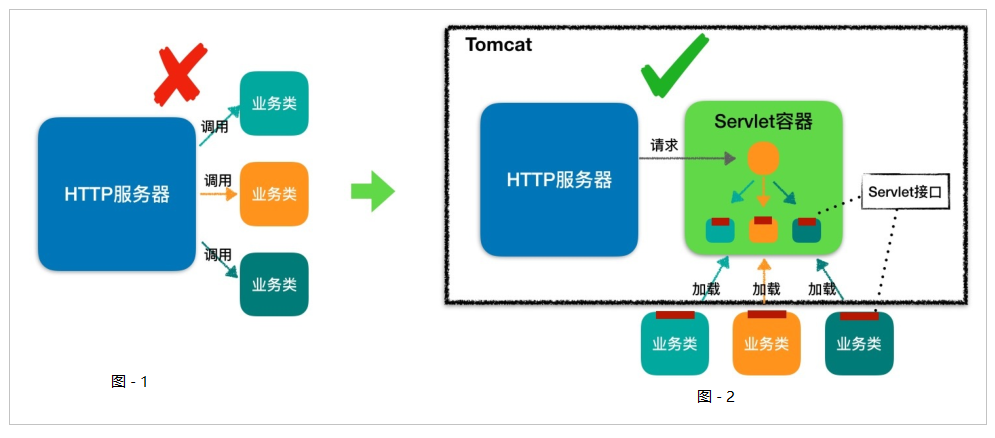
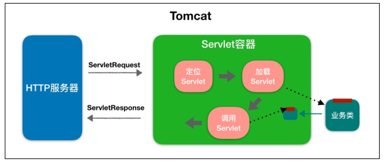
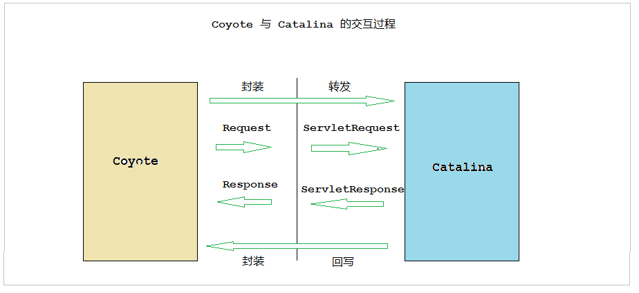

# Tomcat专题

## Tomcat基础

### web概念

- 软件架构 

  - C/S： 客户端/服务器端 ‐‐‐‐‐‐‐‐‐‐‐‐> QQ , 360 .... 

  - B/S： 浏览器/服务器端 ‐‐‐‐‐‐‐‐‐‐‐‐> 京东， 网易 ， 淘宝 ， 传智播客 官网

- 资源分类 

  - 静态资源： 所有用户访问后，得到的结果都是一样的，称为静态资源。静态资 源可以直接被浏览器解析。 
    	* 如： html,css,JavaScript，jpg 

  - 动态资源: 每个用户访问相同资源后，得到的结果可能不一样 , 称为动态资 源。动态资源被访问后，需要先转换为静态资源，再返回给浏览器，通过浏览器进行解析。 
    - 如：servlet/jsp,php,asp.... 

- 网络通信三要素 
  - IP：电子设备(计算机)在网络中的唯一标识。 
  - 端口：应用程序在计算机中的唯一标识。 0~65536 
  - 传输协议：规定了数据传输的规则 
    - 基础协议： 
      - tcp : 安全协议，三次握手。 速度稍慢 
      - udp：不安全协议。 速度快

### 常见的web服务器

webLogic

webSphere

JBoss

Tomcat


### Tomcat历史


### Tomcat安装


### Tomcat目录结构

Tomcat 的主要目录文件如下 ：

| 目录        | 目录下文件                 | 说明                                                         |
| ----------- | -------------------------- | ------------------------------------------------------------ |
| **bin**     | /                          | 存放Tomcat的启动、停止等批处理脚本文件                       |
|             | startup.bat , startup.sh   | 用于在windows和linux下的启动脚本                             |
|             | shutdown.bat , shutdown.sh | 用于在windows和linux下的停止脚本                             |
| **conf**    | /                          | 用于存放Tomcat的相关配置文件                                 |
|             | Catalina                   | 用于存储针对每个虚拟机的Context配置                          |
|             | context.xml                | 用于定义所有web应用均需加载的Context配置，如果web应用指定了自己的context.xml，该文件将被覆盖 |
|             | catalina.properties        | Tomcat 的环境变量配置                                        |
|             | catalina.policy            | Tomcat 运行的安全策略配置                                    |
|             | logging.properties         | Tomcat 的日志配置文件， 可以通过该文件修改Tomcat 的日志级别及日志路径等 |
|             | server.xml                 | Tomcat 服务器的核心配置文件                                  |
|             | tomcat-users.xml           | 定义Tomcat默认的用户及角色映射信息配置                       |
|             | web.xml                    | Tomcat 中所有应用默认的部署描述文件， 主要定义了基础Servlet和MIME映射。 |
| **lib**     | /                          | Tomcat 服务器的依赖包                                        |
| **logs**    | /                          | Tomcat 默认的日志存放目录                                    |
| **webapps** | /                          | Tomcat 默认的Web应用部署目录                                 |
| **work**    | /                          | Web 应用JSP代码生成和编译的临时目录                          |

### Tomcat 启动停止

启动：

```shell
bin/startup.bat
```

停止：

```shell
bin/shutdown.bat
```

访问：

```
http://localhost:8080
```


## Tomcat架构

### HTTP工作原理

HTTP协议是浏览器与服务器之间的数据传送协议。作为应用层协议，HTTP是基于TCP/IP 协议来传递数据的（HTML文件、图片、查询结果等），HTTP协议不涉及数据包 （Packet）传输，主要规定了客户端和服务器之间的通信格式。 



从图上你可以看到，这个过程是：

1. 用户通过浏览器进行了一个操作，比如输入网址并回车，或者是点击链接，接着浏览 器获取了这个事件。 
2. 浏览器向服务端发出TCP连接请求。 
3. 服务程序接受浏览器的连接请求，并经过TCP三次握手建立连接。 
4. 浏览器将请求数据打包成一个HTTP协议格式的数据包。 
5. 浏览器将该数据包推入网络，数据包经过网络传输，最终达到端服务程序。 
6. 服务端程序拿到这个数据包后，同样以HTTP协议格式解包，获取到客户端的意图。 
7. 得知客户端意图后进行处理，比如提供静态文件或者调用服务端程序获得动态结果。 

8. 服务器将响应结果（可能是HTML或者图片等）按照HTTP协议格式打包。 
9. 服务器将响应数据包推入网络，数据包经过网络传输最终达到到浏览器。 

10. 浏览器拿到数据包后，以HTTP协议的格式解包，然后解析数据，假设这里的数据是HTML。 

11. 浏览器将HTML文件展示在页面上。 

那我们想要探究的Tomcat作为一个HTTP服务器，在这个过程中都做了些什么事情呢？主 要是接受连接、解析请求数据、处理请求和发送响应这几个步骤。 

### Tomcat整体架构 

#### Http服务器请求处理

浏览器发给服务端的是一个HTTP格式的请求，HTTP服务器收到这个请求后，需要调用服务端程序来处理，所谓的服务端程序就是你写的Java类，一般来说不同的请求需要由不同 的Java类来处理。



图1 ， 表示HTTP服务器直接调用具体业务类，它们是紧耦合的。

图2，HTTP服务器不直接调用业务类，而是把请求交给容器来处理，容器通过Servlet接口调用业务类。因此Servlet接口和Servlet容器的出现，达到了HTTP服务器与业务类解耦的目的。而Servlet接口和Servlet容器这一整套规范叫作Servlet规范。 

Tomcat按照Servlet规范的要求实现了Servlet容器，同时它们也具有HTTP服务器的功能。作为Java程序员，如果我们要实现新的业务功能，只需要实现一个Servlet，并把它注册到Tomcat（Servlet容器）中，剩下的事情就由Tomcat帮我们处理了。 

#### Servlet容器工作流程 

为了解耦，HTTP服务器不直接调用Servlet，而是把请求交给Servlet容器来处理，那 Servlet容器又是怎么工作的呢？ 

当客户请求某个资源时，HTTP服务器会用一个ServletRequest对象把客户的请求信息封装起来，然后调用Servlet容器的service方法，Servlet容器拿到请求后，根据请求的URL和Servlet的映射关系，找到相应的Servlet，如果Servlet还没有被加载，就用反射机制创建这个Servlet，并调用Servlet的init方法来完成初始化，接着调用Servlet的service方法来处理请求，把ServletResponse对象返回给HTTP服务器，HTTP服务器会把响应发送给 客户端。



#### Tomcat整体架构 

我们知道如果要设计一个系统，首先是要了解需求，我们已经了解了Tomcat要实现两个 核心功能： 

- 处理Socket连接，负责网络字节流与Request和Response对象的转化。 

- 加载和管理Servlet，以及具体处理Request请求。 

因此Tomcat设计了两个核心组件连接器（Connector）和容器（Container）来分别做这 两件事情。连接器负责对外交流，容器负责内部处理。


### 连接器 - Coyote

#### 架构介绍 

Coyote 是Tomcat的连接器框架的名称 , 是Tomcat服务器提供的供客户端访问的外部接 口。客户端通过Coyote与服务器建立连接、发送请求并接受响应 。 

Coyote 封装了底层的网络通信（Socket 请求及响应处理），为Catalina 容器提供了统一 的接口，使Catalina 容器与具体的请求协议及IO操作方式完全解耦。Coyote 将Socket 输入转换封装为 Request 对象，交由Catalina 容器进行处理，处理请求完成后, Catalina 通 过Coyote 提供的Response 对象将结果写入输出流 。 

Coyote 作为独立的模块，只负责具体协议和IO的相关操作， 与Servlet 规范实现没有直接关系，因此即便是 Request 和 Response 对象也并未实现Servlet规范对应的接口， 而是在Catalina 中将他们进一步封装为ServletRequest 和 ServletResponse 。 



 

#### IO模型与协议

在Coyote中 ， Tomcat支持的多种I/O模型和应用层协议，具体包含哪些IO模型和应用层协议，请看下表： 

Tomcat 支持的IO模型（自8.5/9.0 版本起，Tomcat 移除了 对 BIO 的支持）：

| **IO**模型 | 描述                                                         |
| ---------- | ------------------------------------------------------------ |
| NIO        | 非阻塞I/O，采用Java NIO类库实现。                            |
| NIO2       | 异步I/O，采用JDK 7最新的NIO2类库实现。                       |
| APR        | 采用Apache可移植运行库实现，是C/C++编写的本地库。如果选择该方  案，需要单独安装APR库。 |

Tomcat 支持的应用层协议 ：

| 应用层协议 | 描述                                                         |
| ---------- | ------------------------------------------------------------ |
| HTTP/1.1   | 这是大部分Web应用采用的访问协议。                            |
| AJP        | 用于和Web服务器集成（如Apache），以实现对静态资源的优化以及集群部署，当前支持AJP/1.3。 |
| HTTP/2     | HTTP 2.0大幅度的提升了Web性能。下一代HTTP协议 ， 自8.5以及9.0 版本之后支持。 |

协议分层 ：


在 8.0 之前 ， Tomcat 默认采用的I/O方式为 BIO ， 之后改为 NIO。 无论 NIO、NIO2 还是 APR， 在性能方面均优于以往的BIO。 如果采用APR， 甚至可以达到 Apache HTTP Server 的影响性能。

Tomcat为了实现支持多种I/O模型和应用层协议，一个容器可能对接多个连接器，就好比 一个房间有多个门。但是单独的连接器或者容器都不能对外提供服务，需要把它们组装 起来才能工作，组装后这个整体叫作Service组件。这里请你注意，Service本身没有做什 么重要的事情，只是在连接器和容器外面多包了一层，把它们组装在一起。Tomcat内可 能有多个Service，这样的设计也是出于灵活性的考虑。通过在Tomcat中配置多个 Service，可以实现通过不同的端口号来访问同一台机器上部署的不同应用。 

 

#### 连接器组件 


连接器中的各个组件的作用如下：

**EndPoint** 

1） EndPoint ： Coyote 通信端点，即通信监听的接口，是具体Socket接收和发送处理 器，是对传输层的抽象，因此EndPoint用来实现TCP/IP协议的。 

2） Tomcat 并没有EndPoint 接口，而是提供了一个抽象类AbstractEndpoint ， 里面定 义了两个内部类：Acceptor和SocketProcessor。Acceptor用于监听Socket连接请求。 SocketProcessor用于处理接收到的Socket请求，它实现Runnable接口，在Run方法里调用协议处理组件Processor进行处理。为了提高处理能力，SocketProcessor被提交到线程池来执行。而这个线程池叫作执行器（Executor)，我在后面的专栏会详细介绍Tomcat如何扩展原生的Java线程池。 

**Processor** 

Processor ： Coyote 协议处理接口 ，如果说EndPoint是用来实现TCP/IP协议的，那么 Processor用来实现HTTP协议，Processor接收来自EndPoint的Socket，读取字节流解析成Tomcat Request和Response对象，并通过Adapter将其提交到容器处理，Processor是对应用层协议的抽象。 

**ProtocolHandler**

ProtocolHandler： Coyote 协议接口， 通过Endpoint 和 Processor ， 实现针对具体协 议的处理能力。Tomcat 按照协议和I/O 提供了6个实现类 ： AjpNioProtocol ， AjpAprProtocol， AjpNio2Protocol ，Http11NioProtocol ，Http11Nio2Protocol ，Http11AprProtocol。我们在配置tomcat/conf/server.xml 时 ， 至少要指定具体的 ProtocolHandler , 当然也可以指定协议名称 ， 如 ： HTTP/1.1 ，如果安装了APR，那么将使用Http11AprProtocol ， 否则使用 Http11NioProtocol 。 


## Jasper


## Tomcat 服务器配置