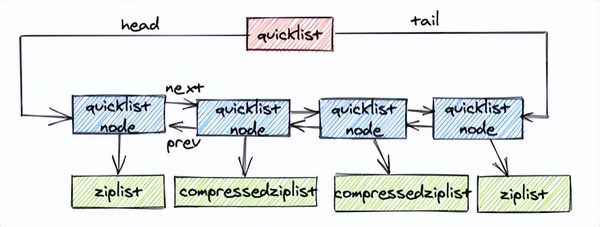
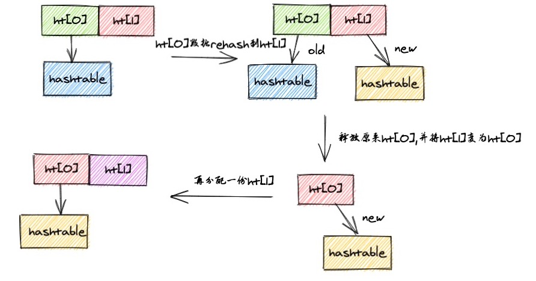
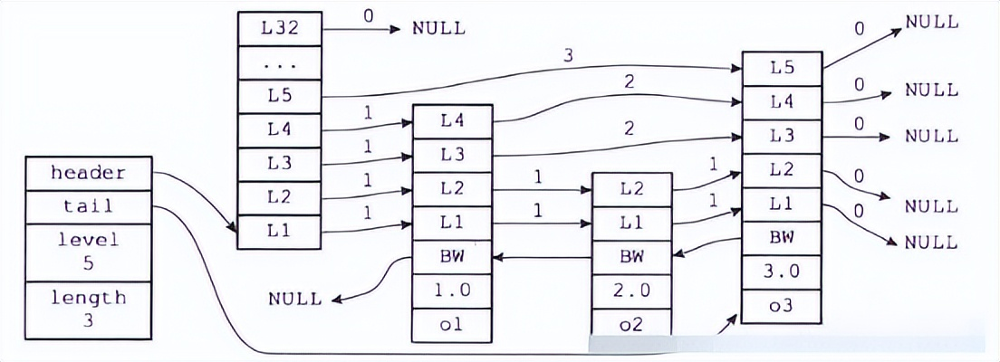
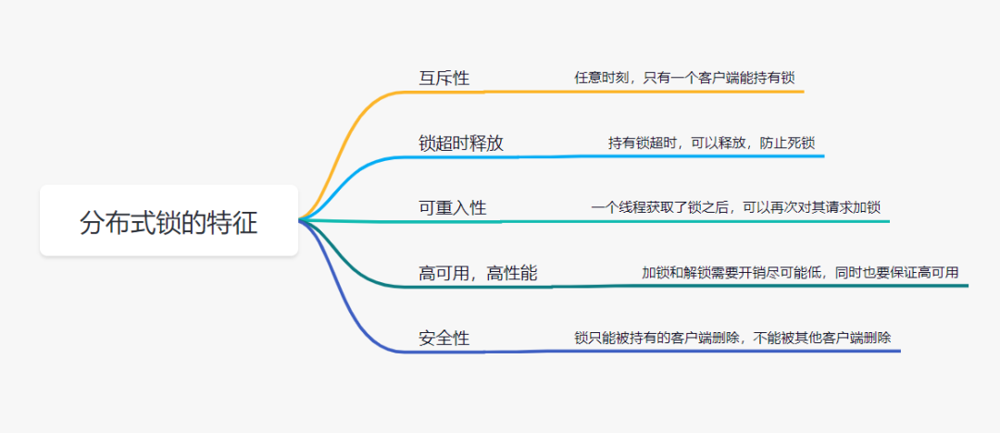
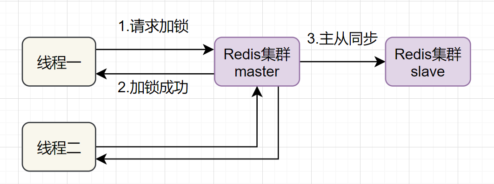
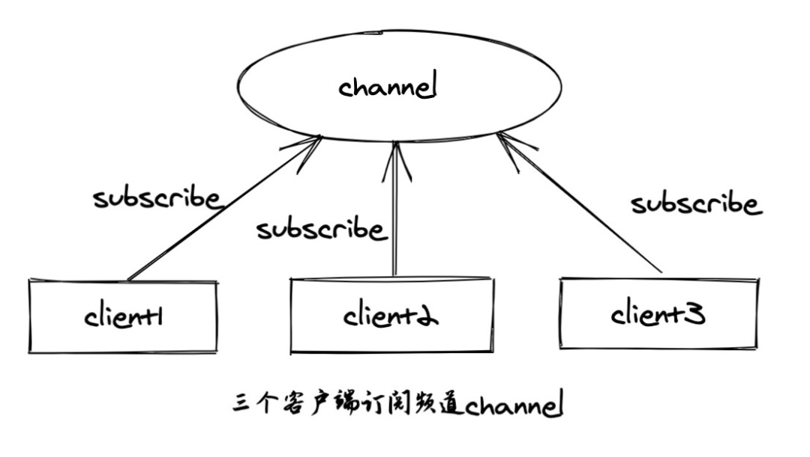
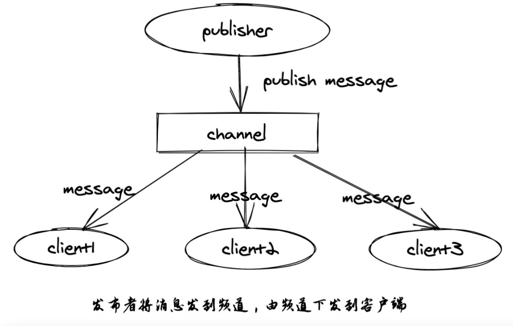
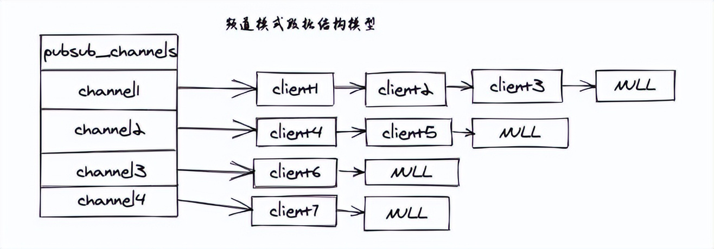
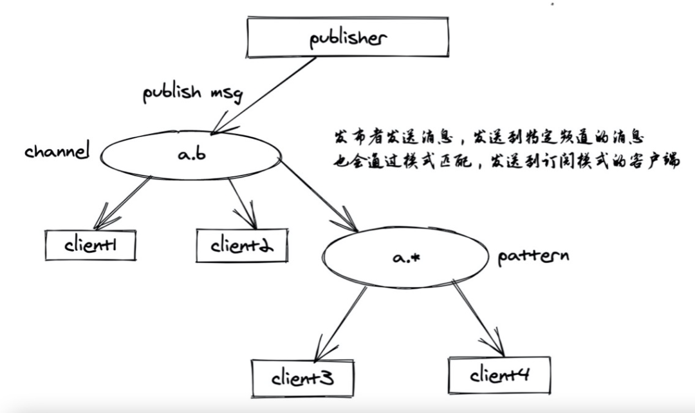

# Redis

## NoSQL概述

NoSQL = Not Only Sql

关系型数据库：行+列 同一个表下数据的结构是一样的

非关系型数据库：数据存储没有固定的格式，并且可以横向进行扩展

传统RDBMS和NoSQL

```
RDBMS
 - 组织化结构
 - 固定SQL
 - 数据和关系都存在单独的表中（行列）
 - DML（数据操作语言）、DDL（数据定义语言）等
 - 严格的一致性（ACID): 原子性、一致性、隔离性、持久性
 - 基础的事务
```


```
NoSQL
 - 不仅仅是数据
 - 没有固定查询语言
 - 键值对存储（redis）、列存储（HBase）、文档存储（MongoDB）、图形数据库（不是存图形，放的是关系）（Neo4j）
 - 最终一致性（BASE）：基本可用、软状态/柔性事务、最终一致性
```


## 

## Redis简介

**Redis**是个基于内存的数据结构的存储系统。

`Redis`之父 **Salvatore Sanfilippo**，一名意大利程序员，大家更习惯称呼他 Antirez。Redis使用`ANSI C`语言编写、遵守BSD协议、支持网络、可基于内存亦可持久化的日志型、Key-Value数据库，并提供多种语言的API。

Redis也被称为数据结构服务器，因为值（value）可以是`字符串(String)`,`哈希(Hash)`, `列表(list)`,`集合(sets)`和`有序集合(sorted sets)`等类型。

#### Redis的优势

- 高性能 – Redis读的速度是130000次/s，写的速度是100000次/s。

- 丰富的数据类型 – Redis支持二进制案例的 Strings, Lists, Hashes, Sets 及 Ordered Sets 数据类型操作。

- 原子性 – Redis的所有操作都是原子性的，意思就是要么成功执行要么失败完全不执行。单个操作是原子性的。多个操作也支持事务，即原子性，通过MULTI和EXEC指令包起来。

- 丰富的特性 – Redis还支持 publish/subscribe, 通知, key 过期等等特性。

#### Redis和其他key-value存储有什么不同

Redis有着更为复杂的数据结构并且提供对他们的原子性操作，这是一个不同于其他数据库的进化路径。Redis的数据类型都是基于基本数据结构的同时对程序员透明，无需进行额外的抽象。

Redis运行在内存中但是可以持久化到磁盘，所以在对不同数据集进行高速读写时需要权衡内存，因为数据量不能大于硬件内存。在内存数据库方面的另一个优点是，相比在磁盘上相同的复杂的数据结构，在内存中操作起来非常简单，这样Redis可以做很多内部复杂性很强的事情。同时，在磁盘格式方面他们是紧凑的以追加的方式产生的，因为他们并不需要进行随机访问。


### Redis安装

#### 下载源码

```
 wget https://download.redis.io/redis-stable.tar.gz
```

#### 编译Redis

```
// 解压
tar zxvf redis-stable.tar.gz

// 编译之前需要安装make和gcc
sudo apt install make
sudo apt-get install gcc

// 编译
make
```

编译过程中报了个错误

```
cd src && make all
make[1]: Entering directory '/home/xuliang/developer/env/redis-stable/src'
/bin/sh: 1: pkg-config: not found
    CC adlist.o
In file included from adlist.c:34:
zmalloc.h:50:10: fatal error: jemalloc/jemalloc.h: No such file or directory
   50 | #include <jemalloc/jemalloc.h>
      |          ^~~~~~~~~~~~~~~~~~~~~
compilation terminated.
make[1]: *** [Makefile:374: adlist.o] Error 1
make[1]: Leaving directory '/home/xuliang/developer/env/redis-stable/src'
```

可以尝试在编译的时候添加一个参数

```
make MALLOC=libc
```

#### 启动服务

编译完成之后在src目录下会生成一下文件

| 文件名          | 描述                            | 备注                 |
| --------------- | ------------------------------- | -------------------- |
| redis-server    | Redis服务端                     |                      |
| redis-sentinel  | Redis Sentinel                  | redis-server的软连接 |
| redis-cli       | Redis命令行工具                 |                      |
| redis-check-rdb | Redis RDB检查工具               |                      |
| redis-check-aof | Redis Append Only File 检查工具 |                      |
| redis-benchmark | Redis 基准/性能测试工具         |                      |


### Redis 配置文件


### Redis实现原理

TODO

#### Redis 特性

二进制安全

字节流


### Redis 基本数据类型

Redis是一个开源，内存存储的数据结构服务器，可用作数据库，高速缓存和消息队列代理。它支持字符串、哈希表、列表、集合、有序集合，位图，hyperloglogs等数据类型。内置复制、Lua脚本、LRU收回、事务以及不同级别磁盘持久化功能，同时通过Redis Sentinel提供高可用，通过Redis Cluster提供自动分区。


#### 数据类型-String

- String类型是redis的最基础的数据结构，也是最经常使用到的类型。而且其他的四种类型多多少少都是在字符串类型的基础上构建的，所以String类型是redis的基础。
- String 类型的值最大能存储 512MB，这里的String类型可以是简单字符串、复杂的xml/json的字符串、二进制图像或者音频的字符串、以及可以是数字的字符串


##### 应用场景

- 缓存功能：String字符串是最常用的数据类型，不仅仅是redis，各个语言都是最基本类型，因此，利用redis作为缓存，配合其它数据库作为存储层，利用redis支持高并发的特点，可以大大加快系统的读写速度、以及降低后端数据库的压力。

- 计数器：许多系统都会使用redis作为系统的实时计数器，可以快速实现计数和查询的功能。而且最终的数据结果可以按照特定的时间落地到数据库或者其它存储介质当中进行永久保存。

- 统计多单位的数量：eg，uid：gongming count：0 根据不同的uid更新count数量。

- 共享用户session：用户重新刷新一次界面，可能需要访问一下数据进行重新登录，或者访问页面缓存cookie，这两种方式做有一定弊端，1）每次都重新登录效率低下 2）cookie保存在客户端，有安全隐患。这时可以利用redis将用户的session集中管理，在这种模式只需要保证redis的高可用，每次用户session的更新和获取都可以快速完成。大大提高效率。


##### 命令介绍

​	TODO

#### 数据类型-List

1. list类型是用来存储多个有序的字符串的，列表当中的每一个字符看做一个元素
2. 一个列表当中可以存储有一个或者多个元素，redis的list支持存储2^32次方-1个元素。
3. redis可以从列表的两端进行插入（pubsh）和弹出（pop）元素，支持读取指定范围的元素集，或者读取指定下标的元素等操作。redis列表是一种比较灵活的链表数据结构，它可以充当队列或者栈的角色。
4. redis列表是链表型的数据结构，所以它的元素是有序的，而且列表内的元素是可以重复的。意味着它可以根据链表的下标获取指定的元素和某个范围内的元素集。

##### 应用场景

- 消息队列：reids的链表结构，可以轻松实现阻塞队列，可以使用左进右出的命令组成来完成队列的设计。比如：数据的生产者可以通过Lpush命令从左边插入数据，多个数据消费者，可以使用BRpop命令阻塞的“抢”列表尾部的数据。

- 文章列表或者数据分页展示的应用。比如，我们常用的博客网站的文章列表，当用户量越来越多时，而且每一个用户都有自己的文章列表，而且当文章多时，都需要分页展示，这时可以考虑使用redis的列表，列表不但有序同时还支持按照范围内获取元素，可以完美解决分页查询功能。大大提高查询效率。

##### 命令介绍

TODO

#### 数据类型-Set

1. redis集合（set）类型和list列表类型类似，都可以用来存储多个字符串元素的集合。
2. 但是和list不同的是set集合当中不允许重复的元素。而且set集合当中元素是没有顺序的，不存在元素下标。
3. redis的set类型是使用哈希表构造的，因此复杂度是O(1)，它支持集合内的增删改查，并且支持多个集合间的交集、并集、差集操作。可以利用这些集合操作，解决程序开发过程当中很多数据集合间的问题。

##### 应用场景

- 标签：比如我们博客网站常常使用到的兴趣标签，把一个个有着相同爱好，关注类似内容的用户利用一个标签把他们进行归并。

- 共同好友功能，共同喜好，或者可以引申到二度好友之类的扩展应用。

- 统计网站的独立IP。利用set集合当中元素不唯一性，可以快速实时统计访问网站的独立IP。

数据结构

set的底层结构相对复杂写，使用了intset和hashtable两种数据结构存储，intset可以理解为数组。


##### 命令介绍

TODO


#### 数据类型-Hash

Redis hash数据结构 是一个键值对（key-value）集合,它是一个 string 类型的 field 和 value 的映射表，redis本身就是一个key-value型数据库，因此hash数据结构相当于在value中又套了一层key-value型数据。所以redis中hash数据结构特别适合存储关系型对象

##### 应用场景

1、由于hash数据类型的key-value的特性，用来存储关系型数据库中表记录，是redis中哈希类型最常用的场景。一条记录作为一个key-value，把每列属性值对应成field-value存储在哈希表当中，然后通过key值来区分表当中的主键。

2、经常被用来存储用户相关信息。优化用户信息的获取，不需要重复从数据库当中读取，提高系统性能。


#### 数据类型-ZSet

redis有序集合也是集合类型的一部分，所以它保留了集合中元素不能重复的特性，但是不同的是，有序集合给每个元素多设置了一个分数，，利用该分数作为排序的依据。

##### 应用场景

1、 排行榜：有序集合经典使用场景。例如视频网站需要对用户上传的视频做排行榜，榜单维护可能是多方面：按照时间、按照播放量、按照获得的赞数等。

2、用Sorted Sets来做带权重的队列，比如普通消息的score为1，重要消息的score为2，然后工作线程可以选择按score的倒序来获取工作任务。让重要的任务优先执行。

##### 命令介绍

TODO


### Redis数据类型的实现

在学习基本类型底层数据存储结构前，首先看下redis整体的存储结构。

redis内部整体的存储结构是一个大的hashmap，内部是数组实现的hash，key冲突通过挂链表去实现，每个dictEntry为一个key/value对象，value为定义的redisObject。

结构图如下：


dictEntry是存储key->value的地方，再让我们看一下dictEntry结构体：

```c
/*
 * 字典
 */
typedef struct dictEntry {
    // 键
    void *key;
    // 值
    union {
        // 指向具体redisObject
        void *val;
        // 
        uint64_t u64;
        int64_t s64;
    } v;
    // 指向下个哈希表节点，形成链表
    struct dictEntry *next;
} dictEntry;
```

#### redisObject

我们接着再往下看redisObject究竟是什么结构的

```c
/*
 * Redis 对象
 */
typedef struct redisObject {
    // 类型 4bits
    unsigned type:4;
    // 编码方式 4bits
    unsigned encoding:4;
    // LRU 时间（相对于 server.lruclock） 24bits
    unsigned lru:22;
    // 引用计数 Redis里面的数据可以通过引用计数进行共享 32bits
    int refcount;
    // 指向对象的值 64-bit
    void *ptr;
} robj;
```

***ptr字段**：与对象的数据内容相关， 如果是整数， 直接存储数据； 否则表示指向数据的指针。 Redis在3.0之后对值对象是字符串且长度<=39（3.2以后44）字节的数据， 内部编码为embstr类型， 字符串sds和redisObject一起分配， 从而只要一次内存操作即可。

**type字段**：表示当前对象使用的数据类型， Redis主要支持5种数据类 型：string、 hash、 list、 set、 zset。 可以使用type{key}命令查看对象所属类型，type命令返回的是值对象类型， 键都是string类型。，但为了提高存储效率与程序执行效率，每种对象的底层数据结构实现都可能不止一种，

**refcount字段**： 记录当前对象被引用的次数， 用于通过引用次数回收内存， 当refcount=0时， 可以安全回收当前对象空间。 使用object refcount{key}获取当前对象引用。 当对象为整数且范围在[0-9999]时， Redis可以使用共享对象的方式来节省内存。

**encoding字段**： 表示Redis内部编码类型， encoding在Redis内部使用，代表当前对象内部采用哪种数据结构实现。 理解Redis内部编码方式对于优化内存非常重要， 同一个对象采用不同的编码实现内存占用存在明显差异。

**lru字段**： 记录对象最后一次被访问的时间， 当配置了maxmemory和maxmemory-policy=volatile-lru或者allkeys-lru时， 用于辅助LRU算法删除键数据。 可以使用object idletime{key}命令在不更新lru字段情况下查看当前键的空闲时间。

redis对象底层的八种数据结构

```
 REDIS_ENCODING_INT（long 类型的整数）
 REDIS_ENCODING_EMBSTR embstr （编码的简单动态字符串）
 REDIS_ENCODING_RAW （简单动态字符串）
 REDIS_ENCODING_HT （字典）
 REDIS_ENCODING_LINKEDLIST （双端链表）
 REDIS_ENCODING_ZIPLIST （压缩列表）
 REDIS_ENCODING_INTSET （整数集合）
 REDIS_ENCODING_SKIPLIST （跳跃表和字典）
```


好了，通过redisObject就可以具体指向redis数据类型了，总结一下每种数据类型都使用了哪些数据结构，如下图所示


前期准备知识已准备完毕，下面分每种基本类型来讲。

#### String数据结构

String类型的转换顺序

- 当保存的值为整数且值的大小不超过long的范围，使用整数存储
- 当字符串长度不超过44字节时，使用EMBSTR 编码
- 大于44字符时，使用raw编码

它只分配一次内存空间，redisObject和sds是连续的内存，查询效率会快很多，也正是因为redisObject和sds是连续在一起，伴随了一些缺点：当字符串增加的时候，它长度会增加，这个时候又需要重新分配内存，导致的结果就是整个redisObject和sds都需要重新分配空间，这样是会影响性能的，所以redis用embstr实现一次分配而后,只允许读，如果修改数据，那么它就会转成raw编码，不再用embstr编码了。

##### SDS结构

embstr和raw都为sds编码，看一下sds的结构体

```c
/* 针对不同长度整形做了相应的数据结构
 * Note: sdshdr5 is never used, we just access the flags byte directly.
 * However is here to document the layout of type 5 SDS strings. 
 */
struct __attribute__ ((__packed__)) sdshdr5 {
    unsigned char flags; /* 3 lsb of type, and 5 msb of string length */
    char buf[];
};

struct __attribute__ ((__packed__)) sdshdr8 {
    uint8_t len; /* used */
    uint8_t alloc; /* excluding the header and null terminator */
    unsigned char flags; /* 3 lsb of type, 5 unused bits */
    char buf[];
};

struct __attribute__ ((__packed__)) sdshdr16 {
    uint16_t len; /* used */
    uint16_t alloc; /* excluding the header and null terminator */
    unsigned char flags; /* 3 lsb of type, 5 unused bits */
    char buf[];
};

struct __attribute__ ((__packed__)) sdshdr32 {
    uint32_t len; /* used */
    uint32_t alloc; /* excluding the header and null terminator */
    unsigned char flags; /* 3 lsb of type, 5 unused bits */
    char buf[];
};

struct __attribute__ ((__packed__)) sdshdr64 {
    uint64_t len; /* used */
    uint64_t alloc; /* excluding the header and null terminator */
    unsigned char flags; /* 3 lsb of type, 5 unused bits */
    char buf[];
};
```

由于redis底层使用c语言实现，可能会有疑问为什么不用c语言的字符串呢，而是用sds结构体。

1) 低复杂度获取字符串长度：由于len存在，可以直接查出字符串长度，复杂度O(1)；如果用c语言字符串，查询字符串长度需要遍历整个字符串，复杂度为O(n)；

2) 避免缓冲区溢出：进行两个字符串拼接c语言可使用strcat函数，但如果没有足够的内存空间。就会造成缓冲区溢出；而用sds在进行合并时会先用len检查内存空间是否满足需求，如果不满足，进行空间扩展，不会造成缓冲区溢出；
3) 减少修改字符串的内存重新分配次数：c语言字符串不记录字符串长度，如果要修改字符串要重新分配内存，如果不进行重新分配会造成内存缓冲区泄露；

redis sds实现了空间预分配和惰性空间释放两种策略

空间预分配：

1. 如果sds修改后，sds长度（len的值）将于1mb，那么会分配与len相同大小的未使用空间，此时len与free值相同。例如，修改之后字符串长度为100字节，那么会给分配100字节的未使用空间。最终sds空间实际为 100 + 100 + 1(保存空字符'\0')；
2. 如果大于等于1mb，每次给分配1mb未使用空间
   惰性空间释放：对字符串进行缩短操作时，程序不立即使用内存重新分配来回收缩短后多余的字节，而是使用 free 属性将这些字节的数量记录下来，等待后续使用（sds也提供api，我们可以手动触发字符串缩短）；

3. 二进制安全：因为C字符串以空字符作为字符串结束的标识，而对于一些二进制文件（如图片等），内容可能包括空字符串，因此C字符串无法正确存取；而所有 SDS 的API 都是以处理二进制的方式来处理 buf 里面的元素，并且 SDS 不是以空字符串来判断是否结束，而是以 len 属性表示的长度来判断字符串是否结束；

4. 遵从每个字符串都是以空字符串结尾的惯例，这样可以重用 C 语言库<string.h> 中的一部分函数。

学习完sds，我们回到上面讲到的，为什么小于44字节用embstr编码呢？再看一下rejectObject和sds定义的结构（短字符串的embstr用最小的sdshdr8）

```c
typedef struct redisObject {
    // 类型 4bits
    unsigned type:4;
    // 编码方式 4bits
    unsigned encoding:4;
    // LRU 时间（相对于 server.lruclock） 24bits
    unsigned lru:22;
    // 引用计数 Redis里面的数据可以通过引用计数进行共享 32bits
    int refcount;
    // 指向对象的值 64-bit
    void *ptr;
} robj;

struct __attribute__ ((__packed__)) sdshdr8 {
    uint8_t len; /* used */
    uint8_t alloc; /* excluding the header and null terminator */
    unsigned char flags; /* 3 lsb of type, 5 unused bits */
    char buf[];
};

```

redisObject占用空间

4 + 4 + 24 + 32 + 64 = 128bits = 16字节

sdshdr8占用空间

1（uint8_t） + 1（uint8_t）+ 1 （unsigned char）+ 1（buf[]中结尾的'\0'字符）= 4字节

初始最小分配为64字节，所以只分配一次空间的embstr最大为 64 - 16- 4 = 44字节


#### List存储结构

Redis3.2之前的底层实现方式：压缩列表ziplist 或者 双向循环链表linkedlist

当list存储的数据量比较少且同时满足下面两个条件时，list就使用ziplist存储数据：

- list中保存的每个元素的长度小于 64 字节；
- 列表中数据个数少于512个

Redis3.2及之后的底层实现方式：quicklist

quicklist是一个双向链表，而且是一个基于ziplist的双向链表，quicklist的每个节点都是一个ziplist，结合了双向链表和ziplist的优点。

##### 压缩列表 - zipList

ziplist是一种压缩列表，它的好处是更能节省内存空间，因为它所存储的内容都是在连续的内存区域当中的。当列表对象元素不大，每个元素也不大的时候，就采用ziplist存储。但当数据量过大时就ziplist就不是那么好用了。因为为了保证他存储内容在内存中的连续性，插入的复杂度是O(N)，即每次插入都会重新进行realloc。如下图所示，redisObject对象结构中ptr所指向的就是一个ziplist。整个ziplist只需要malloc一次，它们在内存中是一块连续的区域。

ziplist结构如下：


- zlbytes:用于记录整个压缩列表占用的内存字节数
- zltail：记录要列表尾节点距离压缩列表的起始地址有多少字节
- zllen：记录了压缩列表包含的节点数量。
- entryX：要说列表包含的各个节点

- zlend：用于标记压缩列表的末端

> `为什么数据量大时不用ziplist？`
>
> 因为ziplist是一段连续的内存，插入的时间复杂化度为O(n)，而且每当插入新的元素需要realloc做内存扩展；而且如果超出ziplist内存大小，还会做重新分配的内存空间，并将内容复制到新的地址。如果数量大的话，重新分配内存和拷贝内存会消耗大量时间。所以不适合大型字符串，也不适合存储量多的元素。

##### 快速列表 - quickList


快速列表是ziplist和linkedlist的混合体，是将linkedlist按段切分，每一段用ziplist来紧凑存储，多个ziplist之间使用双向指针链接。

> `为什么不直接使用linkedlist？`
>
> linkedlist的附加空间相对太高，prev和next指针就要占去16个字节，而且每一个结点都是单独分配，会加剧内存的碎片化，影响内存管理效率。


quicklist结构:

```c
typedef struct quicklist {
    // 指向quicklist的头部
    quicklistNode *head;
    // 指向quicklist的尾部
    quicklistNode *tail;
    unsigned long count;
    unsigned int len;
    // ziplist大小限定，由list-max-ziplist-size给定
    int fill : 16;
    // 节点压缩深度设置，由list-compress-depth给定
    unsigned int compress : 16;
} quicklist;

typedef struct quicklistNode {
    // 指向上一个ziplist节点
    struct quicklistNode *prev;
    // 指向下一个ziplist节点
    struct quicklistNode *next;
    // 数据指针，如果没有被压缩，就指向ziplist结构，反之指向quicklistLZF结构
    unsigned char *zl;
    // 表示指向ziplist结构的总长度(内存占用长度)
    unsigned int sz;
    // ziplist数量
    unsigned int count : 16;     /* count of items in ziplist */
    unsigned int encoding : 2;   /* RAW==1 or LZF==2 */
    // 预留字段，存放数据的方式，1--NONE，2--ziplist
    unsigned int container : 2;  /* NONE==1 or ZIPLIST==2 */
    // 解压标记，当查看一个被压缩的数据时，需要暂时解压，标记此参数为1，之后再重新进行压缩
    unsigned int recompress : 1; /* was this node previous compressed? */
    unsigned int attempted_compress : 1; /* node can't compress; too small */
    // 扩展字段
    unsigned int extra : 10; /* more bits to steal for future usage */
} quicklistNode;

typedef struct quicklistLZF {
    // LZF压缩后占用的字节数
    unsigned int sz; /* LZF size in bytes*/
    // 柔性数组，存放压缩后的ziplist字节数组
    char compressed[];
} quicklistLZF;
```

结构图如下：



**ziplist的长度**

quicklist内部默认单个ziplist长度为8k字节，超出了这个字节数，就会新起一个ziplist。关于长度可以使用list-max-ziplist-size决定。

**压缩深度**

我们上面说到了quicklist下是用多个ziplist组成的，同时为了进一步节约空间，Redis还会对ziplist进行压缩存储，使用LZF算法压缩，可以选择压缩深度。quicklist默认的压缩深度是0，也就是不压缩。压缩的实际深度由配置参数list-compress-depth决定。为了支持快速push/pop操作，quicklist 的首尾两个 ziplist 不压缩，此时深度就是 1。如果深度为 2，就表示 quicklist 的首尾第一个 ziplist 以及首尾第二个 ziplist 都不压缩。


#### Hash存储结构

当Hash中数据项比较少的情况下，Hash底层才用压缩列表ziplist进行存储数据，随着数据的增加，底层的ziplist就可能会转成dict，具体配置如下

```
hash-max-ziplist-entries 512
hash-max-ziplist-value 64
```

在List中已经介绍了ziplist，下面来介绍下dict。

看下数据结构

```c
typedef struct dict {
    dictType *type;
    void *privdata;
    dictht ht[2];
    long rehashidx; /* rehashing not in progress if rehashidx == -1 */
    int iterators; /* number of iterators currently running */
} dict;

typedef struct dictht {
    //指针数组，这个hash的桶
    dictEntry **table;
    //元素个数
    unsigned long size;
    unsigned long sizemask;
    unsigned long used;
} dictht;

// dictEntry大家应该熟悉，在上面有讲，使用来真正存储key->value的地方
typedef struct dictEntry {
    // 键
    void *key;
    // 值
    union {
        // 指向具体redisObject
        void *val;
        // 
        uint64_t u64;
        int64_t s64;
    } v;
    // 指向下个哈希表节点，形成链表
    struct dictEntry *next;
} dictEntry;
```

我们可以看到每个dict中都有两个hashtable

结构图如下：


虽然dict结构有两个hashtable，但是通常情况下只有一个hashtable是有值的。但是在dict扩容缩容的时候，需要分配新的hashtable，然后进行渐近式搬迁，这时候两个hashtable存储的旧的hashtable和新的hashtable。搬迁结束后，旧hashtable删除，新的取而代之。

下面让我们学习下rehash全貌。

 **渐进式rehash**

所谓渐进式rehash是指我们的大字典的扩容是比较消耗时间的，需要重新申请新的数组，然后将旧字典所有链表的元素重新挂接到新的数组下面，是一个O(n)的操作。但是因为我们的redis是单线程的，无法承受这样的耗时过程，所以采用了渐进式rehash小步搬迁，虽然慢一点，但是可以搬迁完毕。

扩容条件

我们的扩容一般会在Hash表中的元素个数等于第一维数组的长度的时候，就会开始扩容。扩容的大小是原数组的两倍。不过在redis在做bgsave（RDB持久化操作的过程），为了减少内存页的过多分离（Copy On Write），redis不会去扩容。但是如果hash表的元素个数已经到达了第一维数组长度的5倍的时候，就会强制扩容，不管你是否在持久化。

不扩容主要是为了尽可能减少内存页过多分离，系统需要更多的开销去回收内存。

缩容条件

当我们的hash表元素逐渐删除的越来越少的时候。redis于是就会对hash表进行缩容来减少第一维数组长度的空间占用。缩容的条件是元素个数低于数组长度的10%，并且缩容不考虑是否在做redis持久化。

不用考虑bgsave主要是因为我们的缩容的内存都是已经使用过的，缩容的时候可以直接置空，而且由于申请的内存比较小，同时会释放掉一些已经使用的内存，不会增大系统的压力。

rehash步骤

1、为ht[1] 分配空间，让字典同时持有ht[0]和ht[1]两个哈希表；

2、定时维持一个索引计数器变量rehashidx，并将它的值设置为0，表示rehash 开始；

3、在rehash进行期间，每次对字典执行CRUD操作时，程序除了执行指定的操作以外，还会将ht[0]中的数据rehash 到ht[1]表中，并且将rehashidx加一；

4、当ht[0]中所有数据转移到ht[1]中时，将rehashidx 设置成-1，表示rehash 结束；

（采用渐进式rehash 的好处在于它采取分而治之的方式，避免了集中式rehash 带来的庞大计算量。特别的在进行rehash时只能对h[0]元素减少的操作，如查询和删除；而查询是在两个哈希表中查找的，而插入只能在ht[1]中进行，ht[1]也可以查询和删除。）

5、将ht[0]释放，然后将ht[1]设置成ht[0]，最后为ht[1]分配一个空白哈希表。

过程如下图：



#### Set数据结构

Redis 的集合相当于Java中的 HashSet，它内部的键值对是无序、唯一的。它的内部实现相当于一个特殊的字典，字典中所有的 value 都是一个值 NULL。集合Set类型底层编码包括hashtable和inset。

当存储的数据同时满足下面这样两个条件的时候，Redis 就采用整数集合intset来实现set这种数据类型：

- 存储的数据都是整数
- 存储的数据元素个数小于512个

当不能同时满足这两个条件的时候，Redis 就使用dict来存储集合中的数据

hashtable在上面介绍过了，我们就只介绍inset。

```c
typedef struct intset {
    uint32_t encoding;
    // length就是数组的实际长度
    uint32_t length;
    // contents 数组是实际保存元素的地方，数组中的元素有以下两个特性：
    // 1.没有重复元素
    // 2.元素在数组中从小到大排列
    int8_t contents[];
} intset;

// encoding 的值可以是以下三个常量的其中一个
#define INTSET_ENC_INT16 (sizeof(int16_t))
#define INTSET_ENC_INT32 (sizeof(int32_t))
#define INTSET_ENC_INT64 (sizeof(int64_t))
```

inset的查询

intset是一个有序集合，查找元素的复杂度为O(logN)（采用二分法），但插入时不一定为O(logN)，因为有可能涉及到升级操作。比如当集合里全是int16_t型的整数，这时要插入一个int32_t，那么为了维持集合中数据类型的一致，那么所有的数据都会被转换成int32_t类型，涉及到内存的重新分配，这时插入的复杂度就为O(N)了。是intset不支持降级操作。

**inset是有序不要和我们zset搞混，zset是设置一个score来进行排序，而inset这里只是单纯的对整数进行升序而已**

#### Zset数据结构

Zset有序集合和set集合有着必然的联系，他保留了集合不能有重复成员的特性，但不同的是，有序集合中的元素是可以排序的，但是它和列表的使用索引下标作为排序依据不同的是，它给每个元素设置一个分数，作为排序的依据。

zet的底层编码有两种数据结构，一个ziplist，一个是skiplist。

Zset也使用了ziplist做了排序，所以下面讲一下ziplist如何做排序。

**ziplist做排序**

每个集合元素使用两个紧挨在一起的压缩列表节点来保存，第一个节点保存元素的成员（member），而第二个元素则保存元素的分值（score）。

存储结构图如下一目了然：


**skiplist跳表**

结构体如下，skiplist是与dict结合来使用的，这个结构比较复杂。

```c
/*
 * 跳跃表
 */
typedef struct zskiplist {
    // 头节点，尾节点
    struct zskiplistNode *header, *tail;
    // 节点数量
    unsigned long length;
    // 目前表内节点的最大层数
    int level;
} zskiplist;

/*
 * 跳跃表节点
 */
typedef struct zskiplistNode {
    // member 对象
    robj *obj;
    // 分值
    double score;
    // 后退指针
    struct zskiplistNode *backward;
    // 层
    struct zskiplistLevel {
        // 前进指针
        struct zskiplistNode *forward;
        // 这个层跨越的节点数量
        unsigned int span;
    } level[];
} zskiplistNode;
```

跳表是什么？

我们先看下链表


如果想查找到node5需要从node1查到node5，查询耗时

但如果在node上加上索引：


这样通过索引就能直接从node1查找到node5

**redis跳跃表**

让我们再看下redis的跳表结构（图太复杂，直接从网上找了张图说明）




- header:指向跳跃表的表头节点，通过这个指针程序定位表头节点的时间复杂度就为O(1)；
- tail:指向跳跃表的表尾节点,通过这个指针程序定位表尾节点的时间复杂度就为O(1)；
- level:记录目前跳跃表内,层数最大的那个节点的层数(表头节点的层数不计算在内)，通过这个属性可以再O(1)的时间复杂度内获取层高最好的节点的层数；
- length:记录跳跃表的长度,也即是,跳跃表目前包含节点的数量(表头节点不计算在内)，通过这个属性，程序可以再O(1)的时间复杂度内返回跳跃表的长度。

结构右方的是四个 zskiplistNode结构,该结构包含以下属性

- 层(level):

节点中用L1、L2、L3等字样标记节点的各个层,L1代表第一层,L2代表第二层,以此类推。

每个层都带有两个属性:前进指针和跨度。前进指针用于访问位于表尾方向的其他节点,而跨度则记录了前进指针所指向节点和当前节点的距离(跨度越大、距离越远)。在上图中,连线上带有数字的箭头就代表前进指针,而那个数字就是跨度。当程序从表头向表尾进行遍历时,访问会沿着层的前进指针进行。

每次创建一个新跳跃表节点的时候,程序都根据幂次定律(powerlaw,越大的数出现的概率越小)随机生成一个介于1和32之间的值作为level数组的大小,这个大小就是层的“高度”。

- 后退(backward)指针：

节点中用BW字样标记节点的后退指针,它指向位于当前节点的前一个节点。后退指针在程序从表尾向表头遍历时使用。与前进指针所不同的是每个节点只有一个后退指针，因此每次只能后退一个节点。

- 分值(score):

各个节点中的1.0、2.0和3.0是节点所保存的分值。在跳跃表中,节点按各自所保存的分值从小到大排列。

- 成员对象(oj):

各个节点中的o1、o2和o3是节点所保存的成员对象。在同一个跳跃表中,各个节点保存的成员对象必须是唯一的,但是多个节点保存的分值却可以是相同的:分值相同的节点将按照成员对象在字典序中的大小来进行排序,成员对象较小的节点会排在前面(靠近表头的方向),而成员对象较大的节点则会排在后面(靠近表尾的方向)。

### Redis 特殊数据类型

#### geospatial（地理位置）

```
1.geospatial将指定的地理空间位置（纬度、经度、名称）添加到指定的key中。
  这些数据将会存储到sorted set这样的目的是为了方便使用GEORADIUS或者GEORADIUSBYMEMBER命令对数据进行半径查询等操作。
2.sorted set使用一种称为Geohash的技术进行填充。经度和纬度的位是交错的，以形成一个独特的52位整数。
  sorted set的double score可以代表一个52位的整数，而不会失去精度。（有兴趣的同学可以学习一下Geohash技术，使用二分法构建唯一的二进制串）
3.有效的经度是-180度到180度
  有效的纬度是-85.05112878度到85.05112878度
```

**应用场景**

1. 查看附近的人
2. 微信位置共享
3. 地图上直线距离的展示

#### Hyperloglog（基数）

什么是基数？ 不重复的元素

hyperloglog 是用来做基数统计的，其优点是：输入的提及无论多么大，hyperloglog使用的空间总是固定的12KB ，利用12KB，它可以计算2^64个不同元素的基数！非常节省空间！但缺点是估算的值，可能存在误差

**应用场景**

网页统计UV （浏览用户数量，同一天同一个ip多次访问算一次访问，目的是计数，而不是保存用户）

传统的方式，set保存用户的id，可以统计set中元素数量作为标准判断。

但如果这种方式保存大量用户id，会占用大量内存，我们的目的是为了计数，而不是去保存id。

#### BitMaps（位图）

Redis提供的Bitmaps这个“数据结构”可以实现对位的操作。Bitmaps本身不是一种数据结构，实际上就是字符串，但是它可以对字符串的位进行操作。

可以把Bitmaps想象成一个以位为单位数组，数组中的每个单元只能存0或者1，数组的下标在bitmaps中叫做偏移量。单个bitmaps的最大长度是512MB，即2^32个比特位。

**应用场景**

两种状态的统计都可以使用bitmaps，例如：统计用户活跃与非活跃数量、登录与非登录、上班打卡等等。


### Redis 应用

#### 分布式锁

Reference：

[Redis实现分布式锁的7种方案，及正确使用姿势！](https://www.cnblogs.com/wangyingshuo/p/14510524.html)

##### 什么是分布式锁

分布式锁其实就是，控制分布式系统不同进程共同访问共享资源的一种锁的实现。如果不同的系统或同一个系统的不同主机之间共享了某个临界资源，往往需要互斥来防止彼此干扰，以保证一致性。

我们先来看下，一把靠谱的分布式锁应该有哪些特征：



- **「互斥性」**: 任意时刻，只有一个客户端能持有锁。
- **「锁超时释放」**：持有锁超时，可以释放，防止不必要的资源浪费，也可以防止死锁。
- **「可重入性」**:一个线程如果获取了锁之后,可以再次对其请求加锁。
- **「高性能和高可用」**：加锁和解锁需要开销尽可能低，同时也要保证高可用，避免分布式锁失效。
- **「安全性」**：锁只能被持有的客户端删除，不能被其他客户端删除

##### Redis分布式锁方案一：SETNX + EXPIRE

提到Redis的分布式锁，很多小伙伴马上就会想到`setnx`+ `expire`命令。即先用`setnx`来抢锁，如果抢到之后，再用`expire`给锁设置一个过期时间，防止锁忘记了释放。

SETNX 是SET IF NOT EXISTS的简写.日常命令格式是SETNX key value，如果 key不存在，则SETNX成功返回1，如果这个key已经存在了，则返回0。

假设某电商网站的某商品做秒杀活动，key可以设置为key_resource_id,value设置任意值，伪代码如下：

```java
if（jedis.setnx(key_resource_id,lock_value) == 1）{ //加锁
    expire（key_resource_id，100）; //设置过期时间
    try {
        do something  //业务请求
    }catch(){
  }
  finally {
       jedis.del(key_resource_id); //释放锁
    }
}
```

但是这个方案中，`setnx`和`expire`两个命令分开了，**「不是原子操作」**。如果执行完`setnx`加锁，正要执行`expire`设置过期时间时，进程crash或者要重启维护了，那么这个锁就“长生不老”了，**「别的线程永远获取不到锁啦」**。

##### Redis分布式锁方案二：SETNX + value值是(系统时间+过期时间)

为了解决方案一，**「发生异常锁得不到释放的场景」**，有小伙伴认为，可以把过期时间放到`setnx`的value值里面。如果加锁失败，再拿出value值校验一下即可。加锁代码如下：

```java
long expires = System.currentTimeMillis() + expireTime; //系统时间+设置的过期时间
String expiresStr = String.valueOf(expires);

// 如果当前锁不存在，返回加锁成功
if (jedis.setnx(key_resource_id, expiresStr) == 1) {
        return true;
} 
// 如果锁已经存在，获取锁的过期时间
String currentValueStr = jedis.get(key_resource_id);

// 如果获取到的过期时间，小于系统当前时间，表示已经过期
if (currentValueStr != null && Long.parseLong(currentValueStr) < System.currentTimeMillis()) {

     // 锁已过期，获取上一个锁的过期时间，并设置现在锁的过期时间（不了解redis的getSet命令的小伙伴，可以去官网看下哈）
    String oldValueStr = jedis.getSet(key_resource_id, expiresStr);
    
    if (oldValueStr != null && oldValueStr.equals(currentValueStr)) {
         // 考虑多线程并发的情况，只有一个线程的设置值和当前值相同，它才可以加锁
         return true;
    }
}
        
//其他情况，均返回加锁失败
return false;
}
```

这个方案的优点是，巧妙移除`expire`单独设置过期时间的操作，把**「过期时间放到setnx的value值」**里面来。解决了方案一发生异常，锁得不到释放的问题。但是这个方案还有别的缺点：

- 过期时间是客户端自己生成的（System.currentTimeMillis()是当前系统的时间），必须要求分布式环境下，每个客户端的时间必须同步。
- 如果锁过期的时候，并发多个客户端同时请求过来，都执行jedis.getSet()，最终只能有一个客户端加锁成功，但是该客户端锁的过期时间，可能被别的客户端覆盖
- 该锁没有保存持有者的唯一标识，可能被别的客户端释放/解锁。

##### Redis分布式锁方案三：使用Lua脚本(包含SETNX + EXPIRE两条指令)

实际上，我们还可以使用Lua脚本来保证原子性（包含setnx和expire两条指令），lua脚本如下：

```lua
if redis.call('setnx',KEYS[1],ARGV[1]) == 1 then
   redis.call('expire',KEYS[1],ARGV[2])
else
   return 0
end;
```

加锁代码如下：

```java
String lua_scripts = "if redis.call('setnx',KEYS[1],ARGV[1]) == 1 then" +
            " redis.call('expire',KEYS[1],ARGV[2]) return 1 else return 0 end";   
Object result = jedis.eval(lua_scripts, Collections.singletonList(key_resource_id), Collections.singletonList(values));
//判断是否成功
return result.equals(1L);
```

这个方案，跟方案二对比，你觉得哪个更好呢？

##### Redis分布式锁方案四：SET的扩展命令（SET EX PX NX）

除了使用Lua脚本，保证`SETNX + EXPIRE`两条指令的原子性，我们还可以巧用Redis的SET指令扩展参数！（`SET key value[EX seconds][PX milliseconds][NX|XX]`），它也是原子性的！

> SET key value [EX seconds] [PX milliseconds] [NX|XX]
>
> - NX :表示key不存在的时候，才能set成功，也即保证只有第一个客户端请求才能获得锁，而其他客户端请求只能等其释放锁，才能获取。
> - XX: 仅当key存在时设置值
> - EX seconds :设定key的过期时间，时间单位是秒。
> - PX milliseconds: 设定key的过期时间，单位为毫秒

伪代码demo如下：

```java
if（jedis.set(key_resource_id, lock_value, "NX", "EX", 100s) == 1）{ //加锁
    try {
        do something  //业务处理
    }catch(){
  }
  finally {
       jedis.del(key_resource_id); //释放锁
    }
}
```

但是呢，这个方案还是可能存在问题：

- 问题一：**「锁过期释放了，业务还没执行完」**。假设线程a获取锁成功，一直在执行临界区的代码。但是100s过去后，它还没执行完。但是，这时候锁已经过期了，此时线程b又请求过来。显然线程b就可以获得锁成功，也开始执行临界区的代码。那么问题就来了，临界区的业务代码都不是严格串行执行的啦。
- 问题二：**「锁被别的线程误删」**。假设线程a执行完后，去释放锁。但是它不知道当前的锁可能是线程b持有的（线程a去释放锁时，有可能过期时间已经到了，此时线程b进来占有了锁）。那线程a就把线程b的锁释放掉了，但是线程b临界区业务代码可能都还没执行完呢。

##### Redis分布式锁方案五：SET EX PX NX  + 校验唯一随机值,再删除

既然锁可能被别的线程误删，那我们给value值设置一个标记当前线程唯一的随机数，在删除的时候，校验一下，不就OK了嘛。伪代码如下：

```java
if（jedis.set(key_resource_id, uni_request_id, "NX", "EX", 100s) == 1）{ //加锁
    try {
        do something  //业务处理
    }catch(){
  }
  finally {
       //判断是不是当前线程加的锁,是才释放
       if (uni_request_id.equals(jedis.get(key_resource_id))) {
        	jedis.del(lockKey); //释放锁
        }
    }
}
```

在这里，**「判断是不是当前线程加的锁」**和**「释放锁」**不是一个原子操作。如果调用jedis.del()释放锁的时候，可能这把锁已经不属于当前客户端，会解除他人加的锁。

为了更严谨，一般也是用lua脚本代替。lua脚本如下：

```lua
if redis.call('get',KEYS[1]) == ARGV[1] then 
   return redis.call('del',KEYS[1]) 
else
   return 0
end;
```

##### Redis分布式锁方案六：Redisson框架

方案五还是可能存在**「锁过期释放，业务没执行完」**的问题。有些小伙伴认为，稍微把锁过期时间设置长一些就可以啦。其实我们设想一下，是否可以给获得锁的线程，开启一个定时守护线程，每隔一段时间检查锁是否还存在，存在则对锁的过期时间延长，防止锁过期提前释放。

当前开源框架Redisson解决了这个问题。我们一起来看下Redisson底层原理图吧：


只要线程一加锁成功，就会启动一个`watch dog`看门狗，它是一个后台线程，会每隔10秒检查一下，如果线程1还持有锁，那么就会不断的延长锁key的生存时间。因此，Redisson就是使用Redisson解决了**「锁过期释放，业务没执行完」**问题。

##### Redis分布式锁方案七：多机实现的分布式锁Redlock+Redisson

前面六种方案都只是基于单机版的讨论，还不是很完美。其实Redis一般都是集群部署的：



如果线程一在Redis的master节点上拿到了锁，但是加锁的key还没同步到slave节点。恰好这时，master节点发生故障，一个slave节点就会升级为master节点。线程二就可以获取同个key的锁啦，但线程一也已经拿到锁了，锁的安全性就没了。

为了解决这个问题，Redis作者 antirez提出一种高级的分布式锁算法：Redlock。Redlock核心思想是这样的：搞多个Redis master部署，以保证它们不会同时宕掉。并且这些master节点是完全相互独立的，相互之间不存在数据同步。同时，需要确保在这多个master实例上，是与在Redis单实例，使用相同方法来获取和释放锁。

我们假设当前有5个Redis master节点，在5台服务器上面运行这些Redis实例。


RedLock的实现步骤:如下

- 1.获取当前时间，以毫秒为单位。
- 2.按顺序向5个master节点请求加锁。客户端设置网络连接和响应超时时间，并且超时时间要小于锁的失效时间。（假设锁自动失效时间为10秒，则超时时间一般在5-50毫秒之间,我们就假设超时时间是50ms吧）。如果超时，跳过该master节点，尽快去尝试下一个master节点。
- 3.客户端使用当前时间减去开始获取锁时间（即步骤1记录的时间），得到获取锁使用的时间。当且仅当超过一半（N/2+1，这里是5/2+1=3个节点）的Redis master节点都获得锁，并且使用的时间小于锁失效时间时，锁才算获取成功。（如上图，10s> 30ms+40ms+50ms+4m0s+50ms）
- 如果取到了锁，key的真正有效时间就变啦，需要减去获取锁所使用的时间。
- 如果获取锁失败（没有在至少N/2+1个master实例取到锁，有或者获取锁时间已经超过了有效时间），客户端要在所有的master节点上解锁（即便有些master节点根本就没有加锁成功，也需要解锁，以防止有些漏网之鱼）。

简化下步骤就是：

- 按顺序向5个master节点请求加锁
- 根据设置的超时时间来判断，是不是要跳过该master节点。
- 如果大于等于3个节点加锁成功，并且使用的时间小于锁的有效期，即可认定加锁成功啦。
- 如果获取锁失败，解锁！

### Redis事物

事务本质：一组命令的集合

####  数据库事务与redis事务

**数据库事物**

数据库事务通过ACID（原子性、一致性、隔离性、持久性）来保证。

数据库中除查询操作以外，插入(Insert)、删除(Delete)和更新(Update)这三种操作都会对数据造成影响，因为事务处理能够保证一系列操作可以完全地执行或者完全不执行，因此在一个事务被提交以后，该事务中的任何一条SQL语句在被执行的时候，都会生成一条撤销日志(Undo Log)。

**Redis事物**

redis事务提供了一种“将多个命令打包， 然后一次性、按顺序地执行”的机制， 并且事务在执行的期间不会主动中断 —— 服务器在执行完事务中的所有命令之后， 才会继续处理其他客户端的其他命令。

Redis中一个事务从开始到执行会经历开始事务（muiti）、命令入队和执行事务(exec)三个阶段，事务中的命令在加入时都没有被执行，直到提交时才会开始执行(Exec)一次性完成。

一组命令中存在两种错误不同处理方式

1.代码语法错误（编译时异常）所有命令都不执行

2.代码逻辑错误（运行时错误），其他命令可以正常执行 （该点不保证事务的原子性）

为什么redis不支持回滚来保证原子性

这种做法的优点：

- Redis 命令只会因为错误的语法而失败（并且这些问题不能在入队时发现），或是命令用在了错误类型的键上面：这也就是说，从实用性的角度来说，失败的命令是由编程错误造成的，而这些错误应该在开发的过程中被发现，而不应该出现在生产环境中。
- 因为不需要对回滚进行支持，所以 Redis 的内部可以保持简单且快速。

鉴于没有任何机制能避免程序员自己造成的错误， 并且这类错误通常不会在生产环境中出现， 所以 Redis 选择了更简单、更快速的无回滚方式来处理事务。

#### 事务监控

悲观锁：认为什么时候都会出现问题，无论做什么操作都会加锁。

乐观锁：认为什么时候都不会出现问题，所以不会上锁！更新数据的时候去判断一下，在此期间是否有人修改过这个数据。

使用cas实现乐观锁

redis使用watch key监控指定数据，相当于加乐观锁

watch保证事务只能在所有被监视键都没有被修改的前提下执行， 如果这个前提不能满足的话，事务就不会被执行。

watch执行流程


### Redis持久化

Redis是一种内存型数据库，一旦服务器进程退出，数据库的数据就会丢失，为了解决这个问题Redis供了两种持久化的方案，将内存中的数据保存到磁盘中，避免数据的丢失
两种持久化方式：快照（RDB文件）和追加式文件（AOF文件），下面分别为大家介绍两种方式的原理。

- RDB持久化方式会在一个特定的间隔保存那个时间点的数据快照。
- AOF持久化方式则会记录每一个服务器收到的写操作。在服务启动时，这些记录的操作会逐条执行从而重建出原来的数据。写操作命令记录的格式跟Redis协议一致，以追加的方式进行保存。
- Redis的持久化是可以禁用的，就是说你可以让数据的生命周期只存在于服务器的运行时间里。

两种方式的持久化是可以同时存在的，但是当Redis重启时，AOF文件会被优先用于重建数据。

#### RDB持久化

RDB持久化产生的文件是一个经过压缩的二进制文件，这个文件可以被保存到硬盘中，可以通过这个文件还原数据库的状态，它可以手动执行，也可以在redis.conf配置文件中配置，定时执行。

##### 工作原理

在进行RDB时，redis的主进程不会做io操作，会fork一个子进程来完成该操作：

1. Redis 调用forks。同时拥有父进程和子进程。
2. 子进程将数据集写入到一个临时 RDB 文件中。
3. 当子进程完成对新 RDB 文件的写入时，Redis 用新 RDB 文件替换原来的 RDB 文件，并删除旧的 RDB 文件。

这种工作方式使得 Redis 可以从写时复制（copy-on-write）机制中获益(因为是使用子进程进行写操作，而父进程依然可以接收来自客户端的请求)

##### 触发机制

在Redis中RDB持久化的触发分为两种：自己手动触发与自动触发。

主动触发

1. save命令是同步的命令，会占用主进程，会造成阻塞，阻塞所有客户端的请求
2. bgsave

bgsave是异步进行，进行持久化的时候，redis还可以将继续响应客户端请求

bgsave和save对比


自动触发

1、save自动触发配置，见下面配置，满足m秒内修改n次key，触发rdb

```properties
# 时间策略   save m n m秒内修改n次key，触发rdb
save 900 1
save 300 10
save 60 10000

# 文件名称
dbfilename dump.rdb

# 文件保存路径
dir /home/work/app/redis/data/

# 如果持久化出错，主进程是否停止写入
stop-writes-on-bgsave-error yes

# 是否压缩
rdbcompression yes

# 导入时是否检查
rdbchecksum yes
```

2、从节点全量复制时，主节点发送rdb文件给从节点完成复制操作，主节点会触发bgsave命令；

3、执行flushall命令，会触发rdb

4、退出redis，且没有开启aof时

##### 优缺点

优点：

1、RDB 的内容为二进制的数据，占用内存更小，更紧凑，更适合做为备份文件；

2、RDB 对灾难恢复非常有用，它是一个紧凑的文件，可以更快的传输到远程服务器进行 Redis 服务恢复；

3、RDB 可以更大程度的提高 Redis 的运行速度，因为每次持久化时 Redis 主进程都会 fork() 一个子进程，进行数据持久化到磁盘，Redis 主进程并不会执行磁盘 I/O 等操作；

4、与 AOF 格式的文件相比，RDB 文件可以更快的重启。

缺点：

1、因为 RDB 只能保存某个时间间隔的数据，如果中途 Redis 服务被意外终止了，则会丢失一段时间内的 Redis 数据。

2、RDB 需要经常 fork() 才能使用子进程将其持久化在磁盘上。如果数据集很大，fork() 可能很耗时，并且如果数据集很大且 CPU 性能不佳，则可能导致 Redis 停止为客户端服务几毫秒甚至一秒钟。

#### AOF持久化（Append Only File）

以日志的形式来记录每个写的操作，将Redis执行过的所有指令记录下来（读操作不记录），只许追加文件但不可以改写文件，redis启动之初会读取该文件重新构建数据，换言之，redis重启的话就根据日志文件的内容将写指令从前到后执行一次以完成数据的恢复工作。

**AOF配置项**

```
# 默认不开启aof  而是使用rdb的方式
appendonly no

# 默认文件名
appendfilename "appendonly.aof"

# 每次修改都会sync 消耗性能
# appendfsync always
# 每秒执行一次 sync 可能会丢失这一秒的数据
appendfsync everysec
# 不执行 sync ,这时候操作系统自己同步数据，速度最快
# appendfsync no 
```

AOF的整个流程大体来看可以分为两步，一步是命令的实时写入（如果是appendfsync everysec 配置，会有1s损耗），第二步是对aof文件的重写。

##### AOF 重写机制

随着Redis的运行，AOF的日志会越来越长，如果实例宕机重启，那么重放整个AOF将会变得十分耗时，而在日志记录中，又有很多无意义的记录，比如我现在将一个数据 incr一千次，那么就不需要去记录这1000次修改，只需要记录最后的值即可。所以就需要进行 AOF 重写。

Redis 提供了bgrewriteaof指令用于对AOF日志进行重写，该指令运行时会开辟一个子进程对内存进行遍历，然后将其转换为一系列的 Redis 的操作指令，再序列化到一个日志文件中。完成后再替换原有的AOF文件，至此完成。

同样的也可以在redis.config中对重写机制的触发进行配置：

通过将no-appendfsync-on-rewrite设置为yes，开启重写机制；
auto-aof-rewrite-percentage 100意为比上次从写后文件大小增长了100%再次触发重写；

auto-aof-rewrite-min-size 64mb意为当文件至少要达到64mb才会触发制动重写。

##### 触发方式

1. 手动触发：bgrewriteaof
2. 自动触发 就是根据配置规则来触发，当然自动触发的整体时间还跟Redis的定时任务频率有关系。

##### 优缺点

优点

1、数据安全，aof 持久化可以配置 appendfsync 属性，有 always，每进行一次 命令操作就记录到 aof 文件中一次。

2、通过 append 模式写文件，即使中途服务器宕机，可以通过 redis-check-aof 工具解决数据一致性问题。

3、AOF 机制的 rewrite 模式。AOF 文件没被 rewrite 之前（文件过大时会对命令 进行合并重写），可以删除其中的某些命令（比如误操作的 flushall）)

缺点

1、AOF 文件比 RDB 文件大，且恢复速度慢。

2、数据集大的时候，比 rdb 启动效率低。

#### RDB与AOF对比


### Redis主从复制

什么是主从复制

```
主从复制，是指将一台Redis服务器的数据，复制到其他的Redis服务器。
2.前者称为主节点(master)，后者称为从节点(slave)；数据的复制是单向的，只能由主节点到从节点
默认情况下，每台redis服务器都是主节点；且一个主节点可以有多个从节点（或者没有），但一个从节点只有一个主
```

主从复制的作用主要包括

- 数据冗余：主从复制实现了数据的热备份，是持久化之外的一种数据冗余方式。
- 故障恢复：当主节点出现问题时，可以由从节点提供服务，实现快速的故障恢复；实际上是一种服务的冗余。
- 负载均衡：在主从复制的基础上，配合读写分离，可以由主节点提供写服务，由从节点提供读服务（即写Redis数据时应用连接主节点，读Redis数据时应用连接从节点），分担服务器负载；尤其是在写少读多的场景下，通过多个从节点分担读负载，可以大大提高Redis服务器的并发量。
- 高可用基石：除了上述作用以外，主从复制还是哨兵和集群能够实施的基础，因此说主从复制是Redis高可用的基础。

主从库采用的是读写分离的方式


**1 原理**

分为全量复制与增量复制

全量复制：发生在第一次复制时

增量复制：只会把主从库网络断连期间主库收到的命令，同步给从库

**2 全量复制的三个阶段**

第一阶段是主从库间建立连接、协商同步的过程。

主要是为全量复制做准备。从库和主库建立起连接，并告诉主库即将进行同步，主库确认回复后，主从库间就可以开始同步了。

具体来说，从库给主库发送 psync 命令，表示要进行数据同步，主库根据这个命令的参数来启动复制。psync 命令包含了主库的 runID 和复制进度 offset 两个参数。runID，是每个 Redis 实例启动时都会自动生成的一个随机 ID，用来唯一标记这个实例。当从库和主库第一次复制时，因为不知道主库的 runID，所以将 runID 设为“？”。offset，此时设为 -1，表示第一次复制。主库收到 psync 命令后，会用 FULLRESYNC 响应命令带上两个参数：主库 runID 和主库目前的复制进度 offset，返回给从库。从库收到响应后，会记录下这两个参数。这里有个地方需要注意，FULLRESYNC 响应表示第一次复制采用的全量复制，也就是说，主库会把当前所有的数据都复制给从库。

第二阶段，主库将所有数据同步给从库。

从库收到数据后，在本地完成数据加载。这个过程依赖于内存快照生成的 RDB 文件。

具体来说，主库执行 bgsave 命令，生成 RDB 文件，接着将文件发给从库。从库接收到 RDB 文件后，会先清空当前数据库，然后加载 RDB 文件。这是因为从库在通过 replicaof 命令开始和主库同步前，可能保存了其他数据。为了避免之前数据的影响，从库需要先把当前数据库清空。在主库将数据同步给从库的过程中，主库不会被阻塞，仍然可以正常接收请求。否则，Redis 的服务就被中断了。但是，这些请求中的写操作并没有记录到刚刚生成的 RDB 文件中。为了保证主从库的数据一致性，主库会在内存中用专门的 replication buffer，记录 RDB 文件生成后收到的所有写操作。

第三个阶段，主库会把第二阶段执行过程中新收到的写命令，再发送给从库。

具体的操作是，当主库完成 RDB 文件发送后，就会把此时 replication buffer 中的修改操作发给从库，从库再重新执行这些操作。这样一来，主从库就实现同步了。


### Redis集群

#### 哨兵机制

哨兵的核心功能是主节点的自动故障转移

下图是一个典型的哨兵集群监控的逻辑图


Redis Sentinel包含了若个Sentinel节点，这样做也带来了两个好处：

1. 对于节点的故障判断是由多个Sentinel节点共同完成，这样可以有效地防止误判
2. 即使个别Sentinel节点不可用，整个Sentinel集群依然是可用的。

哨兵实现了一下功能

1. 监控：每个Sentinel节点会对数据节点（Redis master/slave 节点）和其余Sentinel节点进行监控
2. 通知：Sentinel节点会将故障转移的结果通知给应用方
3. 故障转移：实现slave晋升为master，并维护后续正确的主从关系
4. 配置中心：在Redis Sentinel模式中，客户端在初始化的时候连接的是Sentinel节点集合，从中获取主节点信息

其中，监控和自动故障转移功能，使得哨兵可以及时发现主节点故障并完成转移；而配置中心和通知功能，则需要在与客户端的交互中才能体现。

**1 原理**

**监控**

Sentinel节点需要监控master、slave以及其它Sentinel节点的状态。这一过程是通过Redis的pub/sub系统实现的。Redis Sentinel一共有三个定时监控任务，完成对各个节点发现和监控：

1. 监控主从拓扑信息：每隔10秒，每个Sentinel节点，会向master和slave发送INFO命令获取最新的拓扑结构
2. Sentinel节点信息交换：每隔2秒，每个Sentinel节点，会向Redis数据节点的__sentinel__:hello频道上，发送自身的信息，以及对主节点的判断信息。这样，Sentinel节点之间就可以交换信息
3. 节点状态监控：每隔1秒，每个Sentinel节点，会向master、slave、其余Sentinel节点发送PING命令做心跳检测，来确认这些节点当前是否可达

**主观/客观下线**

主观下线

每个Sentinel节点，每隔1秒会对数据节点发送ping命令做心跳检测，当这些节点超过down-after-milliseconds没有进行有效回复时，Sentinel节点会对该节点做失败判定，这个行为叫做主观下线。

客观下线

客观下线，是指当大多数Sentinel节点，都认为master节点宕机了，那么这个判定就是客观的，叫做客观下线。

那么这个大多数是指多少呢？这其实就是分布式协调中的quorum判定了，大多数就是过半数，比如哨兵数量是5，那么大多数就是5/2+1=3个，哨兵数量是10大多数就是10/2+1=6个。

注：Sentinel节点的数量至少为3个，否则不满足quorum判定条件。

**哨兵选举**

如果发生了客观下线，那么哨兵节点会选举出一个Leader来进行实际的故障转移工作。Redis使用了Raft算法来实现哨兵领导者选举，大致思路如下：

1. 每个Sentinel节点都有资格成为领导者，当它主观认为某个数据节点宕机后，会向其他Sentinel节点发送sentinel is-master-down-by-addr命令，要求自己成为领导者；
2. 收到命令的Sentinel节点，如果没有同意过其他Sentinel节点的sentinelis-master-down-by-addr命令，将同意该请求，否则拒绝（每个Sentinel节点只有1票）；
3. 如果该Sentinel节点发现自己的票数已经大于等于MAX(quorum, num(sentinels)/2+1)，那么它将成为领导者；
4. 如果此过程没有选举出领导者，将进入下一次选举。

**故障转移**

选举出的Leader Sentinel节点将负责故障转移，也就是进行master/slave节点的主从切换。故障转移，首先要从slave节点中筛选出一个作为新的master，主要考虑以下slave信息：

1. 跟master断开连接的时长：如果一个slave跟master的断开连接时长已经超过了down-after-milliseconds的10倍，外加master宕机的时长，那么该slave就被认为不适合选举为master；
2. slave的优先级配置：slave priority参数值越小，优先级就越高；
3. 复制offset：当优先级相同时，哪个slave复制了越多的数据（offset越靠后），优先级越高；
4. run id：如果offset和优先级都相同，则哪个slave的run id越小，优先级越高。

接着，筛选完slave后， 会对它执行slaveof no one命令，让其成为主节点。

最后，Sentinel领导者节点会向剩余的slave节点发送命令，让它们成为新的master节点的从节点，复制规则与parallel-syncs参数有关。

Sentinel节点集合会将原来的master节点更新为slave节点，并保持着对其关注，当其恢复后命令它去复制新的主节点。

注：Leader Sentinel节点，会从新的master节点那里得到一个configuration epoch，本质是个version版本号，每次主从切换的version号都必须是唯一的。其他的哨兵都是根据version来更新自己的master配置。

### Redis发布订阅模型

redis发布与订阅是一种消息通信的模式：发送者（pub）发送消息，订阅者（sub）接收消息。

redis通过PUBLISH和SUBSCRIBE等命令实现了订阅与发布模式，这个功能提供两种信息机制，分别是订阅/发布到频道、订阅/发布到模式的客户端。

**1 频道（channel）**

**订阅**




**发布**




**完整流程**

发布者发布消息

发布者向频道channel:1发布消息hi

```
127.0.0.1:6379> publish channel:1 hi
(integer) 1
```

订阅者订阅消息

```
127.0.0.1:6379> subscribe channel:1
Reading messages... (press Ctrl-C to quit)
1) "subscribe" // 消息类型
2) "channel:1" // 频道
3) "hi" // 消息内容
```

执行subscribe后客户端会进入订阅状态，仅可以使subscribe、unsubscribe、psubscribe和punsubscribe这四个属于"发布/订阅"之外的命令

订阅频道后的客户端可能会收到三种消息类型

- subscribe。表示订阅成功的反馈信息。第二个值是订阅成功的频道名称，第三个是当前客户端订阅的频道数量。
- message。表示接收到的消息，第二个值表示产生消息的频道名称，第三个值是消息的内容。
- unsubscribe。表示成功取消订阅某个频道。第二个值是对应的频道名称，第三个值是当前客户端订阅的频道数量，当此值为0时客户端会退出订阅状态，之后就可以执行其他非"发布/订阅"模式的命令了。

**数据结构**

基于频道的发布订阅模式是通过字典数据类型实现的

```
struct redisServer {
    // ...
    dict *pubsub_channels;
    // ...
};
```

其中，字典的键为正在被订阅的频道， 而字典的值则是一个链表， 链表中保存了所有订阅这个频道的客户端。




订阅

当使用subscribe订阅时，在字典中找到频道key（如没有则创建），并将订阅的client关联在链表后面。

当client 10执行subscribe channel1 channel2 channel3时，会将client 10分别加到 channel1 channel2 channel3关联的链表尾部。


发布

发布时，根据key，找到字典汇总key的地址，然后将msg发送到关联的链表每一台机器。

退订

遍历关联的链表，将指定的地址删除即可。

**2 模式（pattern）**

pattern使用了通配符的方式来订阅

通配符中?表示1个占位符，*表示任意个占位符(包括0)，?*表示1个以上占位符。

所以当使用 publish命令发送信息到某个频道时， 不仅所有订阅该频道的客户端会收到信息， 如果有某个/某些模式和这个频道匹配的话， 那么所有订阅这个/这些频道的客户端也同样会收到信息。




订阅发布完整流程

发布者发布消息

```shell
127.0.0.1:6379> publish b m1
(integer) 1
127.0.0.1:6379> publish b1 m1
(integer) 1
127.0.0.1:6379> publish b11 m1
(integer) 1
```

订阅者订阅消息

```shell
127.0.0.1:6379> psubscribe b*
Reading messages... (press Ctrl-C to quit)
1) "psubscribe"
2) "b*"
3) (integer) 3
1) "pmessage"
2) "b*"
3) "b"
4) "m1"
1) "pmessage"
2) "b*"
3) "b1"
4) "m1"
1) "pmessage"
2) "b*"
3) "b11"
4) "m1"
```

**数据结构**

pattern属性是一个链表，链表中保存着所有和模式相关的信息。

```c
struct redisServer {
    // ...
    list *pubsub_patterns;
    // ...
};
// 链表中的每一个节点结构如下，保存着客户端与模式信息
typedef struct pubsubPattern {
    redisClient *client;
    robj *pattern;
} pubsubPattern;
```

数据结构图如下：


订阅

当有信的订阅时，会将订阅的客户端和模式信息添加到链表后面。


发布

当发布者发布消息时，首先会发送到对应的频道上，在遍历模式列表，根据key匹配模式，匹配成功将消息发给对应的订阅者。

完成的发布伪代码如下

```python
def PUBLISH(channel, message):
    # 遍历所有订阅频道 channel 的客户端
    for client in server.pubsub_channels[channel]:
        # 将信息发送给它们
        send_message(client, message)
    # 取出所有模式，以及订阅模式的客户端
    for pattern, client in server.pubsub_patterns:
        # 如果 channel 和模式匹配
        if match(channel, pattern):
            # 那么也将信息发给订阅这个模式的客户端
            send_message(client, message)
```

退订

使用punsubscribe，可以将订阅者退订，将改客户端移除出链表。

### Redis常见问题


#### 缓存穿透

**问题来源**

缓存穿透是指缓存和数据库中都没有的数据，而用户不断发起请求。由于缓存是不命中时被动写的，并且出于容错考虑，如果从存储层查不到数据则不写入缓存，这将导致这个不存在的数据每次请求都要到存储层去查询，失去了缓存的意义。在流量大时，可能DB就挂掉了，要是有人利用不存在的key频繁攻击我们的应用，这就是漏洞。

如发起为id为“-1”的数据或id为特别大不存在的数据。这时的用户很可能是攻击者，攻击会导致数据库压力过大。

**解决方案**

1、接口层增加校验，如用户鉴权校验，id做基础校验，id<=0的直接拦截；

2、从缓存取不到的数据，在数据库中也没有取到，这时也可以将key-value对写为key-null，缓存有效时间可以设置短点，如30秒（设置太长会导致正常情况也没法使用）。这样可以防止攻击用户反复用同一个id暴力攻击。

3、布隆过滤器。类似于一个hash set，用于快速判某个元素是否存在于集合中，其典型的应用场景就是快速判断一个key是否存在于某容器，不存在就直接返回。布隆过滤器的关键就在于hash算法和容器大小。

#### 缓存击穿

**问题来源**

缓存击穿是指缓存中没有但数据库中有的数据（一般是缓存时间到期），这时由于并发用户特别多，同时读缓存没读到数据，又同时去数据库去取数据，引起数据库压力瞬间增大，造成过大压力。

**解决方案**

1、设置热点数据永远不过期。

2、接口限流与熔断，降级。重要的接口一定要做好限流策略，防止用户恶意刷接口，同时要降级准备，当接口中的某些服务不可用时候，进行熔断，失败快速返回机制。

3、加互斥锁

#### 缓存雪崩

**问题来源**

缓存雪崩是指缓存中数据大批量到过期时间，而查询数据量巨大，引起数据库压力过大甚至down机。和缓存击穿不同的是，缓存击穿指并发查同一条数据，缓存雪崩是不同数据都过期了，很多数据都查不到从而查数据库。

**解决方案**

1、缓存数据的过期时间设置随机，防止同一时间大量数据过期现象发生。

2、如果缓存数据库是分布式部署，将热点数据均匀分布在不同的缓存数据库中。

3、设置热点数据永远不过期


### Redis 常见面试题

1. 说一下你在项目中的redis的应用场景

   	- 5大value类型，
   	- 缓存， 加速查询
   	- 为的是服务无状态，延伸思考，看你的项目有哪些数据杰克狗会对象，在单机需要锁，需要分布式锁，抽出来放到redis
   	- 无锁化

2. redis是单线程还是多线程

   ```
   无论是什么版本，工作线程就是一个
   6.x 高版本出现了IO多线程
   使用上来说，是没什么变化的
   去学一下系统IO课程(选修)    --  netty
   单线程，满足redis的串行原子，只不过IO多线程后，把输入/输出放到更多下的线程里去并行， 1. 执行时间缩短，更快。2,更好的压着系统及硬件的资源
   ```

​			客户端被读取的顺序不能被保障，那个顺序是可以被保障的？在一个连接里，socket里


3. redis存在线程安全问题么？为什么？

   

4. 遇到过缓存穿透么？

   DB里没有数据，缓存肯定没有，就会造成请求透传到DB

​		数据库是架构的瓶颈，有效的请求到达数据库，即便放大前置环节的复杂度和成本

​		如何解决？
​					锁

5. 遇到过缓存击穿么？
   redis没有换缓存，DB存在数据，瞬时出现大量并发请求

   锁

6. 如何避免缓存雪崩

   大量热点key过期

7. Redis是怎么删除过期Key的？

8. 缓存如何回收的

   ​	1。后台轮询，分段分批的删除哪些过期的key

    2.  请求的时候判断是否已经过期

        尽量的吧内存无用空间回收回来

9. 缓存如何淘汰？

   内存空间不足的情况下

   淘汰机制里有不允许淘汰

   lru/lfu/random/ttl

   全空间

   设置过过期key的集合中

10. 如何进行缓存预热？

     ​		

     ​	- 

11. 数据库与缓存不一致，如何解决？

12. 简述一下主从不一致问题？

13. 描述一下redis持久化原理

14. Redis也扛不住了，万级流量会打到DB上，如何处理？

15. Redis有哪些持久化方式