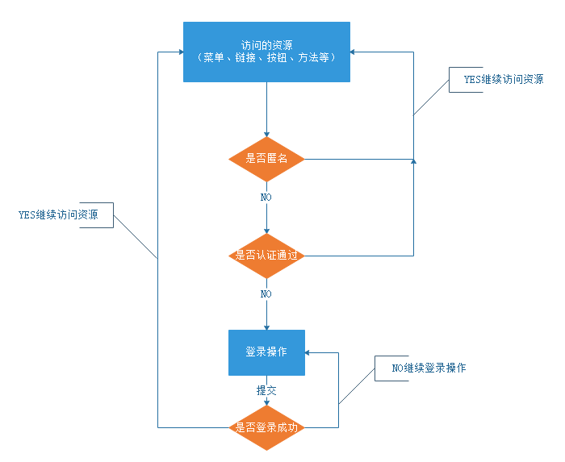
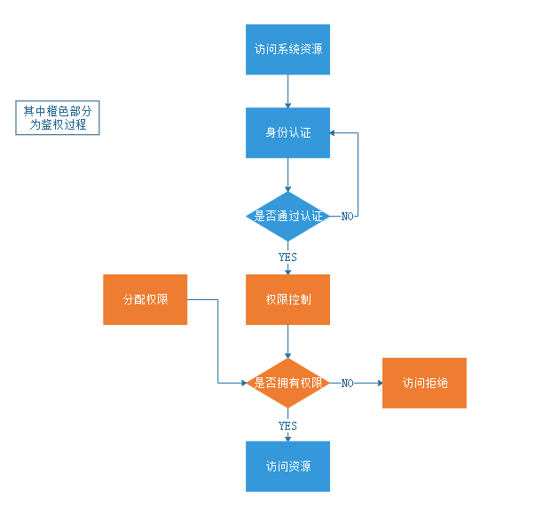
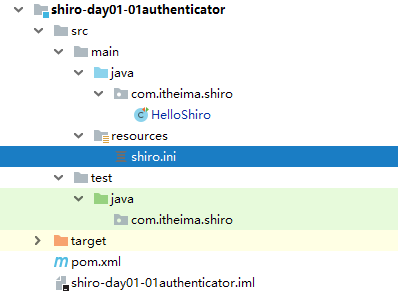
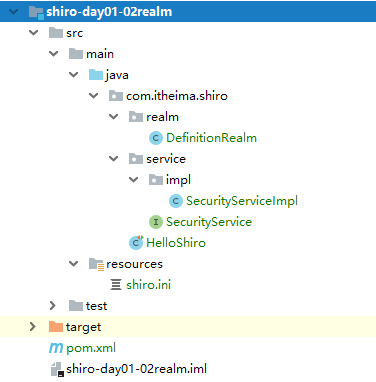
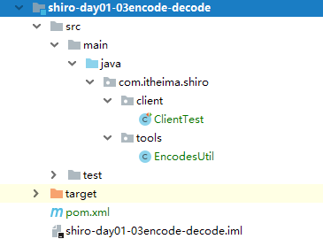
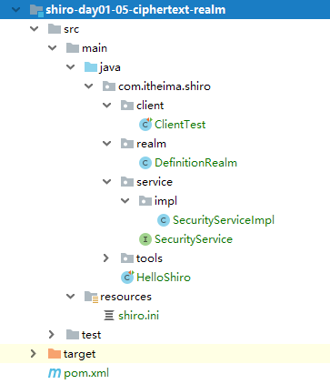
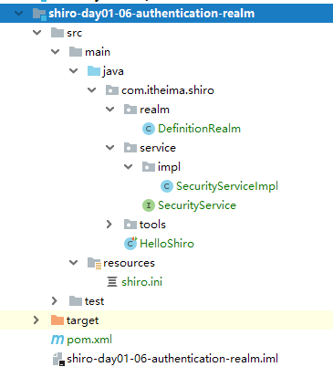
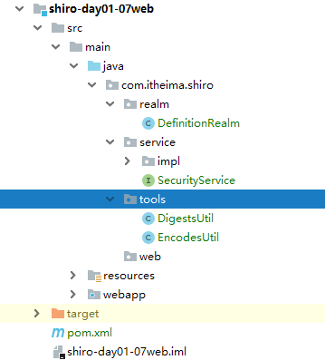

# Shiro 实战

## 第一章  权限概述

### 1、什么是权限

​		权限管理，一般指根据系统设置的安全策略或者安全规则，用户可以访问而且只能访问自己被授权的资源，不多不少。权限管理几乎出现在任何系统里面，只要有用户和密码的系统。 

权限管理在系统中一般分为：

- 访问权限

  ```properties
  一般表示你能做什么样的操作，或者能够访问那些资源。例如：给张三赋予“店铺主管”角色，“店铺主管”具有“查询员工”、“添加员工”、“修改员工”和“删除员工”权限。此时张三能够进入系统，则可以进行这些操作
  ```

- 数据权限

  ```properties
  一般表示某些数据你是否属于你，或者属于你可以操作范围。例如：张三是"店铺主管"角色，他可以看他手下客服人员所有的服务的买家订单信息，他的手下只能看自己负责的订单信息
  ```

### 2、认证概念

#### 【1】什么是认证

​		身份认证，就是判断一个用户是否为合法用户的处理过程。最常用的简单身份认证方式是系统通过核对用户输入的用户名和密码，看其是否与系统中存储的该用户的用户名和密码一致，来判断用户身份是否正确。例如：密码登录，手机短信验证、三方授权等

#### 【2】认证流程



#### 【3】关键对象

​		上边的流程图中需要理解以下关键对象：

​        **Subject**：主体：访问系统的用户，主体可以是用户、程序等，进行认证的都称为主体；

​        **Principal**：身份信息是主体（subject）进行身份认证的标识，标识必须具有唯一性，如用户名、手机号、邮箱地址等，一个主体可以有多个身份，但是必须有一个主身份（Primary Principal）。

​        **credential**：凭证信息：是只有主体自己知道的安全信息，如密码、证书等。

### 3、授权概念

#### 【1】什么是授权

​		授权，即访问控制，控制谁能访问哪些资源。主体进行身份认证后，系统会为其分配对应的权限，当访问资

源时，会校验其是否有访问此资源的权限。

这里首先理解4个对象。

​		用户对象user：当前操作的用户、程序。

​		资源对象resource：当前被访问的对象

​		角色对象role ：一组 "权限操作许可权" 的集合。

​		权限对象permission：权限操作许可权

#### 【2】授权流程



#### 【3】关键对象

**授权可简单理解为who对what进行How操作**

**Who：**主体（Subject），可以是一个用户、也可以是一个程序

**What：**资源（Resource），如系统菜单、页面、按钮、方法、系统商品信息等。

​		访问类型：商品菜单，订单菜单、分销商菜单

​		数据类型：我的商品，我的订单，我的评价

**How：**权限/许可（Permission）

​		我的商品（资源）===>访问我的商品(权限许可)

​		分销商菜单（资源）===》访问分销商列表（权限许可）		


## 第二章 Shiro概述

### 1、Shiro简介

#### 【1】什么是Shiro?

Shiro是apache旗下一个开源框架，它将软件系统的安全认证相关的功能抽取出来，实现用户身份认证，权限授权、加密、会话管理等功能，组成了一个通用的安全认证框架。

#### 【2】Shiro 的特点

Shiro 是一个强大而灵活的开源安全框架，能够非常清晰的处理认证、授权、管理会话以及密码加密。如下是它所具有的特点：

- 易于理解的 Java Security API；
- 简单的身份认证（登录），支持多种数据源（LDAP，JDBC 等）；

- 对角色的简单的签权（访问控制），也支持细粒度的鉴权；

- 支持一级缓存，以提升应用程序的性能；

- 内置的基于 POJO 企业会话管理，适用于 Web 以及非 Web 的环境；

- 异构客户端会话访问；

- 非常简单的加密 API； 

- 不跟任何的框架或者容器捆绑，可以独立运行。

### 2、核心组件

- Shiro架构图


- **Subject**

  Subject主体，外部应用与subject进行交互，subject将用户作为当前操作的主体，这个主体：可以是一个通过浏览器请求的用户，也可能是一个运行的程序。Subject在shiro中是一个接口，接口中定义了很多认证授相关的方法，外部程序通过subject进行认证授，而subject是通过SecurityManager安全管理器进行认证授权

  

- **SecurityManager**

  SecurityManager权限管理器，它是shiro的核心，负责对所有的subject进行安全管理。通过SecurityManager可以完成subject的认证、授权等，SecurityManager是通过Authenticator进行认证，通过Authorizer进行授权，通过SessionManager进行会话管理等。SecurityManager是一个接口，继承了Authenticator, Authorizer, SessionManager这三个接口


- **Authenticator**

  Authenticator即认证器，对用户登录时进行身份认证

  

- **Authorizer**

  Authorizer授权器，用户通过认证器认证通过，在访问功能时需要通过授权器判断用户是否有此功能的操作权限。


- **Realm（数据库读取+认证功能+授权功能实现）**

  Realm领域，相当于datasource数据源，securityManager进行安全认证需要通过Realm获取用户权限数据
  **比如：** 如果用户身份数据在数据库那么realm就需要从数据库获取用户身份信息。
  **注意：** 不要把realm理解成只是从数据源取数据，在realm中还有认证授权校验的相关的代码。　


- **SessionManager**

  SessionManager会话管理，shiro框架定义了一套会话管理，它不依赖web容器的session，所以shiro可以使用在非web应用上，也可以将分布式应用的会话集中在一点管理，此特性可使它实现单点登录。


- **SessionDAO**

  SessionDAO即会话dao，是对session会话操作的一套接口
  比如:
  	可以通过jdbc将会话存储到数据库
  	也可以把session存储到缓存服务器


- **CacheManager** 

  CacheManager缓存管理，将用户权限数据存储在缓存，这样可以提高性能


- **Cryptography**

  Cryptography密码管理，shiro提供了一套加密/解密的组件，方便开发。比如提供常用的散列、加/解密等功能


## 第三章 Shiro入门

### 1 身份认证

#### 1.1 基本流程


 流程如下：

​	1、Shiro把用户的数据封装成标识token，token一般封装着用户名，密码等信息

​	2、使用Subject门面获取到封装着用户的数据的标识token

​	3、Subject把标识token交给SecurityManager，在SecurityManager安全中心中，SecurityManager把标识token委托给认证器Authenticator进行身份验证。认证器的作用一般是用来指定如何验证，它规定本次认证用到哪些Realm

​	4、认证器Authenticator将传入的标识token，与数据源Realm对比，验证token是否合法

#### 1.2 案例演示

##### 1.2.1 需求

使用shiro完成一个用户的登录

##### 1.2.2 实现

###### 【1】新建项目

shiro-day01-01authenticator




###### 【2】导入依赖

```xml
<?xml version="1.0" encoding="UTF-8"?>

<project xmlns="http://maven.apache.org/POM/4.0.0" xmlns:xsi="http://www.w3.org/2001/XMLSchema-instance"
  xsi:schemaLocation="http://maven.apache.org/POM/4.0.0 http://maven.apache.org/xsd/maven-4.0.0.xsd">
  <modelVersion>4.0.0</modelVersion>

  <groupId>com.itheima.shiro</groupId>
  <artifactId>shiro-day01-01authenticator</artifactId>
  <version>1.0-SNAPSHOT</version>

  <name>shiro-day01-01authenticator</name>
  <!-- FIXME change it to the project's website -->
  <url>http://www.example.com</url>

  <properties>
    <project.build.sourceEncoding>UTF-8</project.build.sourceEncoding>
  </properties>

  <dependencies>

    <dependency>
      <groupId>commons-logging</groupId>
      <artifactId>commons-logging</artifactId>
      <version>1.1.3</version>
    </dependency>

    <dependency>
      <groupId>org.apache.shiro</groupId>
      <artifactId>shiro-core</artifactId>
      <version>1.3.2</version>
    </dependency>

    <dependency>
      <groupId>junit</groupId>
      <artifactId>junit</artifactId>
      <version>4.11</version>
    </dependency>

  </dependencies>

  <build>
    <plugins>
      <!-- compiler插件, 设定JDK版本 -->
      <plugin>
        <groupId>org.apache.maven.plugins</groupId>
        <artifactId>maven-compiler-plugin</artifactId>
        <version>3.1</version>
        <configuration>
          <source>8</source>
          <target>8</target>
          <showWarnings>true</showWarnings>
        </configuration>
      </plugin>
    </plugins>
  </build>
</project>

```

###### 【3】编写shiro.ini

```ini
#声明用户账号
[users]
jay=123
```

###### 【4】编写HelloShiro

```java
package com.itheima.shiro;

import org.apache.shiro.SecurityUtils;
import org.apache.shiro.authc.UsernamePasswordToken;
import org.apache.shiro.config.IniSecurityManagerFactory;
import org.apache.shiro.mgt.SecurityManager;
import org.apache.shiro.subject.Subject;
import org.apache.shiro.util.Factory;
import org.junit.Test;

/**
 * @Description：shiro的第一个例子
 */
public class HelloShiro {

    @Test
    public void shiroLogin() {
        //导入权限ini文件构建权限工厂
        Factory<SecurityManager> factory = new IniSecurityManagerFactory("classpath:shiro.ini");
        //工厂构建安全管理器
        SecurityManager securityManager = factory.getInstance();
        //使用SecurityUtils工具生效安全管理器
        SecurityUtils.setSecurityManager(securityManager);
        //使用SecurityUtils工具获得主体
        Subject subject = SecurityUtils.getSubject();
        //构建账号token
        UsernamePasswordToken usernamePasswordToken = new UsernamePasswordToken("jay", "123");
        //登录操作
        subject.login(usernamePasswordToken);
        System.out.println("是否登录成功：" + subject.isAuthenticated());
    }
}

```

【2.2.4】测试

```
"C:\Program Files\Java\jdk1.8.0_311\bin\java.exe" 
SLF4J: Failed to load class "org.slf4j.impl.StaticLoggerBinder".
SLF4J: Defaulting to no-operation (NOP) logger implementation
SLF4J: See http://www.slf4j.org/codes.html#StaticLoggerBinder for further details.
是否登录成功：true

进程已结束，退出代码为 0
```


##### 1.2.3 小结

```
1、权限定义：ini文件
2、加载过程:
	导入权限ini文件构建权限工厂
	工厂构建安全管理器
	使用SecurityUtils工具生效安全管理器
	使用SecurityUtils工具获得主体
	使构建账号token用SecurityUtils工具获得主体
	构建账号token
	登录操作
```

### 2 Realm

#### 2.1 Realm接口


所以，一般在真实的项目中，我们不会直接实现Realm接口，我们一般的情况就是直接继承AuthorizingRealm，能够继承到认证与授权功能。它需要强制重写两个方法

```java
public class DefinitionRealm extends AuthorizingRealm {
 
    /**
	 * @Description 认证
	 * @param authcToken token对象
	 * @return 
	 */
	public abstract AuthenticationInfo doGetAuthenticationInfo(AuthenticationToken authcToken) {
        return null;
    }

	/**
	 * @Description 鉴权
	 * @param principals 令牌
	 * @return
	 */
	public abstract AuthorizationInfo doGetAuthorizationInfo(PrincipalCollection principals){
        return null;
    }
}
```

#### 2.2 自定义Realm

##### 2.2.1 需求

```
1、自定义Realm，取得密码用于比较
```

##### 2.2.2 实现

###### 【1】创建项目

shiro-day01-02realm



###### 【2】定义SecurityService

SecurityService

```java
package com.itheima.shiro.service;

/**
 * @Description：权限服务接口
 */
public interface SecurityService {

    /**
     * @Description 查找密码按用户登录名
     * @param loginName 登录名称
     * @return
     */
    String findPasswordByLoginName(String loginName);
}

```

SecurityServiceImpl

```java
package com.itheima.shiro.service.impl;

import com.itheima.shiro.service.SecurityService;

/**
 * @Description：权限服务层
 */
public class SecurityServiceImpl implements SecurityService {

    @Override
    public String findPasswordByLoginName(String loginName) {
        return "123";
    }
}

```

###### 【3】定义DefinitionRealm

```java
package com.itheima.shiro.realm;

import com.itheima.shiro.service.SecurityService;
import com.itheima.shiro.service.impl.SecurityServiceImpl;
import org.apache.shiro.authc.*;
import org.apache.shiro.authz.AuthorizationInfo;
import org.apache.shiro.realm.AuthorizingRealm;
import org.apache.shiro.subject.PrincipalCollection;

/**
 * @Description：声明自定义realm
 */
public class DefinitionRealm extends AuthorizingRealm {

    /**
     * @Description 认证接口
     * @param token 传递登录token
     * @return
     */
    @Override
    protected AuthenticationInfo doGetAuthenticationInfo(AuthenticationToken token) throws AuthenticationException {
        //从AuthenticationToken中获得登录名称
        String loginName = (String) token.getPrincipal();
        SecurityService securityService = new SecurityServiceImpl();
        String password = securityService.findPasswordByLoginName(loginName);
        if ("".equals(password)||password==null){
            throw new UnknownAccountException("账户不存在");
        }
        //传递账号和密码
        return  new SimpleAuthenticationInfo(loginName,password,getName());
    }


    @Override
    protected AuthorizationInfo doGetAuthorizationInfo(PrincipalCollection principals) {
        return null;
    }

}

```

###### 【4】编辑shiro.ini

```ini
#声明自定义的realm，且为安全管理器指定realms
[main]
definitionRealm=com.itheima.shiro.realm.DefinitionRealm
securityManager.realms=$definitionRealm
#声明用户账号
#[users]
#jay=123
```

#### 2.3 认证源码跟踪

（1）通过debug模式追踪源码subject.login(token) 发现。首先是进入Subject接口的默认实现类。果然，Subject将用户的用户名密码委托给了securityManager去做。

```java
// class DelegatingSubject
public void login(AuthenticationToken token) throws AuthenticationException {
    clearRunAsIdentitiesInternal();
    Subject subject = securityManager.login(this, token);

    PrincipalCollection principals;

    String host = null;

    if (subject instanceof DelegatingSubject) {
        DelegatingSubject delegating = (DelegatingSubject) subject;
        //we have to do this in case there are assumed identities - we don't want to lose the 'real' principals:
        principals = delegating.principals;
        host = delegating.host;
    } else {
        principals = subject.getPrincipals();
    }

    if (principals == null || principals.isEmpty()) {
        String msg = "Principals returned from securityManager.login( token ) returned a null or " +
                "empty value.  This value must be non null and populated with one or more elements.";
        throw new IllegalStateException(msg);
    }
    this.principals = principals;
    this.authenticated = true;
    if (token instanceof HostAuthenticationToken) {
        host = ((HostAuthenticationToken) token).getHost();
    }
    if (host != null) {
        this.host = host;
    }
    Session session = subject.getSession(false);
    if (session != null) {
        this.session = decorate(session);
    } else {
        this.session = null;
    }
}
```


（2）然后，securityManager说：“卧槽，认证器authenticator小弟，听说你的大学学的专业就是认证呀，那么这个认证的任务就交给你咯”。遂将用户的token委托给内部认证组件authenticator去做

```java
// class AuthenticatingSecurityManager
public Subject login(Subject subject, AuthenticationToken token) throws AuthenticationException {
    AuthenticationInfo info;
    try {
        info = authenticate(token);
    } catch (AuthenticationException ae) {
        try {
            onFailedLogin(token, ae, subject);
        } catch (Exception e) {
            if (log.isInfoEnabled()) {
                log.info("onFailedLogin method threw an " +
                        "exception.  Logging and propagating original AuthenticationException.", e);
            }
        }
        throw ae; //propagate
    }

    Subject loggedIn = createSubject(token, info, subject);

    onSuccessfulLogin(token, info, loggedIn);

    return loggedIn;
}
// class AuthenticatingSecurityManager
public AuthenticationInfo authenticate(AuthenticationToken token) throws AuthenticationException {
    return this.authenticator.authenticate(token);
}
```


（3）事实上，securityManager的内部组件一个比一个懒。内部认证组件authenticator说：“你们传过来的token我需要拿去跟数据源Realm做对比，这样吧，这个光荣的任务就交给Realm你去做吧”。Realm对象：“一群大懒虫！”。

```java
// class AbstractAuthenticator
public final AuthenticationInfo authenticate(AuthenticationToken token) throws AuthenticationException {
    if (token == null) {
        throw new IllegalArgumentException("Method argument (authentication token) cannot be null.");
    }

    AuthenticationInfo info;
    try {
        info = doAuthenticate(token);
        if (info == null) {
            String msg = "No account information found for authentication token [" + token + "] by this " +
                    "Authenticator instance.  Please check that it is configured correctly.";
            throw new AuthenticationException(msg);
        }
    } catch (Throwable t) {
       ...
    }

    log.debug("Authentication successful for token [{}].  Returned account [{}]", token, info);
    notifySuccess(token, info);
    return info;
}
// class ModularRealmAuthenticator
protected AuthenticationInfo doAuthenticate(AuthenticationToken authenticationToken) throws AuthenticationException {
    assertRealmsConfigured();
    Collection<Realm> realms = getRealms();
    if (realms.size() == 1) {
        return doSingleRealmAuthentication(realms.iterator().next(), authenticationToken);
    } else {
        return doMultiRealmAuthentication(realms, authenticationToken);
    }
}
```


（4）Realm在接到内部认证组件authenticator组件后很伤心，最后对电脑前的你说：“大兄弟，对不住了，你去实现一下呗”。从图中的方法体中可以看到，当前对象是Realm类对象，即将调用的方法是doGetAuthenticationInfo(token)。而这个方法，就是你即将要重写的方法。如果帐号密码通过了，那么返回一个认证成功的info凭证。如果认证失败，抛出一个异常就好了。你说：“什么?最终还是劳资来认证？”没错，就是苦逼的你去实现了，谁叫你是程序猿呢。所以，你不得不查询一下数据库，重写doGetAuthenticationInfo方法，查出来正确的帐号密码，返回一个正确的凭证info

```java
// class ModularRealmAuthenticator
protected AuthenticationInfo doSingleRealmAuthentication(Realm realm, AuthenticationToken token) {
    if (!realm.supports(token)) {
        String msg = "Realm [" + realm + "] does not support authentication token [" +
            token + "].  Please ensure that the appropriate Realm implementation is " +
            "configured correctly or that the realm accepts AuthenticationTokens of this type.";
        throw new UnsupportedTokenException(msg);
    }
    AuthenticationInfo info = realm.getAuthenticationInfo(token);
    if (info == null) {
        String msg = "Realm [" + realm + "] was unable to find account data for the " +
            "submitted AuthenticationToken [" + token + "].";
        throw new UnknownAccountException(msg);
    }
    return info;
}

protected AuthenticationInfo doMultiRealmAuthentication(Collection<Realm> realms, AuthenticationToken token) {
    AuthenticationStrategy strategy = getAuthenticationStrategy();
    AuthenticationInfo aggregate = strategy.beforeAllAttempts(realms, token);

    for (Realm realm : realms) {
        aggregate = strategy.beforeAttempt(realm, token, aggregate);
        if (realm.supports(token)) {
            AuthenticationInfo info = null;
            Throwable t = null;
            try {
                info = realm.getAuthenticationInfo(token);
            } catch (Throwable throwable) {
                t = throwable; 
            }
            aggregate = strategy.afterAttempt(realm, token, info, aggregate, t);
        } else {
            log.debug("Realm [{}] does not support token {}.  Skipping realm.", realm, token);
        }
    }
    aggregate = strategy.afterAllAttempts(token, aggregate);
    return aggregate;
}

// class AuthenticatingRealm
public final AuthenticationInfo getAuthenticationInfo(AuthenticationToken token) throws AuthenticationException {
    AuthenticationInfo info = getCachedAuthenticationInfo(token);
    if (info == null) {
        //otherwise not cached, perform the lookup:
        info = doGetAuthenticationInfo(token);
        log.debug("Looked up AuthenticationInfo [{}] from doGetAuthenticationInfo", info);
        if (token != null && info != null) {
            cacheAuthenticationInfoIfPossible(token, info);
        }
    } else {
        log.debug("Using cached authentication info [{}] to perform credentials matching.", info);
    }

    if (info != null) {
        assertCredentialsMatch(token, info);
    } else {
        log.debug("No AuthenticationInfo found for submitted AuthenticationToken [{}].  Returning null.", token);
    }
    return info;
}


```


（5）好了，这个时候你自己编写了一个类，继承了AuthorizingRealm，并实现了上述doGetAuthenticationInfo方法。你在doGetAuthenticationInfo中编写了查询数据库的代码，并将数据库中存放的用户名与密码封装成了一个AuthenticationInfo对象返回。可以看到下图中，info这个对象是有值的，说明从数据库中查询出来了正确的帐号密码

```java
// class DefinitionRealm
protected AuthenticationInfo doGetAuthenticationInfo(AuthenticationToken authenticationToken) throws AuthenticationException{
    //从AuthenticationToken中获得登录名称
    String loginName = (String) authenticationToken.getPrincipal();
    SecurityService securityService = new SecurityServiceImpl();
    String password = securityService.findPasswordByName(loginName);
    if ("".equals(password)||password==null){
        throw new UnknownAccountException("账户不存在");
    }
    //传递账号和密码
    return  new SimpleAuthenticationInfo(loginName, password, getName());
}
```

（6）那么，接下来就很简单了。把用户输入的帐号密码与刚才你从数据库中查出来的帐号密码对比一下即可。token封装着用户的帐号密码，AuthenticationInfo封装着从数据库中查询出来的帐号密码。再往下追踪一下代码，最终到了下图中的核心区域。如果没有报异常，说明本次登录成功。

```java
// class AuthenticatingRealm
protected void assertCredentialsMatch(AuthenticationToken token, AuthenticationInfo info) throws AuthenticationException {
    CredentialsMatcher cm = getCredentialsMatcher();
    if (cm != null) {
        if (!cm.doCredentialsMatch(token, info)) {
            //not successful - throw an exception to indicate this:
            String msg = "Submitted credentials for token [" + token + "] did not match the expected credentials.";
            throw new IncorrectCredentialsException(msg);
        }
    } else {
        throw new AuthenticationException("......");
    }
}
```


### 3 编码、散列算法

#### 3.1 编码与解码

Shiro提供了base64和16进制字符串编码/解码的API支持，方便一些编码解码操作。

Shiro内部的一些数据的【存储/表示】都使用了base64和16进制字符串

##### 3.1.1 需求

理解base64和16进制字符串编码/解码


##### 3.1.2 新建项目

新建shiro-day01-03encode-decode



##### 3.1.3 新建EncodesUtil

```java
package com.itheima.shiro.tools;

import org.apache.shiro.codec.Base64;
import org.apache.shiro.codec.Hex;

/**
 * @Description：封装base64和16进制编码解码工具类
 */
public class EncodesUtil {

    /**
     * @Description HEX-byte[]--String转换
     * @param input 输入数组
     * @return String
     */
    public static String encodeHex(byte[] input){
        return Hex.encodeToString(input);
    }

    /**
     * @Description HEX-String--byte[]转换
     * @param input 输入字符串
     * @return byte数组
     */
    public static byte[] decodeHex(String input){
        return Hex.decode(input);
    }

    /**
     * @Description Base64-byte[]--String转换
     * @param input 输入数组
     * @return String
     */
    public static String encodeBase64(byte[] input){
        return Base64.encodeToString(input);
    }

    /**
     * @Description Base64-String--byte[]转换
     * @param input 输入字符串
     * @return byte数组
     */
    public static byte[] decodeBase64(String input){
        return Base64.decode(input);
    }

}

```

##### 3.1.4 新建ClientTest

```java
package com.itheima.shiro.client;

import com.itheima.shiro.tools.EncodesUtil;
import org.junit.Test;

/**
 * @Description：测试
 */
public class ClientTest {

    /**
     * @Description 测试16进制编码
     */
    @Test
    public void testHex(){
        String val = "holle";
        String flag = EncodesUtil.encodeHex(val.getBytes());
        String valHandler = new String(EncodesUtil.decodeHex(flag));
        System.out.println("比较结果："+val.equals(valHandler));
    }

    /**
     * @Description 测试base64编码
     */
    @Test
    public void testBase64(){
        String val = "holle";
        String flag = EncodesUtil.encodeBase64(val.getBytes());
        String valHandler = new String(EncodesUtil.decodeBase64(flag));
        System.out.println("比较结果："+val.equals(valHandler));
    }


}

```

【1.5】小结

1. shiro目前支持的编码与解码：
   	base64
     （HEX）16进制字符串
2. 那么shiro的编码与解码什么时候使用呢？又是怎么使用的呢？

```

```

#### 3.2 散列算法

散列算法一般用于生成数据的摘要信息，是一种不可逆的算法，一般适合存储密码之类的数据，常见的散列算法如MD5、SHA等。一般进行散列时最好提供一个salt（盐），比如加密密码“admin”，产生的散列值是“21232f297a57a5a743894a0e4a801fc3”，可以到一些md5解密网站很容易的通过散列值得到密码“admin”，即如果直接对密码进行散列相对来说破解更容易，此时我们可以加一些只有系统知道的干扰数据，如salt（即盐）；这样散列的对象是“密码+salt”，这样生成的散列值相对来说更难破解。

shiro支持的散列算法：

Md2Hash、Md5Hash、Sha1Hash、Sha256Hash、Sha384Hash、Sha512Hash

```java
import org.apache.shiro.crypto.hash.Md2Hash;
import org.apache.shiro.crypto.hash.Md5Hash;
import org.apache.shiro.crypto.hash.Sha1Hash;
import org.apache.shiro.crypto.hash.Sha256Hash;
import org.apache.shiro.crypto.hash.Sha384Hash;
import org.apache.shiro.crypto.hash.Sha512Hash;
```


##### 3.2.1 新增DigestsUtil

```java
package com.itheima.shiro.tools;

import com.sun.org.apache.bcel.internal.generic.NEW;
import org.apache.shiro.crypto.SecureRandomNumberGenerator;
import org.apache.shiro.crypto.hash.SimpleHash;
import sun.security.util.Password;

import java.util.HashMap;
import java.util.Map;

/**
 * @Description：摘要
 */
public class DigestsUtil {

    private static final String SHA1 = "SHA-1";

    private static final Integer ITERATIONS =512;

    /**
     * @Description sha1方法
     * @param input 需要散列字符串
     * @param salt 盐字符串
     * @return
     */
    public static String sha1(String input, String salt) {
       return new SimpleHash(SHA1, input, salt,ITERATIONS).toString();
    }

    /**
     * @Description 随机获得salt字符串
     * @return
     */
    public static String generateSalt(){
        SecureRandomNumberGenerator randomNumberGenerator = new SecureRandomNumberGenerator();
        return randomNumberGenerator.nextBytes().toHex();
    }


    /**
     * @Description 生成密码字符密文和salt密文
     * @param
     * @return
     */
    public static Map<String,String> entryptPassword(String passwordPlain) {
       Map<String,String> map = new HashMap<>();
       String salt = generateSalt();
       String password =sha1(passwordPlain,salt);
       map.put("salt", salt);
       map.put("password", password);
       return map;
    }
}

```

##### 3.2.2 新增ClientTest

```java
package com.itheima.shiro.client;

import com.itheima.shiro.tools.DigestsUtil;
import com.itheima.shiro.tools.EncodesUtil;
import org.junit.Test;

import java.util.Map;

/**
 * @Description：测试
 */
public class ClientTest {

    /**
     * @Description 测试16进制编码
     */
    @Test
    public void testHex(){
        String val = "holle";
        String flag = EncodesUtil.encodeHex(val.getBytes());
        String valHandler = new String(EncodesUtil.decodeHex(flag));
        System.out.println("比较结果："+val.equals(valHandler));
    }

    /**
     * @Description 测试base64编码
     */
    @Test
    public void testBase64(){
        String val = "holle";
        String flag = EncodesUtil.encodeBase64(val.getBytes());
        String valHandler = new String(EncodesUtil.decodeBase64(flag));
        System.out.println("比较结果："+val.equals(valHandler));
    }

    @Test
    public void testDigestsUtil(){
       Map<String,String> map =  DigestsUtil.entryptPassword("123");
        System.out.println("获得结果："+map.toString());
    }

}

```


### 4 Realm使用散列算法

上面我们了解编码，以及散列算法，那么在realm中怎么使用？在shiro-day01-02realm中我们使用的密码是明文的校验方式，也就是SecurityServiceImpl中findPasswordByLoginName返回的是明文123的密码

```java
package com.itheima.shiro.service.impl;

import com.itheima.shiro.service.SecurityService;

/**
 * @Description：权限服务层
 */
public class SecurityServiceImpl implements SecurityService {

    @Override
    public String findPasswordByLoginName(String loginName) {
        return "123";
    }
}
```

#### 4.1 新建项目

shiro-day01-05-ciphertext-realm



#### 4.2 创建密文密码

使用ClientTest的testDigestsUtil创建密码为“123”的password密文和salt密文

```
password:56265d624e484ca62c6dfbc523e6d6fc7932d0d5
salt:845a66ac80174c0e486db9354cf84f9a
```

#### 4.3 修改SecurityService

SecurityService修改成返回salt和password的map

```java
package com.itheima.shiro.service;

import java.util.Map;

/**
 * @Description：权限服务接口
 */
public interface SecurityService {

    /**
     * @Description 查找密码按用户登录名
     * @param loginName 登录名称
     * @return
     */
    Map<String,String> findPasswordByLoginName(String loginName);
}

```

```java
package com.itheima.shiro.service.impl;

import com.itheima.shiro.service.SecurityService;

import java.util.HashMap;
import java.util.Map;

/**
 * @Description：权限服务层
 */
public class SecurityServiceImpl implements SecurityService {

    @Override
    public Map<String,String> findPasswordByLoginName(String loginName) {
        //模拟数据库中存储的密文信息
       return  DigestsUtil.entryptPassword("123");
    }
}

```


#### 4.4 指定密码匹配方式

为DefinitionRealm类添加构造方法如下：

```java
/**
 * @Description 构造函数
 */
public DefinitionRealm() {
    // 指定密码匹配方式为sha1
    HashedCredentialsMatcher matcher = new HashedCredentialsMatcher(DigestsUtil.SHA1);
    // 指定密码迭代次数
    matcher.setHashIterations(DigestsUtil.ITERATIONS);
    // 使用父亲方法使匹配方式生效
    setCredentialsMatcher(matcher);
}
```

修改DefinitionRealm类的认证doGetAuthenticationInfo方法如下

```java
	/**
     * @Description 认证接口
     * @param token 传递登录token
     * @return
     */
@Override
protected AuthenticationInfo doGetAuthenticationInfo(AuthenticationToken token) throws AuthenticationException {
    //从AuthenticationToken中获得登录名称
    String loginName = (String) token.getPrincipal();
    SecurityService securityService = new SecurityServiceImpl();
    Map<String, String> map = securityService.findPasswordByLoginName(loginName);
    if (map.isEmpty()){
        throw new UnknownAccountException("账户不存在");
    }
    String salt = map.get("salt");
    String password = map.get("password");
    //传递账号和密码:参数1：缓存对象，参数2：明文密码，参数三：字节salt,参数4：当前DefinitionRealm名称
    return  new SimpleAuthenticationInfo(loginName,password, ByteSource.Util.bytes(salt),getName());
}
```


### 5 身份授权

#### 5.1 基本流程


1、首先调用Subject.isPermitted/hasRole接口，其会委托给SecurityManager。

2、SecurityManager接着会委托给内部组件Authorizer；

3、Authorizer再将其请求委托给我们的Realm去做；Realm才是真正干活的；

4、Realm将用户请求的参数封装成权限对象。再从我们重写的doGetAuthorizationInfo方法中获取从数据库中查询到的权限集合。

5、Realm将用户传入的权限对象，与从数据库中查出来的权限对象，进行一一对比。如果用户传入的权限对象在从数据库中查出来的权限对象中，则返回true，否则返回false。

进行授权操作的前提：用户必须通过认证。

在真实的项目中，角色与权限都存放在数据库中。为了快速上手，我们先创建一个自定义DefinitionRealm，模拟它已经登录成功。直接返回一个登录验证凭证，告诉Shiro框架，我们从数据库中查询出来的密码是也是就是你输入的密码。所以，不管用户输入什么，本次登录验证都是通过的。

```java
  /**
     * @Description 认证接口
     * @param token 传递登录token
     * @return
     */
@Override
protected AuthenticationInfo doGetAuthenticationInfo(AuthenticationToken token) throws AuthenticationException {
    //从AuthenticationToken中获得登录名称
    String loginName = (String) token.getPrincipal();
    SecurityService securityService = new SecurityServiceImpl();
    Map<String, String> map = securityService.findPasswordByLoginName(loginName);
    if (map.isEmpty()){
        throw new UnknownAccountException("账户不存在");
    }
    String salt = map.get("salt");
    String password = map.get("password");
    //传递账号和密码:参数1：用户认证凭证信息，参数2：明文密码，参数三：字节salt,参数4：当前DefinitionRealm名称
    return  new SimpleAuthenticationInfo(loginName,password, ByteSource.Util.bytes(salt),getName());
}
```

好了，接下来，我们要重写我们本小节的核心方法了。在DefinitionRealm中找到下列方法：

```java
@Override
protected AuthorizationInfo doGetAuthorizationInfo(PrincipalCollection principals) {
    return null;
}
```

此方法的传入的参数PrincipalCollection  principals，是一个包装对象，它表示"用户认证凭证信息"。包装的是谁呢？没错，就是认证doGetAuthenticationInfo（）方法的返回值的第一个参数loginName。你可以通过这个包装对象的getPrimaryPrincipal（）方法拿到此值,然后再从数据库中拿到对应的角色和资源，构建SimpleAuthorizationInfo。

```java
/**
 * @Description 授权方法
 */
@Override
protected AuthorizationInfo doGetAuthorizationInfo(PrincipalCollection principals) {
    //拿到用户认证凭证信息
    String loginName = (String) principals.getPrimaryPrincipal();
    //从数据库中查询对应的角色和资源
    SecurityService securityService = new SecurityServiceImpl();
    List<String> roles = securityService.findRoleByloginName(loginName);
    List<String> permissions = securityService.findPermissionByloginName(loginName);
    //构建资源校验
    SimpleAuthorizationInfo authorizationInfo = new SimpleAuthorizationInfo();
    authorizationInfo.addRoles(roles);
    authorizationInfo.addStringPermissions(permissions);
    return authorizationInfo;
}
```

#### 5.2 案例演示

##### 5.2.1需求

```
1、实现doGetAuthorizationInfo方法实现鉴权
2、使用subject类实现权限的校验
```

##### 5.2.2 实现

###### 【2.2.1】创建项目

拷贝shiro-day01-05-ciphertext-realm新建shiro-day01-06-authentication-realm



###### 【2.2.2】编写SecurityService

在SecurityService中添加

```java
 	/**
     * @Description 查找角色按用户登录名
     * @param  loginName 登录名称
     * @return
     */
List<String> findRoleByloginName(String loginName);

	/**
     * @Description 查找资源按用户登录名
     * @param  loginName 登录名称
     * @return
     */
List<String>  findPermissionByloginName(String loginName);
```

SecurityServiceImpl添加实现

```java
@Override
public List<String> findRoleByloginName(String loginName) {
    List<String> list = new ArrayList<>();
    list.add("admin");
    list.add("dev");
    return list;
}

@Override
public List<String>  findPermissionByloginName(String loginName) {
    List<String> list = new ArrayList<>();
    list.add("order:add");
    list.add("order:list");
    list.add("order:del");
    return list;
}
```

###### 【2.2.3】编写DefinitionRealm

在DefinitionRealm中修改doGetAuthorizationInfo方法如下

```java
/**
  * @Description 授权方法
  */
@Override
protected AuthorizationInfo doGetAuthorizationInfo(PrincipalCollection principals) {
    //拿到用户认证凭证信息
    String loginName = (String) principals.getPrimaryPrincipal();
    //从数据库中查询对应的角色和资源
    SecurityService securityService = new SecurityServiceImpl();
    List<String> roles = securityService.findRoleByloginName(loginName);
    List<String> permissions = securityService.findPermissionByloginName(loginName);
    //构建资源校验
    SimpleAuthorizationInfo authorizationInfo = new SimpleAuthorizationInfo();
    authorizationInfo.addRoles(roles);
    authorizationInfo.addStringPermissions(permissions);
    return authorizationInfo;
}
```

###### 【2.2.4】编写HelloShiro

```java
package com.itheima.shiro;

import org.apache.shiro.SecurityUtils;
import org.apache.shiro.authc.UsernamePasswordToken;
import org.apache.shiro.config.IniSecurityManagerFactory;
import org.apache.shiro.mgt.SecurityManager;
import org.apache.shiro.subject.Subject;
import org.apache.shiro.util.Factory;
import org.junit.Assert;
import org.junit.Test;

/**
 * @Description：shiro的第一个例子
 */
public class HelloShiro {


    @Test
    public void testPermissionRealm() {
        Subject subject = shiroLogin("jay", "123");
        //判断用户是否已经登录
        System.out.println("是否登录成功：" + subject.isAuthenticated());

        //---------检查当前用户的角色信息------------
        System.out.println("是否有管理员角色："+subject.hasRole("admin"));
        //---------如果当前用户有此角色，无返回值。若没有此权限，则抛 UnauthorizedException------------
        try {
            subject.checkRole("coder");
            System.out.println("有coder角色");
        }catch (Exception e){
            System.out.println("没有coder角色");
        }

        //---------检查当前用户的权限信息------------
        System.out.println("是否有查看订单列表资源："+subject.isPermitted("order:list"));
        //---------如果当前用户有此权限，无返回值。若没有此权限，则抛 UnauthorizedException------------
        try {
            subject.checkPermissions("order:add", "order:del");
            System.out.println("有添加和删除订单资源");
        }catch (Exception e){
            System.out.println("没有有添加和删除订单资源");
        }

    }


    /**
     * @Description 登录方法
     */
    private Subject shiroLogin(String loginName,String password) {
        //导入权限ini文件构建权限工厂
        Factory<SecurityManager> factory = new IniSecurityManagerFactory("classpath:shiro.ini");
        //工厂构建安全管理器
        SecurityManager securityManager = factory.getInstance();
        //使用SecurityUtils工具生效安全管理器
        SecurityUtils.setSecurityManager(securityManager);
        //使用SecurityUtils工具获得主体
        Subject subject = SecurityUtils.getSubject();
        //构建账号token
        UsernamePasswordToken usernamePasswordToken = new UsernamePasswordToken(loginName, password);
        //登录操作
        subject.login(usernamePasswordToken);
        return subject;
    }
}

```

##### 5.2.3 授权源码追踪

（1）客户端调用 subject.hasRole("admin")，判断当前用户是否有"admin"角色权限。

```java
public void testPermissionRealm() {
    Subject subject = shiroLogin("jay", "1234");
    //判断用户是否已经登录
    System.out.println("是否登录成功：" + subject.isAuthenticated());

    //---------检查当前用户的角色信息------------
    System.out.println("是否有管理员角色："+subject.hasRole("admin"));
    //---------如果当前用户有此角色，无返回值。若没有此权限，则抛 UnauthorizedException------------
    try {
        subject.checkRole("coder");
        System.out.println("有coder角色");
    }catch (Exception e){
        System.out.println("没有coder角色");
    }

    //---------检查当前用户的权限信息------------
    System.out.println("是否有查看订单列表资源："+subject.isPermitted("order:list"));
    //---------如果当前用户有此权限，无返回值。若没有此权限，则抛 UnauthorizedException------------
    try {
        subject.checkPermissions("order:add", "order:del");
        System.out.println("有添加和删除订单资源");
    }catch (Exception e){
        System.out.println("没有有添加和删除订单资源");
    }

}
```

(2）Subject门面对象接收到要被验证的角色信息"admin"，并将其委托给securityManager中验证。

```java
// class DelegatingSubject
public boolean hasRole(String roleIdentifier) {
    return hasPrincipals() && securityManager.hasRole(getPrincipals(), roleIdentifier);
}
```

(3）securityManager将验证请求再次委托给内部的小弟：内部组件Authorizer authorizer

```java
// class AuthorizingSecurityManager
public boolean hasRole(PrincipalCollection principals, String roleIdentifier) {
    return this.authorizer.hasRole(principals, roleIdentifier);
}
```

(4)内部小弟authorizer也是个混子，将其委托给了我们自定义的Realm去做

```java
// class ModularRealmAuthorizer
public boolean hasRole(PrincipalCollection principals, String roleIdentifier) {
    assertRealmsConfigured();
    for (Realm realm : getRealms()) {
        if (!(realm instanceof Authorizer)) continue;
        if (((Authorizer) realm).hasRole(principals, roleIdentifier)) {
            return true;
        }
    }
    return false;
}
```

(5) 先拿到PrincipalCollection principal对象，同时传入校验的角色循环校验,循环中先创建鉴权信息

```java
// class AuthorizingRealm
public boolean hasRole(PrincipalCollection principal, String roleIdentifier) {
    AuthorizationInfo info = getAuthorizationInfo(principal);
    return hasRole(roleIdentifier, info);
}
```

（6）先看缓存中是否已经有鉴权信息

```java
// class Authorizing
protected AuthorizationInfo getAuthorizationInfo(PrincipalCollection principals) {
    if (principals == null) {
        return null;
    }
    AuthorizationInfo info = null;
    if (log.isTraceEnabled()) {
        log.trace("Retrieving AuthorizationInfo for principals [" + principals + "]");
    }
	// 先从缓存中进行查询
    Cache<Object, AuthorizationInfo> cache = getAvailableAuthorizationCache();
    if (cache != null) {
        if (log.isTraceEnabled()) {
            log.trace("Attempting to retrieve the AuthorizationInfo from cache.");
        }
        Object key = getAuthorizationCacheKey(principals);
        info = cache.get(key);
        if (log.isTraceEnabled()) {
            if (info == null) {
                log.trace("No AuthorizationInfo found in cache for principals [" + principals + "]");
            } else {
                log.trace("AuthorizationInfo found in cache for principals [" + principals + "]");
            }
        }
    }

    if (info == null) {
        // Call template method if the info was not found in a cache
        // 如果缓存中没有，从实现的Realm中进行查询
        info = doGetAuthorizationInfo(principals);
        // If the info is not null and the cache has been created, then cache the authorization info.
        if (info != null && cache != null) {
            if (log.isTraceEnabled()) {
                log.trace("Caching authorization info for principals: [" + principals + "].");
            }
            Object key = getAuthorizationCacheKey(principals);
            cache.put(key, info);
        }
    }
    return info;
}
```


(7)都是一群懒货！！最后干活的还是我这个猴子！

```java
protected AuthorizationInfo doGetAuthorizationInfo(PrincipalCollection principals) {
    //拿到用户认证凭证信息
    String loginName = (String) principals.getPrimaryPrincipal();
    //从数据库中查询对应的角色和资源
    SecurityService securityService = new SecurityServiceImpl();
    List<String> roles = securityService.findRoleByloginName(loginName);
    List<String> permissions = securityService.findPermissionByloginName(loginName);
    //构建资源校验
    SimpleAuthorizationInfo authorizationInfo = new SimpleAuthorizationInfo();
    authorizationInfo.addRoles(roles);
    authorizationInfo.addStringPermissions(permissions);
    return authorizationInfo;
}
```

#### 5.3 小结

```
1、鉴权需要实现doGetAuthorizationInfo方法
2、鉴权使用门面subject中方法进行鉴权
	以check开头的会抛出异常
	以is和has开头会返回布尔值
```


## 第四章 Web项目集成Shiro

### 1、Web集成原理分析

#### 1.1 web集成的配置

还记得吗，以前我们在没有与WEB环境进行集成的时候，为了生成SecurityManager对象，是通过手动读取配置文件生成工厂对象，再通过工厂对象获取到SecurityManager的。就像下面代码展示的那样

```java
 /**
   * @Description 登录方法
   */
private Subject shiroLogin(String loginName,String password) {
    //导入权限ini文件构建权限工厂
    Factory<SecurityManager> factory = new IniSecurityManagerFactory("classpath:shiro.ini");
    //工厂构建安全管理器
    SecurityManager securityManager = factory.getInstance();
    //使用SecurityUtils工具生效安全管理器
    SecurityUtils.setSecurityManager(securityManager);
    //使用SecurityUtils工具获得主体
    Subject subject = SecurityUtils.getSubject();
    //构建账号token
    UsernamePasswordToken usernamePasswordToken = new UsernamePasswordToken(loginName, password);
    //登录操作
    subject.login(usernamePasswordToken);
    return subject;
}
```

不过，现在我们既然说要与WEB集成，那么首先要做的事情就是把我们的shiro.ini这个配置文件交付到WEB环境中，定义shiro.ini文件如下

```ini
#声明自定义的realm，且为安全管理器指定realms
[main]
definitionRealm=com.itheima.shiro.realm.DefinitionRealm
securityManager.realms=$definitionRealm
```

##### 1.1.1 新建项目

新建web项目shiro-day01-07web,其中realm、service、resources内容从shiro-day01-06authentication-realm中拷贝即可



##### 1.1.2 pom.xml配置

```xml
<?xml version="1.0" encoding="UTF-8"?>

<project xmlns="http://maven.apache.org/POM/4.0.0" xmlns:xsi="http://www.w3.org/2001/XMLSchema-instance"
  xsi:schemaLocation="http://maven.apache.org/POM/4.0.0 http://maven.apache.org/xsd/maven-4.0.0.xsd">
  <modelVersion>4.0.0</modelVersion>

  <groupId>com.itheima.shiro</groupId>
  <artifactId>shiro-day01-07web</artifactId>
  <version>1.0-SNAPSHOT</version>
  <packaging>war</packaging>

  <name>shiro-day01-07web Maven Webapp</name>
  <!-- FIXME change it to the project's website -->
  <url>http://www.example.com</url>

  <dependencies>

    <dependency>
      <groupId>commons-logging</groupId>
      <artifactId>commons-logging</artifactId>
      <version>1.1.3</version>
    </dependency>

    <dependency>
      <groupId>org.apache.shiro</groupId>
      <artifactId>shiro-core</artifactId>
      <version>1.3.2</version>
    </dependency>

    <dependency>
      <groupId>org.apache.shiro</groupId>
      <artifactId>shiro-web</artifactId>
      <version>1.3.2</version>
    </dependency>

    <dependency>
      <groupId>junit</groupId>
      <artifactId>junit</artifactId>
      <version>4.11</version>
    </dependency>

  </dependencies>

  <build>
    <plugins>
      <!-- tomcat7插件,命令： mvn tomcat7:run -DskipTests -->
      <plugin>
        <groupId>org.apache.tomcat.maven</groupId>
        <artifactId>tomcat7-maven-plugin</artifactId>
        <version>2.2</version>
        <configuration>
          <uriEncoding>utf-8</uriEncoding>
          <port>8080</port>
          <path>/platform</path>
        </configuration>
      </plugin>

      <!-- compiler插件, 设定JDK版本 -->
      <plugin>
        <groupId>org.apache.maven.plugins</groupId>
        <artifactId>maven-compiler-plugin</artifactId>
        <version>3.1</version>
        <configuration>
          <source>8</source>
          <target>8</target>
          <showWarnings>true</showWarnings>
        </configuration>
      </plugin>
    </plugins>
  </build>
</project>

```

##### 1.1.3 web.xml配置

```xml
<web-app xmlns:xsi="http://www.w3.org/2001/XMLSchema-instance"
         xmlns="http://java.sun.com/xml/ns/javaee"
         xsi:schemaLocation="http://java.sun.com/xml/ns/javaee http://java.sun.com/xml/ns/javaee/web-app_3_0.xsd"
         version="3.0">
  <display-name>shiro-day01-07web</display-name>

  <!-- 初始化SecurityManager对象所需要的环境-->
  <context-param>
    <param-name>shiroEnvironmentClass</param-name>
    <param-value>org.apache.shiro.web.env.IniWebEnvironment</param-value>
  </context-param>

  <!-- 指定Shiro的配置文件的位置 -->
  <context-param>
    <param-name>shiroConfigLocations</param-name>
    <param-value>classpath:shiro.ini</param-value>
  </context-param>

  <!-- 监听服务器启动时，创建shiro的web环境。
       即加载shiroEnvironmentClass变量指定的IniWebEnvironment类-->
  <listener>
    <listener-class>org.apache.shiro.web.env.EnvironmentLoaderListener</listener-class>
  </listener>

  <!-- shiro的l过滤入口，过滤一切请求 -->
  <filter>
    <filter-name>shiroFilter</filter-name>
    <filter-class>org.apache.shiro.web.servlet.ShiroFilter</filter-class>
  </filter>
  <filter-mapping>
    <filter-name>shiroFilter</filter-name>
    <!-- 过滤所有请求 -->
    <url-pattern>/*</url-pattern>
  </filter-mapping>

</web-app>

```

#### 1.2 SecurityManager对象创建

上面我们集成shiro到web项目了，下面我们来追踪下源码，看下SecurityManager对象是如何创建的

（1）我启动了服务器，监听器捕获到了服务器启动事件。我现在所处的位置EnvironmentLoaderListener监听器的入口处
