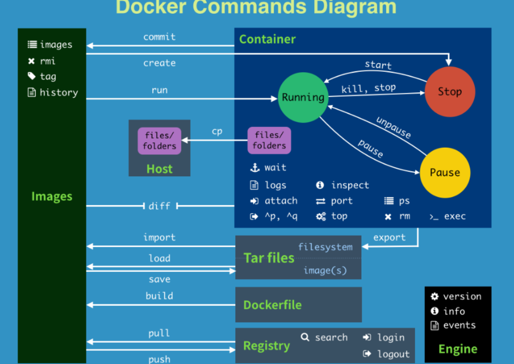
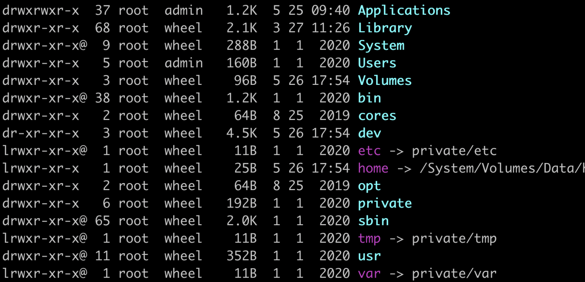
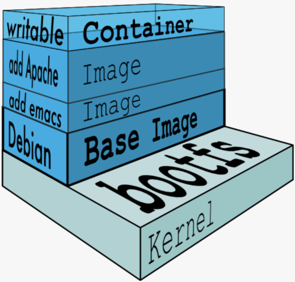
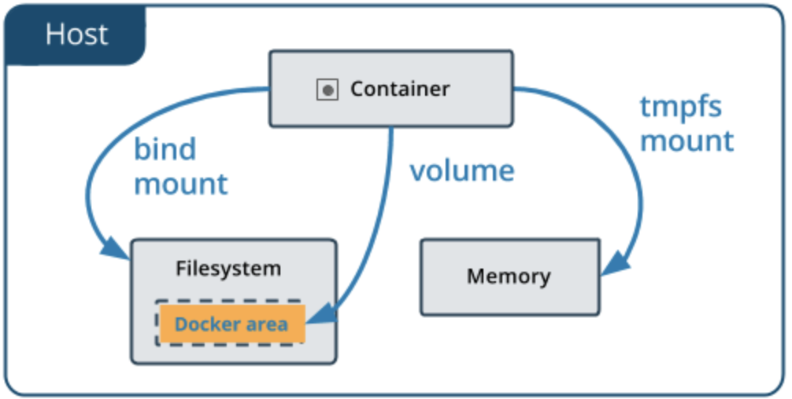

# Docker 详解

## 一、Docker简介

### 1.1 Docker是什么？

Docker是基于Go语言实现的云开源项目。

Docker的主要目标是“Build，Ship and Run Any App,Anywhere”，也就是通过对应用组件的封装、分发、部署、运行等生命周期的管理，使用户的APP（可以是一个WEB应用或数据库应用等等）及其运行环境能够做到“一次镜像，处处运行”。


Linux容器技术的出现就解决了这样一个问题，而 Docker 就是在它的基础上发展过来的。将应用打成镜像，通过镜像成为运行在Docker容器上面的实例，而 Docker容器在任何操作系统上都是一致的，这就实现了跨平台、跨服务器。只需要一次配置好环境，换到别的机子上就可以一键部署好，大大简化了操作。

解决了运行环境和配置问题的软件容器， 方便做持续集成并有助于整体发布的容器虚拟化技术。

### 1.2 容器与虚拟机比较

**【1】传统虚拟机技术**

虚拟机（virtual machine）就是带环境安装的一种解决方案。

它可以在一种操作系统里面运行另一种操作系统，比如在Windows10系统里面运行Linux系统CentOS7。应用程序对此毫无感知，因为虚拟机看上去跟真实系统一模一样，而对于底层系统来说，虚拟机就是一个普通文件，不需要了就删掉，对其他部分毫无影响。这类虚拟机完美的运行了另一套系统，能够使应用程序，操作系统和硬件三者之间的逻辑不变。 

虚拟机的缺点：

- 资源占用多
- 冗余步骤多
- 启动慢

**【2】容器虚拟化技术**

由于前面虚拟机存在某些缺点，Linux发展出了另一种虚拟化技术：Linux容器(Linux Containers，缩写为 LXC)

Linux容器是与系统其他部分隔离开的一系列进程，从另一个镜像运行，并由该镜像提供支持进程所需的全部文件。容器提供的镜像包含了应用的所有依赖项，因而在从开发到测试再到生产的整个过程中，它都具有可移植性和一致性。

Linux 容器不是模拟一个完整的操作系统而是对进程进行隔离。有了容器，就可以将软件运行所需的所有资源打包到一个隔离的容器中。容器与虚拟机不同，不需要捆绑一整套操作系统，只需要软件工作所需的库资源和设置。系统因此而变得高效轻量并保证部署在任何环境中的软件都能始终如一地运行。


Docker容器是在操作系统层面上实现虚拟化，直接复用本地主机的操作系统，而传统虚拟机则是在硬件层面实现虚拟化。与传统的虚拟机相比，Docker优势体现为启动速度快、占用体积小。

### 1.3 docker底层实现

- docker的基础是linux容器（LXC）等技术
- 在LXC的基础上docker进行了进一步的封装，让用户不需要去关心容器的管理，使得操作更为简便。
- docker是使用Cgroups来提供的容器隔离，而union文件系统用于保存镜像并使容器变得短暂

**Cgroups:** 是Linux内核功能，它让两件事情变成可能：限制Linux进程组的资源占用（内存、CPU)；为进程组制作PID、UTS、IPC、网络、用户及装载命名空间。

**Union文件系统：**在union文件系统里，文件系统可以被装载在其他文件系统之上，其结果就是一个分层的积累变化。如下图：


## 二、Docker 安装


## 三、Docker 常用命令

### 3.1 帮助启动类命令

- **启动docker**：`systemctl start docker`
- **停止docker**：`systemctl stop docker`
- **重启docker**：`systemctl restart docker`
- **查看docker状态**：`systemctl status docker`
- **开机启动**：`systemctl enable docker`
- **查看docker概要信息**：`docker info`
- **查看docker总体帮助文档**：`docker --help`
- **查看docker命令帮助文档**： `docker 命令 --help`


### 3.2 镜像命令

#### 3.2.1 docker images

**【1】列出本地主机上的镜像列表**

```shell
PS > docker images
REPOSITORY    TAG       IMAGE ID       CREATED         SIZE
hello-world   latest    feb5d9fea6a5   16 months ago   13.3kB
```

各个选项说明:

```
REPOSITORY：表示镜像的仓库源
TAG：镜像的标签版本号
IMAGE ID：镜像ID
CREATED：镜像创建时间
SIZE：镜像大小
```

同一仓库源可以有多个 TAG版本，代表这个仓库源的不同个版本，我们使用 REPOSITORY:TAG 来定义不同的镜像。

如果你不指定一个镜像的版本标签，例如你只使用 ubuntu，docker 将默认使用 ubuntu:latest 镜像

**【2】OPTIONS说明**

-a： 列出本地所有镜像（含历史映像层）

-q： 只显示镜像ID


#### 3.2.2 docker search

搜索镜像的名字，可以在https://hub.docker.com网站上进行查询。

**【1】语法： docker search [options] 镜像名称**

```
PS > docker search hello-world
NAME                                       DESCRIPTION                                     STARS     OFFICIAL   AUTOMATED
hello-world                                Hello World! (an example of minimal Dockeriz…   1971      [OK]
kitematic/hello-world-nginx                A light-weight nginx container that demonstr…   153
tutum/hello-world                          Image to test docker deployments. Has Apache…   90                   [OK]
dockercloud/hello-world                    Hello World!                                    20                   [OK]
crccheck/hello-world                       Hello World web server in under 2.5 MB          15                   [OK]
```

个选项说明：

| 参数        | 说明             |
| ----------- | ---------------- |
| NAME        | 镜像名称         |
| DESCRIPTION | 镜像说明         |
| STARS       | 点赞数量         |
| OFFICIAL    | 是否为官方的     |
| AUTOMATED   | 是否是自动构建的 |

**【2】 OPTIONS说明**

--limit: 只列出N个镜像，默认25个。

```
PS > docker search --limit 5 redis
NAME                     DESCRIPTION                                     STARS     OFFICIAL   AUTOMATED
redis                    Redis is an open source key-value store that…   11787     [OK]
redislabs/redisinsight   RedisInsight - The GUI for Redis                79
redislabs/redisearch     Redis With the RedisSearch module pre-loaded…   56
redislabs/redis          Clustered in-memory database engine compatib…   36
redislabs/rebloom        A probablistic datatypes module for Redis       22                   [OK]
```


#### 3.2.3 docker pull 

下载镜像 `docker pull 镜像名称[:TAG]`

TAG是可选的，如果没有指定，默认为latest

```shell
PS > docker pull ubuntu
Using default tag: latest
latest: Pulling from library/ubuntu
677076032cca: Pull complete
Digest: sha256:9a0bdde4188b896a372804be2384015e90e3f84906b750c1a53539b585fbbe7f
Status: Downloaded newer image for ubuntu:latest
docker.io/library/ubuntu:latest
```


#### 3.2.4 docker system df

查看镜像/容器/数据卷所占的空间

```
PS > docker system df
TYPE            TOTAL     ACTIVE    SIZE      RECLAIMABLE
Images          2         1         77.82MB   77.81MB (99%)
Containers      1         0         0B        0B
Local Volumes   0         0         0B        0B
Build Cache     0         0         0B        0B
```


#### 3.2.5 docker rmi

删除镜像

- 删除单个  ： docker rmi -f 镜像ID 
- 删除多个  ： docker rmi -f 镜像ID1:TAG  镜像ID2:TAG

- 删除全部  ： docker rmi -f $(docker images -qa)


### 3.3 容器命令

#### 3.3.1 新建/启动容器

```shell
docker run [OPTIONS] IMAGE [COMMAND] [ARGS...]
```

**【1】OPTIONS说明**

OPTIONS说明（常用）：有些是一个减号，有些是两个减号

- --name="容器新名字" ：为容器指定一个名称；

- -d: 后台运行容器并返回容器ID，也即启动守护式容器(后台运行)；

- -i：以交互模式运行容器，通常与 -t 同时使用；

- -t：为容器重新分配一个伪输入终端，通常与 -i 同时使用；也即启动交互式容器(前台有伪终端，等待交互)；

- -P: 随机端口映射，大写P

- -p: 指定端口映射，小写p

| 参数                          | 说明                               |
| ----------------------------- | ---------------------------------- |
| -p hostPort:ContainerPort     | 端口映射，-p 8080:80               |
| -p ip:hostPort:containerPort  | 配置监听地址 -p 10.0.0.100:8080:80 |
| -p ip::containerPort          | 随机分配端口 -p 10.0.0.100::80     |
| -p hostPort:containerPort:udp | 指定协议 -p 8080:80:tcp            |
| -p 80:81 -p 82:83             | 指定多个                           |

**【2】 启动交互式容器**

使用镜像ubuntu:latest以交互模式启动一个容器,在容器内执行/bin/bash命令。

```shell
docker run -it ubuntu /bin/bash
```

参数说明：

- -i: 交互式操作。

- -t: 终端。

- ubuntu : ubuntu 镜像。

- /bin/bash：放在镜像名后的是命令，这里我们希望有个交互式 Shell，因此用的是 /bin/bash。

要退出终端，直接输入 exit:

使用示例：

```shell
PS C:\Windows\System32> docker images
REPOSITORY    TAG       IMAGE ID       CREATED         SIZE
ubuntu        latest    58db3edaf2be   10 days ago     77.8MB
hello-world   latest    feb5d9fea6a5   16 months ago   13.3kB
PS C:\Windows\System32> docker ps
CONTAINER ID   IMAGE     COMMAND   CREATED   STATUS    PORTS     NAMES
PS C:\Windows\System32> docker images
REPOSITORY    TAG       IMAGE ID       CREATED         SIZE
ubuntu        latest    58db3edaf2be   11 days ago     77.8MB
hello-world   latest    feb5d9fea6a5   16 months ago   13.3kB
PS C:\Windows\System32> docker run -it ubuntu /bin/bash
root@1eb019dfafde:/#
```


#### 3.3.2 列出正在运行的容器

```
docker ps [OPTIONS]
```

**【1】OPTIONS说明（常用）：**

- -a :列出当前所有正在运行的容器+历史上运行过的

- -l :显示最近创建的容器。

- -n：显示最近n个创建的容器。

- -q :静默模式，只显示容器编号。

  

#### 3.3.3 退出容器

**【1】exit**

在容器中直接按exit退出，容器终止运行

**【2】ctrl+p+q**

使用该方法容器不停止运行


#### 3.3.4 启动已停止的容器

```
docker start 容器ID/容器名称
```


#### 3.3.5 重启容器

```
docker restart 容器ID/容器名称
```


#### 3.3.6 停止容器

```
docker stop 容器ID/容器名称
```


#### 3.3.7 强制停止容器

```
docker kill 容器ID/容器名称
```

#### 3.3.8 删除已停止的容器

```
docker rm 容器ID
```

**【1】 一次性删除多个容器**

```
docker rm -f $(docker ps -a -q)
或
docker ps -a -q | xargs docker rm
```


#### 3.3.9 实战

以redis:6.0.8镜像为例

**【1】 启动守护式容器**

在大部分的场景下，我们希望 docker 的服务是在后台运行的， 我们可以过 -d 指定容器的后台运行模式。我们使用镜像ubuntu以后台模式启动一个容器`docker run -d centos`

然后我们使用`docker ps -a` 来查看一下容器，会发现容器已经退出。很重要的要说明的一点: **Docker容器后台运行,就必须有一个前台进程.**容器运行的命令如果不是那些一直挂起的命令（比如运行top，tail），就是会自动退出的。这个是docker的机制问题，比如你的web容器，我们以nginx为例，正常情况下，我们配置启动服务只需要启动响应的service即可。例如service nginx start但是，这样做，nginx为后台进程模式运行，就导致docker前台没有运行的应用，这样的容器后台启动后，会立即自杀因为他觉得他没事可做了.

所以，最佳的解决方案是，将你要运行的程序以前台进程的形式运行，常见就是命令行模式，表示我还有交互操作，别中断。

**【2】 查看容器日志**

```
docker logs 容器ID
```


**【3】查看容器内运行的进程**

```
docker top 容器ID
```


**【4】查看容器内部细节**

```
docker inspect 容器ID
```


**【5】 进入正在运行的容器**

重新进入容器有两种方式：

```
docker exec -it 容器ID /bin/bash
或
docker attach 容器ID
```

两者的区别：

- attach 直接进入容器启动命令的终端，不会启动新的进程 用exit退出，会导致容器的停止。
- exec 是在容器中打开新的终端，并且可以启动新的进程 用exit退出，不会导致容器的停止。

这里推荐使用exec， 退出容器的终端不会导致容器的终止。


**【6】从容器拷贝文件到主机**


```
docker cp 容器ID:/path/to/file /path/to/copy
```


**【7】导入导出容器**

exoprt 一个容器留作归档文件

import 从tar包中的内容创建一个新的容器

```
docker export 容器ID > container.tar.gz


```


#### 3.1.10 常用命令总结



- **attach：**  Attach to a running container         # 当前 shell 下 attach 连接指定运行镜像

- **build：** Build an image from a Dockerfile        # 通过 Dockerfile 定制镜像

- **commit：** Create a new image from a container changes  # 提交当前容器为新的镜像

- **cp：**  Copy files/folders from the containers filesystem to the host path  #从容器中拷贝指定文件或者目录到宿主机中

- **create：** Create a new container             # 创建一个新的容器，同 run，但不启动容器

diff    Inspect changes on a container's filesystem  # 查看 docker 容器变化

events   Get real time events from the server      # 从 docker 服务获取容器实时事件

exec    Run a command in an existing container     # 在已存在的容器上运行命令

export   Stream the contents of a container as a tar archive  # 导出容器的内容流作为一个 tar 归档文件[对应 import ]

history  Show the history of an image          # 展示一个镜像形成历史

images   List images                  # 列出系统当前镜像

import   Create a new filesystem image from the contents of a tarball # 从tar包中的内容创建一个新的文件系统映像[对应export]

info    Display system-wide information        # 显示系统相关信息

inspect  Return low-level information on a container  # 查看容器详细信息

kill    Kill a running container            # kill 指定 docker 容器

load    Load an image from a tar archive        # 从一个 tar 包中加载一个镜像[对应 save]

login   Register or Login to the docker registry server   # 注册或者登陆一个 docker 源服务器

logout   Log out from a Docker registry server      # 从当前 Docker registry 退出

logs    Fetch the logs of a container         # 输出当前容器日志信息

port    Lookup the public-facing port which is NAT-ed to PRIVATE_PORT   # 查看映射端口对应的容器内部源端口

pause   Pause all processes within a container     # 暂停容器

ps     List containers                # 列出容器列表

pull    Pull an image or a repository from the docker registry server  # 从docker镜像源服务器拉取指定镜像或者库镜像

push    Push an image or a repository to the docker registry server   # 推送指定镜像或者库镜像至docker源服务器

restart  Restart a running container          # 重启运行的容器

rm     Remove one or more containers         # 移除一个或者多个容器

rmi Remove one or more images    # 移除一个或多个镜像[无容器使用该镜像才可删除，否则需删除相关容器才可继续或 -f 强制删除]

run    Run a command in a new container        # 创建一个新的容器并运行一个命令

save    Save an image to a tar archive         # 保存一个镜像为一个 tar 包[对应 load]

search   Search for an image on the Docker Hub     # 在 docker hub 中搜索镜像

start   Start a stopped containers           # 启动容器

stop    Stop a running containers           # 停止容器

tag    Tag an image into a repository         # 给源中镜像打标签

top    Lookup the running processes of a container  # 查看容器中运行的进程信息

unpause  Unpause a paused container           # 取消暂停容器

version  Show the docker version information      # 查看 docker 版本号

wait    Block until a container stops, then print its exit code  # 截取容器停止时的退出状态值


## 四、Docker镜像


### 4.1 Docker镜像是什么

是一种轻量级、可执行的独立软件包，它包含运行某个软件所需的所有内容，我们把应用程序和配置依赖打包好形成一个可交付的运行环境(包括代码、运行时需要的库、环境变量和配置文件等)，这个打包好的运行环境就是image镜像文件。

只有通过这个镜像文件才能生成Docker容器实例(类似Java中new出来一个对象)。

#### 4.1.1 bootfs(boot file system)

bootfs(boot file system)主要包含bootloader和kernel, bootloader主要是引导加载kernel, Linux刚启动时会加载bootfs文件系统，在Docker镜像的最底层是引导文件系统bootfs。这一层与我们典型的Linux/Unix系统是一样的，包含boot加载器和内核。当boot加载完成之后整个内核就都在内存中了，此时内存的使用权已由bootfs转交给内核，此时系统也会卸载bootfs。

#### 4.1.2 rootfs(root file system)

rootfs包含典型的目录结构，包括 /dev, /proc, /bin, /etc, /lib, /usr, and /tmp等再加上要运行用户应用所需要的所有配置文件，二进制文件和库文件。这个文件系统在不同的Linux 发行版中是不同的。而且用户可以对这个文件进行修改,Linux 系统在启动时，roofs 首先会被挂载为只读模式，然后在启动完成后被修改为读写模式，随后它们就可以被修改了。




#### 4.1.3 UnionFS

UnionFS（联合文件系统）：Union文件系统（UnionFS）是一种分层、轻量级并且高性能的文件系统，它支持对文件系统的修改作为一次提交来一层层的叠加，同时可以将不同目录挂载到同一个虚拟文件系统下(unite several directories into a single virtual filesystem)，而目录的物理位置是分开的。Union 文件系统是 Docker 镜像的基础。镜像可以通过分层来进行继承，基于基础镜像（没有父镜像），可以制作各种具体的应用镜像。

特性：一次同时加载多个文件系统，但从外面看起来，只能看到一个文件系统，联合加载会把各层文件系统叠加起来，这样最终的文件系统会包含所有底层的文件和目录

#### 4.1.4 Docker镜像加载原理

docker的镜像实际上由一层一层的文件系统组成，这种层级的文件系统UnionFS。


当用docker run启动这个容器时，实际上在镜像的顶部添加了一个新的可写层。这个可写层也叫容器层。



这里我们通过案例来证明一下，这是我本地已经下载好的镜像包，大家可以看到centos这个镜像包的大小才209M，平时我们安装的虚拟机上的centos都是几个G，这个里为什么200M就可以？这里我们的centos镜像文件只是一个最精简的rootfs版本，与底层系统共用了kernel，所以才200M就可以将一个centos跑起来，对于不同发行版本可能这个大小会略微有所不同。


我们总结下镜像加速的原理，因为Docker镜像是分层的，因此在加载一个镜像的时候，会按照从底层到高层的顺序依次加载该镜像所需要的镜像层。在加载的过程中，如果当前镜像层已经存在，则会跳过当前镜像层。比如：已经下载过MySQL镜像，现在要下载Tomcat镜像，而这两个镜像都需要CentOS镜像层，那么下载Tomcat镜像的时候，就会跳过下载CentOS镜像层。


> 平时我们安装进虚拟机的CentOS都是好几个G，为什么docker这里才200M？？
>
> 对于一个精简的OS，rootfs可以很小，只需要包括最基本的命令、工具和程序库就可以了，因为底层直接用Host的kernel，自己只需要提供 rootfs 就行了。由此可见对于不同的linux发行版, bootfs基本是一致的, rootfs会有差别, 因此不同的发行版可以公用bootfs。


#### 4.1.5 为什么要采用分层结构

镜像分层最大的一个好处就是共享资源，方便复制迁移，就是为了复用。

 比如说有多个镜像都从相同的 base 镜像构建而来，那么 Docker Host 只需在磁盘上保存一份 base 镜像；

同时内存中也只需加载一份 base 镜像，就可以为所有容器服务了。而且镜像的每一层都可以被共享。


### 4.2 重点概念

Docker镜像层都是只读的，容器层是可写的 当容器启动时，一个新的可写层被加载到镜像的顶部。 这一层通常被称作“容器层”，“容器层”之下的都叫“镜像层”。

当容器启动时，一个新的可写层被加载到镜像的顶部。这一层通常被称作“容器层”，“容器层”之下的都叫“镜像层”。

所有对容器的改动 - 无论添加、删除、还是修改文件都只会发生在容器层中。只有容器层是可写的，容器层下面的所有镜像层都是只读的。


### 4.3 Docker镜像操作案例


## 五、数据容器卷

### 5.1 什么是容器数据卷

容器之间可以有一个**数据共享**的技术，docker容器产生的数据同步到本地或者别的地方。这就是数据卷技术，就是**目录挂载**，将容器内的目录，挂载到虚拟机上或者Linux上

**目的：**实现容器数据的持久化和同步操作。容器间也可以数据共享

### 5.2 为什么需要容器数据卷

数据的持久化，假设MySQL的数据存储在自身的镜像当中，如果将镜像删除的话，存储的数据就会丢失，这样真的就是删库跑路了，因此需要将容器中的数据持久化到磁盘上去；

如果将数据存储于镜像中，主机上的其他进程不方便访问这些数据；

### 5.3 数据卷持久化的三种方式比较

#### 5.3.1 bind mount

存在于主机系统中的任意位置，非 Docker 的进程或者 Docker 容器可能随时对其进行修改，存在潜在的安全风险。bind mount在不同的宿主机系统时不可移植的，比如Windows和Linux的目录结构是不一样的，bind mount所指向的host目录也不能一样。

#### 5.3.2 volume

存于主机文件系统中的某个区域，由Docker管理文件目录（/var/lib/docker/volumes/）。非Docker进程不应该修改这些数据。卷是Docker中持久化数据的最好方式；

#### 5.3.3 tmpfs mount

存于内存中，并不是持久化到磁盘。在容器的生命周期中，可以被容器用来存放非持久化的状态或敏感信息;




### 5.4 数据的覆盖问题

1. 如果挂载一个`空的数据卷`到容器中的一个`非空目录`中，那么这个目录下的文件会被复制到数据卷中。
2. 如果挂载一个`非空的数据卷`到容器中的一个目录中，那么容器中的目录中会显示数据卷中的数据。如果原来容器中的目录中有数据，那么这些原始数据会被隐藏掉。

这两个规则都非常重要，灵活利用第一个规则可以帮助我们`初始化数据卷`中的内容。掌握第二个规则可以保证挂载数据卷后的数据总是你期望的结果。

### 5.5 使用数据卷

#### 5.3.1 直接使用命令挂载 -v

```
docker run -it -v 主机目录:容器内目录
docker run -it -v /home/test:/home centos /bin/bash
```

`docker inspect` 命令查看容器信息


### 5.6 数据卷容器

如果用户需要在多个容器之间共享一些持续更新的数据，最简单的方式是使用数据卷容器。数据卷容器也是一个容器，但是它的目的是专门提供数据卷给其他容器挂载。复制卷始终具有相同的挂载点，数据卷的生命周期一直持续到没有容器使用它为止，类似于继承关系。

1. 守护进程方式启动一个名字叫centos01共享目录为/data1版本为centos最近一个版本的容器;

```
docker run -d -it --name centos01 -v /data1 centos:latest
```

1. 进入centos01容器内部；

```
#查看下容器id
docker ps 
#进入容器内部
docker exec -it ec09d368858f /bin/bash
```

1. 进入目录data1，创建文件；

```
#查看文件目录
ls
#进入目录data1
cd data1
#创建文件
touch data01.txt
```

1. 守护进程的方式启动一个名字为centos02共享容器数据卷centos01版本为centos最近一个版本的容器；

```
docker run -d -it --name centos02 --volumes-from centos01 centos:latest
```

1. 进入centos02容器内部，检查文件目录是否存在data01.txt文件；

```
#进入容器内部
docker exec -it ec09d368858f /bin/bash
#进入data1
cd data1
#ls查看文件目录发现存在data01.txt文件
ls
```

1. 进入centos02容器内部data1目录，在对应目录下创建data02.txt;

```
#在对应目录下创建data02.txt
touch data02.txt
```

1. 再次进入centos01的容器进入data1目录，会发现data02.txt文件已经同步过来了；

```
cd data1
ls
```


#### 


## 六、Docker网络

### 6.1 docker网络

安装docker后，默认会创建三种网络模式


### 6.2 常用基本命令

```
root@xuliang:~# docker network --help

Usage:  docker network COMMAND

Manage networks

Commands:
  connect     Connect a container to a network
  create      Create a network
  disconnect  Disconnect a container from a network
  inspect     Display detailed information on one or more networks
  ls          List networks
  prune       Remove all unused networks
  rm          Remove one or more networks

Run 'docker network COMMAND --help' for more information on a command.
```

查看网络

```
docker network ls
```

查看网络的详细信息

```
root@xuliang:~# docker network inspect bridge
[
    {
        "Name": "bridge",
        "Id": "784bb9eef35dc43db35fe8fc65a77aa26cf8c9ae4526ca95d7ed2e99f0bfa1a1",
        "Created": "2023-02-25T02:02:06.306980273Z",
        "Scope": "local",
        "Driver": "bridge",
        "EnableIPv6": false,
        "IPAM": {
            "Driver": "default",
            "Options": null,
            "Config": [
                {
                    "Subnet": "172.17.0.0/16",
                    "Gateway": "172.17.0.1"
                }
            ]
        },
        "Internal": false,
        "Attachable": false,
        "Ingress": false,
        "ConfigFrom": {
            "Network": ""
        },
        "ConfigOnly": false,
        "Containers": {},
        "Options": {
            "com.docker.network.bridge.default_bridge": "true",
            "com.docker.network.bridge.enable_icc": "true",
            "com.docker.network.bridge.enable_ip_masquerade": "true",
            "com.docker.network.bridge.host_binding_ipv4": "0.0.0.0",
            "com.docker.network.bridge.name": "docker0",
            "com.docker.network.driver.mtu": "1500"
        },
        "Labels": {}
    }
]
```

删除网络

```
docker network rm 网络名称
```


### 6.3 Docker 的网络模型


## 七、Docker网络


