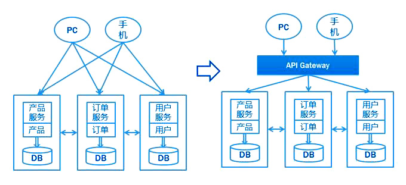
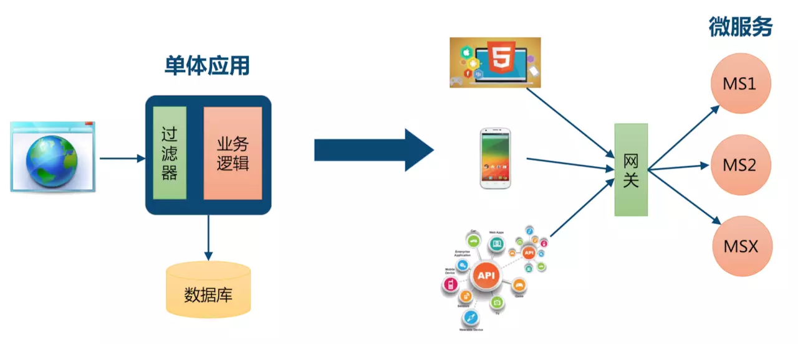
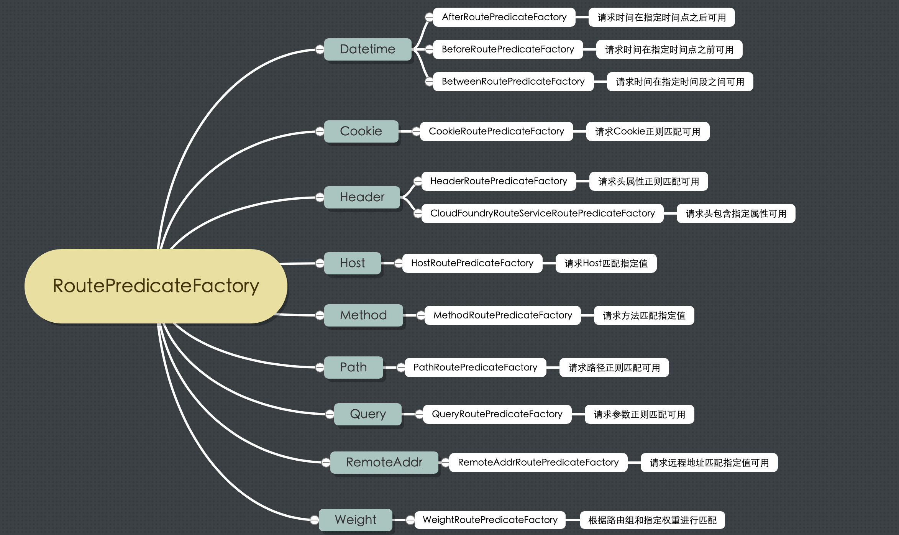

---
# 用来设置该文档是否出现在博客当中, false 不出现
article: true
# 是否置顶，也可以使用number， 来排序
sticky: false
# 是否收藏图片
star: false
# 该文档是否出现在时间线中
timeline: true

category:
  - spring cloud
  - gateway

tag: 
  - spring cloud
  - gateway

date: 2022-12-10
---

# Spring Cloud Gateway


## 一、什么是 Spring Cloud Gateway

Spring Cloud Gateway 作为 Spring Cloud 生态系统中的网关，目标是替代 Netflix Zuul，其不仅提供统一的路由方式，并且还基于 Filter 链的方式提供了网关基本的功能。目前最新版 Spring Cloud 中引用的还是 Zuul 1.x 版本，而这个版本是基于过滤器的，是阻塞 IO，不支持长连接。

Zuul 2.x 版本一直跳票，2019 年 5 月，Netflix 终于开源了支持异步调用模式的 Zuul 2.0 版本，真可谓千呼万唤始出来。但是 Spring Cloud 已经不再集成 Zuul 2.x 了，那么是时候了解一下 SpringCloud Gateway 了。

Spring Cloud Gateway 是基于 Spring 生态系统之上构建的 API 网关，包括：Spring 5，Spring Boot 2 和 Project Reactor。Spring Cloud Gateway 旨在提供一种简单而有效的方法来路由到 API，并为它们提供跨领域的关注点，例如：安全性，监视/指标，限流等。由于 Spring 5.0 支持 Netty，Http2，而 Spring boot 2.0 支持 Spring 5.0，因此 Spring Cloud Gateway 支持 Netty 和 Http2 顺理成章。


## 二、什么是服务网关

API Gateway（APIGW / API 网关），顾名思义，是出现在系统边界上的一个面向 API 的、串行集中式的强管控服务，这里的边界是企业 IT 系统的边界，可以理解为企业级应用防火墙，主要起到隔离外部访问与内部系统的作用。在微服务概念的流行之前，API 网关就已经诞生了，例如银行、证券等领域常见的前置机系统，它也是解决访问认证、报文转换、访问统计等问题的。

API 网关的流行，源于近几年来移动应用与企业间互联需求的兴起。移动应用、企业互联，使得后台服务支持的对象，从以前单一的Web应用，扩展到多种使用场景，且每种使用场景对后台服务的要求都不尽相同。这不仅增加了后台服务的响应量，还增加了后台服务的复杂性。随着微服务架构概念的提出，API网关成为了微服务架构的一个标配组件。

API 网关是一个服务器，是系统对外的唯一入口。API 网关封装了系统内部架构，为每个客户端提供定制的 API。所有的客户端和消费端都通过统一的网关接入微服务，在网关层处理所有非业务功能。API 网关并不是微服务场景中必须的组件，如下图，不管有没有 API 网关，后端微服务都可以通过 API 很好地支持客户端的访问。



但对于服务数量众多、复杂度比较高、规模比较大的业务来说，引入 API 网关也有一系列的好处：

- 聚合接口使得服务对调用者透明，客户端与后端的耦合度降低

- 聚合后台服务，节省流量，提高性能，提升用户体验

- 提供安全、流控、过滤、缓存、计费、监控等 API 管理功能


## 三、为什么要使用网关

- 单体应用：浏览器发起请求到单体应用所在的机器，应用从数据库查询数据原路返回给浏览器，对于单体应用来说是不需要网关的。
- 微服务：微服务的应用可能部署在不同机房，不同地区，不同域名下。此时客户端（浏览器/手机/软件工具）想要请求对应的服务，都需要知道机器的具体 IP 或者域名 URL，当微服务实例众多时，这是非常难以记忆的，对于客户端来说也太复杂难以维护。此时就有了网关，客户端相关的请求直接发送到网关，由网关根据请求标识解析判断出具体的微服务地址，再把请求转发到微服务实例。这其中的记忆功能就全部交由网关来操作了。




**总结**

如果让客户端直接与各个微服务交互：

- 客户端会多次请求不同的微服务，增加了客户端的复杂性

- 存在跨域请求，在一定场景下处理相对复杂

- 身份认证问题，每个微服务需要独立身份认证

- 难以重构，随着项目的迭代，可能需要重新划分微服务

- 某些微服务可能使用了防火墙/浏览器不友好的协议，直接访问会有一定的困难

　　

因此，我们需要网关介于客户端与服务器之间的中间层，所有外部请求率先经过微服务网关，客户端只需要与网关交互，只需要知道网关地址即可。这样便简化了开发且有以下优点：

- 易于监控，可在微服务网关收集监控数据并将其推送到外部系统进行分析

- 易于认证，可在微服务网关上进行认证，然后再将请求转发到后端的微服务，从而无需在每个微服

- 务中进行认证

- 减少了客户端与各个微服务之间的交互次数


## 四、网关解决了什么问题


网关具有身份认证与安全、审查与监控、动态路由、负载均衡、缓存、请求分片与管理、静态响应处理等功能。当然最主要的职责还是与“外界联系”。

总结一下，网关应当具备以下功能：

- 性能：API 高可用，负载均衡，容错机制。

- 安全：权限身份认证、脱敏，流量清洗，后端签名（保证全链路可信调用），黑名单（非法调用的限制）。

- 日志：日志记录，一旦涉及分布式，全链路跟踪必不可少。

- 缓存：数据缓存。

- 监控：记录请求响应数据，API 耗时分析，性能监控。

- 限流：流量控制，错峰流控，可以定义多种限流规则。

- 灰度：线上灰度部署，可以减小风险。

- 路由：动态路由规则。


## 五、常用网关解决方案

### 5.1 Nginx + Lua

Nginx 是由 IgorSysoev 为俄罗斯访问量第二的 Rambler.ru 站点开发的，一个高性能的 HTTP 和反向代理服务器。Ngnix 一方面可以做反向代理，另外一方面做可以做静态资源服务器。

- Nginx 适合做门户网关，是作为整个全局的网关，对外的处于最外层的那种；而 Gateway 属于业务网关，主要用来对应不同的客户端提供服务，用于聚合业务。各个微服务独立部署，职责单一，对外提供服务的时候需要有一个东西把业务聚合起来。

- Gateway 可以实现熔断、重试等功能，这是 Nginx 不具备的。

### 5.2 Kong

Kong 是 Mashape 提供的一款 API 管理软件，它本身是基于 Ngnix + Lua 的，但比 Nginx 提供了更简单的配置方式，数据采用了 ApacheCassandra/PostgreSQL 存储，并且提供了一些优秀的插件，比如验证，日志，调用频次限制等。Kong 非常诱人的地方就是提供了大量的插件来扩展应用，通过设置不同的插件可以为服务提供各种增强的功能。

- 优点：基于 Nginx 所以在性能和稳定性上都没有问题。Kong 作为一款商业软件，在 Nginx 上做了很扩展工作，而且还有很多付费的商业插件。Kong 本身也有付费的企业版，其中包括技术支持、使用培训服务以及 API 分析插件。

- 缺点：如果你使用 Spring Cloud，Kong 如何结合目前已有的服务治理体系？


### 5.3 Spring Cloud Netiflx Zuul

Zuul 是 Netflix 公司开源的一个 API 网关组件，Spring Cloud 对其进行二次基于 Spring Boot 的注解式封装做到开箱即用。目前来说，结合 Sring Cloud 提供的服务治理体系，可以做到请求转发，根据配置或者默认的路由规则进行路由和 Load Balance，无缝集成 Hystrix。

虽然可以通过自定义 Filter 实现我们想要的功能，但是由于 Zuul 本身的设计是基于单线程的接收请求和转发处理，是阻塞 IO，不支持长连接。目前来看 Zuul 就显得很鸡肋，随着 Zuul 2.x 一直跳票

（2019 年 5 月发布了 Zuul 2.0 版本），Spring Cloud 推出自己的 Spring Cloud Gateway。大意就是：Zuul 已死，Spring Cloud Gateway 永生（手动狗头）。


### 5.4 Spring Cloud Gateway

本文主角


## 六、Spring Cloud Gateway实现网关

### 6.1 核心概念

**路由（Route）：**路由是网关最基础的部分，路由信息由 ID、目标 URI、一组断言和一组过滤器组成。如果断言路由为真，则说明请求的 URI 和配置匹配。

**断言（Predicate）：**Java8 中的断言函数。Spring Cloud Gateway 中的断言函数输入类型是
Spring 5.0 框架中的 ServerWebExchange。Spring Cloud Gateway 中的断言函数允许开发者去定义匹配来自于 Http Request 中的任何信息，比如请求头和参数等。

**过滤器（Filter）：**一个标准的 Spring Web Filter。Spring Cloud Gateway 中的 Filter 分为两种类型，分别是 Gateway Filter 和 Global Filter。过滤器将会对请求和响应进行处理。


### 6.2 工作原理


如上图所示，客户端向 Spring Cloud Gateway 发出请求。再由网关处理程序 Gateway Handler Mapping 映射确定与请求相匹配的路由，将其发送到网关 Web 处理程序 Gateway Web Handler 。该处理程序通过指定的过滤器链将请求发送到我们实际的服务执行业务逻辑，然后返回。过滤器由虚线分隔的原因是，过滤器可以在发送代理请求之前和之后运行逻辑。所有 pre 过滤器逻辑均被执行。然后发出代理请求。发出代理请求后，将运行 post 过滤器逻辑。


### 6.3 路由规则

Spring Cloud Gateway 创建 Route 对象时， 使用 RoutePredicateFactory 创建 Predicate 对象，Predicate 对象可以赋值给 Route。

- Spring Cloud Gateway 包含许多内置的 Route Predicate Factories。

- 所有这些断言都匹配 HTTP 请求的不同属性。

- 多个 Route Predicate Factories 可以通过逻辑与（and）结合起来一起使用。

路由断言工厂 RoutePredicateFactory 包含的主要实现类如图所示，包括 Datetime、 请求的远端地址、 路由权重、 请求头、 Host 地址、 请求方法、 请求路径和请求参数等类型的路由断言。



路由配置的形式有两种

【1】 简写形式

```yaml
spring:
  cloud:
    gateway:
      routes:
        - id: after_route
          uri: https://example.org
          predicates:
            - Cookie=mycookie,mycookievalue
```

【2】 完整形式

```yaml
spring:
  cloud:
    gateway:
      routes:
      - id: after_route
        uri: https://example.org
        predicates:
        - name: Cookie
          args:
            name: mycookie
            regexp: mycookievalue
```


接下来我们举例说明其中一部分如何使用，其余等大家工作中需要应用时自行查询。


#### 6.3.1 Path

```yaml
spring:
  application:
   name: gateway-server # 应用名称
  cloud:
    gateway:
      # 路由规则
      routes:
        - id: product-service # 路由 ID，唯一
          uri: http://localhost:7070/ # 目标 URI，路由到微服务的地址
          predicates: # 断言（判断条件）
            - Path=/product/** # 匹配对应 URL 的请求，将匹配到的请求追加在目标URI 之后
```

请求 http://localhost:9000/product/1 将会路由至 http://localhost:7070/product/1


#### 6.3.2 Query

```yaml
spring:
  application:
    name: gateway-server # 应用名称
  cloud:
    gateway:
      # 路由规则
      routes:
        - id: product-service # 路由 ID，唯一
          uri: http://localhost:7070/ # 目标 URI，路由到微服务的地址
          predicates: # 断言（判断条件）
            #- Query=token # 匹配请求参数中包含 token 的请求
            - Query=token, abc. # 匹配请求参数中包含 token 并且其参数值满足正则表达式 abc. 的请求
```

- `Query=token` ：比如，http://localhost:9000/product/1?token=123

- `Query=token, abc` ：比如，http://localhost:9000/product/1?token=abc1


#### 6.3.3 Method

```yaml
spring:
  application:
    name: gateway-server # 应用名称
  cloud:
    gateway:
    # 路由规则
      routes:
        - id: product-service # 路由 ID，唯一
          uri: http://localhost:7070/ # 目标 URI，路由到微服务的地址
          predicates: # 断言（判断条件）
            - Method=GET # 匹配任意 GET 请求
```


#### 6.3.4 Datetime

```yaml
spring:
  application:
    name: gateway-server # 应用名称
  cloud:
    gateway:
    # 路由规则
    routes:
      - id: product-service # 路由 ID，唯一
        uri: http://localhost:7070/ # 目标 URI，路由到微服务的地址
        predicates: # 断言（判断条件）
          # 匹配中国上海时间 2020-02-02 20:20:20 之后的请求
          - After=2020-02-02T20:20:20.000+08:00[Asia/Shanghai]
          # 配置指定时间之前
          - Before=2017-01-20T17:42:47.789-07:00[Asia/Shanghai]
          # 匹配两个时间段之间
          - Between=2017-01-20T17:42:47.789-07:00[Asia/Shanghai], 2017-01-21T17:42:47.789-07:00[Asia/Shanghai]
```


#### 6.3.5 RemoteAddr

```yaml
spring:
  application:
    name: gateway-server # 应用名称
  cloud:
    gateway:
      # 路由规则
      routes:
        - id: product-service # 路由 ID，唯一
          uri: http://localhost:7070/ # 目标 URI，路由到微服务的地址
          predicates: # 断言（判断条件）
            - RemoteAddr=192.168.10.1/0 # 匹配远程地址请求是 RemoteAddr 的请求，0表示子网掩码
```

- RemoteAddr=192.168.10.1/0 ：比如，http://192.168.10.1:9000/product/1


#### 6.3.6 Header

```yaml
spring:
  application:
    name: gateway-server # 应用名称
  cloud:
    gateway:
      # 路由规则
      routes:
        - id: product-service # 路由 ID，唯一
          uri: http://localhost:7070/ # 目标 URI，路由到微服务的地址
          predicates: # 断言（判断条件）
          # 匹配请求头包含 X-Request-Id 并且其值匹配正则表达式 \d+ 的请求
          - Header=X-Request-Id, \d+
```


#### 6.3.7 Cookie

```yaml
spring:
  cloud:
    gateway:
      # 路由规则
      routes:
      - id: cookie_route
        uri: https://example.org
        predicates:
          # Cookie 接收两个值，name 和 regexp, regexp是一个正则表达式的形式
          - Cookie=chocolate, ch.p
```


#### 6.3.8 Host

```yaml
spring:
  cloud:
    gateway:
      routes:
      - id: host_route
        uri: https://example.org
        predicates:
        - Host=**.somehost.org,**.anotherhost.org
```


#### 6.3.9 Weight

Weight路由接收两个参数，group和weight，

```yaml
spring:
  cloud:
    gateway:
      routes:
      - id: weight_high
        uri: https://weighthigh.org
        predicates:
        - Weight=group1, 8
      - id: weight_low
        uri: https://weightlow.org
        predicates:
        - Weight=group1, 2
```

该配置表示80%的请求转发给weight_high，20%的请求转发给weight_low
