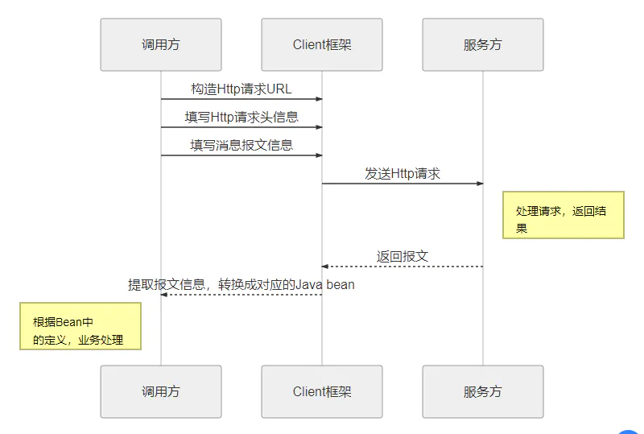
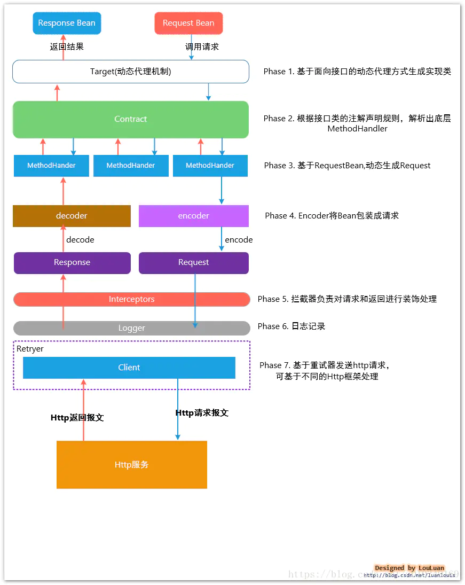

# Spring Cloud OpenFeign 源码解析


## Feign 简介

### Feign是什么？

Feign 的英文表意为“假装，伪装，变形”， 是一个http请求调用的轻量级框架，可以以Java接口注解的方式调用Http请求，而不用像Java中通过封装HTTP请求报文的方式直接调用。Feign通过处理注解，将请求模板化，当实际调用的时候，传入参数，根据参数再应用到请求上，进而转化成真正的请求，这种请求相对而言比较直观。

Feign被广泛应用在Spring Cloud 的解决方案中，是学习基于Spring Cloud 微服务架构不可或缺的重要组件。

开源项目地址：[https://github.com/OpenFeign/feign](https://links.jianshu.com/go?to=https%3A%2F%2Fgithub.com%2FOpenFeign%2Ffeign)

### Feign解决了什么？

封装了Http调用流程，更适合面向接口化的编程习惯在服务调用的场景中，我们经常调用基于Http协议的服务，而我们经常使用到的框架可能有HttpURLConnection、Apache HttpComponnets、OkHttp3 、Netty等等，这些框架在基于自身的专注点提供了自身特性。而从角色划分上来看，他们的职能是一致的提供Http调用服务。

具体流程如下：



### Feign是如何设计的？




## Spring Cloud Openfeign


### 自动装配实现

#### 简单使用

Openfeign的自动装备只需要在spring boot的启动类上或者配置类上添加@EnableFeignClients注解即可。例如：

```java
@EnableFeignClients
public class CloudOneApplication {
    public static void main(String[] args) {
        SpringApplication.run(CloudOneApplication.class, args);
    }
}
```

在@EnableFeignClients注解中的一些属性：

- value： 用来指定需要扫描的包含FeignClient客户端的包列表。
- basePackages：和value的含义相同
- basePackageClasses：以类的形式配置扫描路径
- defaultConfiguration：配置类
- clients：配置FeignClient客户端


#### EnableFeignClients源码

```java
@Retention(RetentionPolicy.RUNTIME)
@Target(ElementType.TYPE)
@Documented
@Import(FeignClientsRegistrar.class)
public @interface EnableFeignClients {

    //basePackages 属性的别名，允许使用更简洁的注释声明
    String[] value() default {};

    //扫描包下带注释的组件
    String[] basePackages() default {};

    //basePackages() 的类型安全的替代方法，用于指定要扫描带注释的组件的软件包，指定类别的包装将被扫描。
    Class<?>[] basePackageClasses() default {};

    //适用于所有自定义@Configuration,可以包含组成客户端的部分的@Bean 
    Class<?>[] defaultConfiguration() default {};

    //用@FeignClient注释的类的列表，如果不为空，则禁用类路径*扫描。
    Class<?>[] clients() default {};
}
```

在该类中引入了FeignClientsRegistrar类，接下来咱们直接看registerBeanDefinitions方法：

```java
@Override
public void registerBeanDefinitions(AnnotationMetadata metadata, BeanDefinitionRegistry registry) {
    /**
     * 注册@EnableFeignClients中定义defaultConfiguration属性下的类，包装成FeignClientSpecification，注册到
     * Spring容器。在@FeignClient中有一个属性：configuration，这个属性是表示各个FeignClient自定义的配置类，后面
     * 也会通过调用registerClientConfiguration方法来注册成FeignClientSpecification到容器。所以，这里可以完全理
     * 解在@EnableFeignClients中配置的是做为兜底的配置，在各个@FeignClient配置的就是自定义的情况。
     */
    registerDefaultConfiguration(metadata, registry);
    /**
     * 该方法负责读取@EnableFeignClients的属性，获取需要扫描的包名，然后扫描指定的所有包名下的被@FeignClient注解注
     * 释的接口，将扫描出来的接口调用registerFeignClient方法注册到spring容器。
     */
    registerFeignClients(metadata, registry);
}
```

#### 注册配置类

```java
private void registerDefaultConfiguration(AnnotationMetadata metadata, BeanDefinitionRegistry registry) {
    Map<String, Object> defaultAttrs = metadata
        .getAnnotationAttributes(EnableFeignClients.class.getName(), true);

    if (defaultAttrs != null && defaultAttrs.containsKey("defaultConfiguration")) {
        String name;
        if (metadata.hasEnclosingClass()) {
            name = "default." + metadata.getEnclosingClassName();
        } else {
            name = "default." + metadata.getClassName();
        }
        registerClientConfiguration(registry, name, defaultAttrs.get("defaultConfiguration"));
    }
}

```

#### 注册Feign客户端

```java
public void registerFeignClients(AnnotationMetadata metadata, BeanDefinitionRegistry registry) {

    LinkedHashSet<BeanDefinition> candidateComponents = new LinkedHashSet<>();
    Map<String, Object> attrs = metadata
        .getAnnotationAttributes(EnableFeignClients.class.getName());
    final Class<?>[] clients = attrs == null ? null : (Class<?>[]) attrs.get("clients");
    // 如果clients没有指定，则执行包路径扫描
    if (clients == null || clients.length == 0) {
        ClassPathScanningCandidateComponentProvider scanner = getScanner();
        scanner.setResourceLoader(this.resourceLoader);
        scanner.addIncludeFilter(new AnnotationTypeFilter(FeignClient.class));
        Set<String> basePackages = getBasePackages(metadata);
        for (String basePackage : basePackages) {
            candidateComponents.addAll(scanner.findCandidateComponents(basePackage));
        }
    }
    else {
        for (Class<?> clazz : clients) {
            candidateComponents.add(new AnnotatedGenericBeanDefinition(clazz));
        }
    }

    //便利需要这侧的客户端列表， 将FeignClient注册进容器中。
    for (BeanDefinition candidateComponent : candidateComponents) {
        if (candidateComponent instanceof AnnotatedBeanDefinition) {
            // verify annotated class is an interface
            AnnotatedBeanDefinition beanDefinition = (AnnotatedBeanDefinition) candidateComponent;
            AnnotationMetadata annotationMetadata = beanDefinition.getMetadata();
            Assert.isTrue(annotationMetadata.isInterface(),
                          "@FeignClient can only be specified on an interface");

            Map<String, Object> attributes = annotationMetadata
                .getAnnotationAttributes(FeignClient.class.getCanonicalName());

            String name = getClientName(attributes);
            registerClientConfiguration(registry, name,attributes.get("configuration"));
			// 这里开始注册FeignClient
            registerFeignClient(registry, annotationMetadata, attributes);
        }
    }
}
```

从这里也可以看出，如果制定了clients，就不会在执行包扫描了。

```java
private void registerFeignClient(BeanDefinitionRegistry registry,
			AnnotationMetadata annotationMetadata, Map<String, Object> attributes) {
    String className = annotationMetadata.getClassName();
    Class clazz = ClassUtils.resolveClassName(className, null);
    ConfigurableBeanFactory beanFactory = registry instanceof ConfigurableBeanFactory
        ? (ConfigurableBeanFactory) registry : null;
    String contextId = getContextId(beanFactory, attributes);
    String name = getName(attributes);
    FeignClientFactoryBean factoryBean = new FeignClientFactoryBean();
    factoryBean.setBeanFactory(beanFactory);
    factoryBean.setName(name);
    factoryBean.setContextId(contextId);
    factoryBean.setType(clazz);
    BeanDefinitionBuilder definition = BeanDefinitionBuilder
        .genericBeanDefinition(clazz, () -> {
            factoryBean.setUrl(getUrl(beanFactory, attributes));
            factoryBean.setPath(getPath(beanFactory, attributes));
            factoryBean.setDecode404(Boolean.parseBoolean(String.valueOf(attributes.get("decode404"))));
            Object fallback = attributes.get("fallback");
            if (fallback != null) {
                factoryBean.setFallback(fallback instanceof Class
                                        ? (Class<?>) fallback
                                        : ClassUtils.resolveClassName(fallback.toString(), null));
            }
            Object fallbackFactory = attributes.get("fallbackFactory");
            if (fallbackFactory != null) {
                factoryBean.setFallbackFactory(fallbackFactory instanceof Class
                                               ? (Class<?>) fallbackFactory
                                               : ClassUtils.resolveClassName(fallbackFactory.toString(),
                                                                             null));
            }
            return factoryBean.getObject();
        });
    definition.setAutowireMode(AbstractBeanDefinition.AUTOWIRE_BY_TYPE);
    definition.setLazyInit(true);
    validate(attributes);

    AbstractBeanDefinition beanDefinition = definition.getBeanDefinition();
    beanDefinition.setAttribute(FactoryBean.OBJECT_TYPE_ATTRIBUTE, className);
    beanDefinition.setAttribute("feignClientsRegistrarFactoryBean", factoryBean);

    // has a default, won't be null
    boolean primary = (Boolean) attributes.get("primary");

    beanDefinition.setPrimary(primary);

    String[] qualifiers = getQualifiers(attributes);
    if (ObjectUtils.isEmpty(qualifiers)) {
        qualifiers = new String[] { contextId + "FeignClient" };
    }

    BeanDefinitionHolder holder = new BeanDefinitionHolder(beanDefinition, className, qualifiers);
    BeanDefinitionReaderUtils.registerBeanDefinition(holder, registry);
}
```


ribbon 获取服务列表流程

```

```

RibbonClientConfiguration     spring cloud 配置ribbon  149

https://www.jianshu.com/p/f076ab3e4031

[Spring Cloud——Feign设计原理 - 简书 (jianshu.com)](https://www.jianshu.com/p/76debd6c688e)

[Spring Cloud——OpenFeign源码解析 - 简书 (jianshu.com)](https://www.jianshu.com/p/9203f6aa80ba)