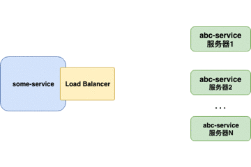
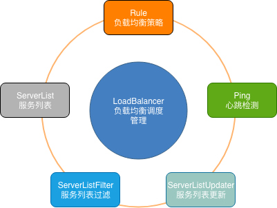

# Spring Cloud Ribbon 源码解析


## 负载均衡

负载均衡，英文名称为Load Balance，其含义就是指将负载（工作任务）进行平衡、分摊到多个操作单元上进行运行，例如FTP服务器、Web服务器、企业核心应用服务器和其它主要任务服务器等，从而协同完成工作任务。

负载均衡构建在原有网络结构之上，它提供了一种透明且廉价有效的方法扩展服务器和网络设备的带宽、加强网络数据处理能力、增加吞吐量、提高网络的可用性和灵活性。

### 服务器端负载均衡器

传统上，Load Balancers（例如Nginx、F5）是放置在服务器端的组件。当请求来自 **客户端** 时，它们将转到负载均衡器，负载均衡器将为请求指定 **服务器**。负载均衡器使用的最简单的算法是随机指定。在这种情况下，大多数负载平衡器是用于控制负载平衡的硬件集成软件。


重点：

- 对客户端不透明，客户端不知道服务器端的服务列表，甚至不知道自己发送请求的目标地址存在负载均衡器。
- 服务器端维护负载均衡服务器，控制负载均衡策略和算法。

### 客户端负载均衡器

当负载均衡器位于 **客户端** 时，**客户端**得到可用的服务器列表然后按照特定的负载均衡策略,分发请求到不同的 **服务器** 。



重点：

- 对客户端透明，客户端需要知道服务器端的服务列表，需要自行决定请求要发送的目标地址。
- 客户端维护负载均衡服务器，控制负载均衡策略和算法。
- 目前单独提供的客户端实现比较少，大部分都是在框架内部自行实现。


## Spring Cloud Ribbon

Ribbon是Netflix公司开源的一个客户单负载均衡的项目，可以自动与 Eureka 进行交互。它提供下列特性：

- 负载均衡
- 容错
- 以异步和反应式模型执行多协议 (HTTP, TCP, UDP)
- 缓存和批量

### Ribbon中的关键组件



- **ServerList**：可以响应客户端的特定服务的服务器列表。

- **ServerListFilter**：可以动态获得的具有所需特征的候选服务器列表的过滤器。

- **ServerListUpdater**：用于执行动态服务器列表更新。

- **Rule**：负载均衡策略，用于确定从服务器列表返回哪个服务器。

- **Ping**：客户端用于快速检查服务器当时是否处于活动状态。

- **LoadBalancer**：负载均衡器，负责负载均衡调度的管理。

### 简单使用

通常情况下，将RestTemplate和Ribbon结合使用，例如：

```java
@Configuration
public class RibbonConfig {
    @Bean
    @LoadBalanced
    RestTemplate restTemplate() {
        return new RestTemplate();
    }
}
```

消费端调用服务端接口：

```java
@Service
public class RibbonService {
	
    @Autowired
    @LoadBalanced
    private RestTemplate restTemplate;
    
    public String hi(String name) {
        return restTemplate.getForObject("http://service-hi/hi?name="+name,String.class);
    }
}
```

在自动注入时，只会将标注了`@LoadBalanced`注解的RestTemplate对象注入进来。那么`@LoadBalanced`是如何做到的呢？我们来看一下源码：

```java
@Target({ ElementType.FIELD, ElementType.PARAMETER, ElementType.METHOD })
@Retention(RetentionPolicy.RUNTIME)
@Documented
@Inherited
@Qualifier
public @interface LoadBalanced {

}
```

可以看到在LoadBalanced的定义上添加了`@Qualifier`注解，由此实现了对`RestTemplate`对象的标记。下面我们就来看看，Spring Cloud Ribbon是如何实现客户端的负载均衡的。

### 源码分析

#### 自动装配

根据Spring Boot的自动装配原则，我们直接去查看spring-cloud-netflix-ribbon-2.2.9.RELEASE.jar包下的META_INF目录中的spring.factories文件：

```properties
org.springframework.boot.autoconfigure.EnableAutoConfiguration=\
org.springframework.cloud.netflix.ribbon.RibbonAutoConfiguration
```

可以看到，Ribbon的自动装配类为`RibbonAutoConfiguration`，下面我们来看一下`RibbonAutoConfiguration`的定义：

```java
@Configuration
@Conditional(RibbonAutoConfiguration.RibbonClassesConditions.class)
@RibbonClients
@AutoConfigureAfter(name = "org.springframework.cloud.netflix.eureka.EurekaClientAutoConfiguration")
@AutoConfigureBefore({ LoadBalancerAutoConfiguration.class, AsyncLoadBalancerAutoConfiguration.class })
@EnableConfigurationProperties({ RibbonEagerLoadProperties.class, ServerIntrospectorProperties.class })
@ConditionalOnProperty(value = "spring.cloud.loadbalancer.ribbon.enabled", havingValue = "true", matchIfMissing = true)
public class RibbonAutoConfiguration {

}
```

下面来挨个分析：

##### @Configuration： 

标明这个一个配置类

##### @Conditional

自动装配的条件，条件类为`RibbonAutoConfiguration.RibbonClassesConditions.class`

```java
static class RibbonClassesConditions extends AllNestedConditions {
    RibbonClassesConditions() {
        // 该参数表示解析该注解的时机是在向容器中注入bean的时候记性解析。
        super(ConfigurationPhase.PARSE_CONFIGURATION);
    }

    @ConditionalOnClass(IClient.class)
    static class IClientPresent {    }

    @ConditionalOnClass(RestTemplate.class)
    static class RestTemplatePresent {    }

    @SuppressWarnings("deprecation")
    @ConditionalOnClass(AsyncRestTemplate.class)
    static class AsyncRestTemplatePresent {    }

    @ConditionalOnClass(Ribbon.class)
    static class RibbonPresent {    }
}
```

该条件装配类继承自`AllNestedConditions`，表示该类定义的所有内部类的条件注解都必须满足。即当前环境必须存在这几个类：IClient、RestTemplate、AsyncRestTemplate、Ribbon。

##### @RibbonClients

```java
@Configuration(proxyBeanMethods = false)
@Retention(RetentionPolicy.RUNTIME)
@Target({ ElementType.TYPE })
@Documented
@Import(RibbonClientConfigurationRegistrar.class)
public @interface RibbonClients {
	RibbonClient[] value() default {};
	Class<?>[] defaultConfiguration() default {};
}
```

该注解引入了`RibbonClientConfigurationRegistrar.class`类，该类负责对`@RibbonClients`及`@RibbonClient`两种注解的解析。

```java
public class RibbonClientConfigurationRegistrar implements ImportBeanDefinitionRegistrar {

	@Override
	public void registerBeanDefinitions(AnnotationMetadata metadata, BeanDefinitionRegistry registry) {
		// 解析@RibbonClients
        Map<String, Object> attrs = metadata.getAnnotationAttributes(RibbonClients.class.getName(), true);
		if (attrs != null && attrs.containsKey("value")) {
			AnnotationAttributes[] clients = (AnnotationAttributes[]) attrs.get("value");
			for (AnnotationAttributes client : clients) {
				registerClientConfiguration(registry, getClientName(client), client.get("configuration"));
			}
		}
		if (attrs != null && attrs.containsKey("defaultConfiguration")) {
			String name;
			if (metadata.hasEnclosingClass()) {
				name = "default." + metadata.getEnclosingClassName();
			} else {
				name = "default." + metadata.getClassName();
			}
			registerClientConfiguration(registry, name, attrs.get("defaultConfiguration"));
		}
        // 解析@RibbonClients
		Map<String, Object> client = metadata.getAnnotationAttributes(RibbonClient.class.getName(), true);
		String name = getClientName(client);
		if (name != null) {
			registerClientConfiguration(registry, name, client.get("configuration"));
		}
	}

	private String getClientName(Map<String, Object> client) {
		if (client == null) {
			return null;
		}
		String value = (String) client.get("value");
		if (!StringUtils.hasText(value)) {
			value = (String) client.get("name");
		}
		if (StringUtils.hasText(value)) {
			return value;
		}
		throw new IllegalStateException("Either 'name' or 'value' must be provided in @RibbonClient");
	}

	private void registerClientConfiguration(BeanDefinitionRegistry registry, Object name,
			Object configuration) {
		BeanDefinitionBuilder builder = BeanDefinitionBuilder.genericBeanDefinition(RibbonClientSpecification.class);
		builder.addConstructorArgValue(name);
		builder.addConstructorArgValue(configuration);
		registry.registerBeanDefinition(name + ".RibbonClientSpecification", builder.getBeanDefinition());
	}
}
```


https://www.jianshu.com/p/f3db11f045cc